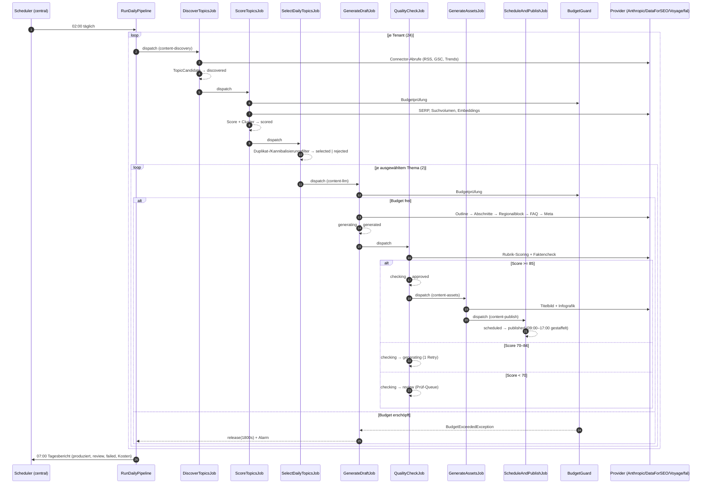

# Content-Pipeline — Architektur, Security und Kosten

Status: **verbindlich (Architektur-Freeze)**
Ticket: SUN-RC-002 (#2)
Letzte Änderung: 2026-09-09

Dieses Dokument friert die Architektur der vollautomatischen Ratgeber-Pipeline ein.
Alle Folgetickets (#3–#26) referenzieren die hier festgelegten Modulgrenzen, Status-Enums,
Tabellenverantwortungen und Budgets. Abweichungen brauchen ein eigenes Ticket.

---

## 1. Modulstruktur

Der gesamte Pipeline-Code lebt unter `app/Content/`. Bestehende Verzeichnisse
(`app/Services/`, `app/Jobs/`) werden **nicht** erweitert — die Pipeline ist ein
abgeschlossenes Modul mit einer schmalen Schnittstelle zum Rest der Anwendung.

```
app/Content/
├── Enums/              TopicStatus, DraftStatus, SourceType, ProviderName, AlarmLevel
├── Providers/          Ein Adapter je externem Dienst (siehe §5)
│   ├── Contracts/      LlmClientContract, EmbeddingClientContract, SerpClientContract, ImageClientContract
│   ├── Anthropic/      LlmClient, PromptBuilder, TokenUsage
│   ├── DataForSeo/     SerpClient, TrendsClient, KeywordClient
│   ├── Voyage/         EmbeddingClient
│   ├── Images/         FalClient, UnsplashClient
│   ├── Google/         SearchConsoleClient
│   └── Support/        RetryingClient, CircuitBreaker, BudgetGuard, CostLogger
├── Connectors/         SourceConnector-Framework (#7–#11), normalisiert auf TopicCandidateDto
├── Jobs/               Die sieben Kettenglieder (§3) + Orchestrator-Jobs
├── Services/           TopicScoringService, ClusterService, DraftGenerator, QualityGate,
│                       AssetService, PublisherService, RefreshService, MetricsCollector
├── Dto/                TopicCandidateDto, ScoreResultDto, OutlineDto, DraftDto,
│                       QualityReportDto, CostRecordDto
├── Prompts/            Prompt-Templates und Branchen-Styleguides (#13)
├── Support/            Slugger, Fingerprint, SeoLinter, WordCounter
└── Exceptions/         BudgetExceededException, CircuitOpenException, ProviderException
```

Das Filament-Panel liegt getrennt davon unter `app/Filament/Content/`, der Panel-Provider
unter `app/Providers/Filament/ContentPanelProvider.php` — analog zu Admin und Dashboard.

**Regeln:**

* Jobs enthalten keine Fachlogik. Sie laden Zustand, rufen genau einen Service und
  schreiben den Folgestatus. Das macht jeden Schritt einzeln wiederholbar.
* Kein Service greift direkt auf HTTP zu. Jeder externe Aufruf läuft durch
  `app/Content/Providers/*`.
* Services sind zustandslos und werden per Container injiziert.

---

## 2. Status-Enums (final)

### `App\Content\Enums\TopicStatus`

| Wert | Bedeutung | Erlaubte Folgezustände |
|---|---|---|
| `discovered` | Von einem Connector gefunden, noch unbewertet | `scored`, `rejected` |
| `scored` | Score, Cluster und Suchvolumen liegen vor | `selected`, `rejected` |
| `selected` | Für die Tagesproduktion ausgewählt | — (terminal) |
| `rejected` | Duplikat, Kannibalisierung, zu schwacher Score oder Sperrwort | — (terminal) |

### `App\Content\Enums\DraftStatus`

| Wert | Bedeutung | Erlaubte Folgezustände |
|---|---|---|
| `generating` | `GenerateDraftJob` läuft | `generated`, `failed` |
| `generated` | Volltext liegt vor, ungeprüft | `checking`, `failed` |
| `checking` | `QualityCheckJob` läuft | `approved`, `review`, `generating`, `failed` |
| `approved` | Qualitätsgate bestanden (auto oder manuell) | `scheduled`, `review`, `failed` |
| `review` | Wartet auf manuelle Freigabe im Content-Panel | `approved`, `generating`, `failed` |
| `scheduled` | Veröffentlichungszeitpunkt gesetzt | `published`, `review`, `failed` |
| `published` | Live und in der Sitemap | `generating` (Refresh-Loop, #24) |
| `failed` | Retries erschöpft, Alarm gesetzt | `generating` (manueller Neustart) |

Beide Enums prüfen Übergänge über `canTransitionTo()`. Jeder Statuswechsel in der Pipeline
geht ausschließlich über diese Methode; ein unerlaubter Übergang wirft, statt still den
Zustand zu verbiegen.

`generating` und `checking` sind In-Flight-Zustände. Hängt ein Entwurf länger als
`config('content.pipeline.stuck_after_minutes')` (45) darin, meldet der Orchestrator ihn
als hängend (#22).

### Zurückziehen (`archived`) — kein eigener `DraftStatus`

Der Anzeige-Status `archived` („Zurückgezogen") kommt **nicht** aus `DraftStatus`, sondern
aus den Spalten `withdrawn_at`, `withdrawn_reason` und `withdrawn_by` auf `article_drafts`.
Der veröffentlichte Beitrag in `posts` wird beim Zurückziehen zusätzlich auf den dort schon
vorhandenen Status `archived` gesetzt; führend für Grund, Zeitpunkt und Person bleibt der
Entwurf. Begründung: Der Pipeline-Status sagt weiterhin, wie weit die
Erstellung gekommen ist; das Zurückziehen liegt eine Ebene darüber und überschreibt ihn nur
für die Anzeige. Damit bleibt der Übergangsgraph oben unverändert gültig, und der Grund
steht im Klartext im Dashboard statt in einem Enum-Wert.

Der Vertrag steckt in `App\Content\Concerns\Withdrawable`:

| Baustein | Bedeutung |
|---|---|
| `withdraw(string $reason, ?int $userId)` | Setzt die Spalten, Pflichtgrund ab `content.withdrawal.reason_min_length`, feuert `ContentWithdrawn` |
| `republish()` | Hebt die Zurücknahme auf, feuert `ContentRepublished` |
| `display_status` (Accessor) | Einziger Weg zum Anzeige-Status; ruft `DisplayStatus::fromDraft($status, $this->isWithdrawn())` |
| `scopeNotWithdrawn()` | Standardfilter für Frontend, Sitemap, Feed und Refresh-Loop |
| `DisplayStatus::allowsWithdrawal()` | Steuert die Sichtbarkeit der Aktion im Panel |

Verbindliche Folgen für die anderen Tickets:

* **#3** hält die drei Spalten auf `article_drafts` (Index auf `withdrawn_at`); sie kommen
  aus der additiven Migration `2026_09_10_000003_add_withdrawal_columns_to_article_drafts.php`,
  die nach den create-Migrationen läuft. `ArticleDraft` bindet `Withdrawable` ein.
* **#21** hört auf `ContentWithdrawn`: Artikel aus Sitemap und Feed entfernen, Cache
  invalidieren, je nach `content.withdrawal.strategy` `noindex` setzen, weiterleiten oder
  410 liefern. **Der Fingerprint bleibt registriert**, damit das Thema nicht sofort neu
  erzeugt wird; für `content.withdrawal.topic_cooldown_days` gilt es zusätzlich als gesperrt.
  Auf `ContentRepublished` läuft dasselbe rückwärts.
* **#20** bietet die Aktion „Zurückziehen" mit Pflichtgrund in Prüf-Queue und Artikelliste
  überall dort an, wo `allowsWithdrawal()` wahr ist, und zeigt Grund, Zeitpunkt und Person
  am Artikel.
* **#24** wählt Aktualisierungskandidaten ausschließlich über `notWithdrawn()`.

---

## 3. Job-Kette

```
DiscoverTopicsJob   → ScoreTopicsJob → SelectDailyTopicsJob
      → GenerateDraftJob → QualityCheckJob → GenerateAssetsJob → ScheduleAndPublishJob
```

| Job | Queue | Läuft je | Liest | Schreibt Status |
|---|---|---|---|---|
| `DiscoverTopicsJob` | `content-discovery` | Tenant | Connectors | `discovered` |
| `ScoreTopicsJob` | `content-discovery` | Tenant | DataForSEO, Voyage | `scored` |
| `SelectDailyTopicsJob` | `content-discovery` | Tenant | interne Scores | `selected` / `rejected` |
| `GenerateDraftJob` | `content-llm` | Artikel | Anthropic | `generating` → `generated` |
| `QualityCheckJob` | `content-llm` | Artikel | Anthropic, Quellen | `checking` → `approved` / `review` |
| `GenerateAssetsJob` | `content-assets` | Artikel | fal.ai / Unsplash | (unverändert) |
| `ScheduleAndPublishJob` | `content-publish` | Artikel | — | `scheduled` → `published` |

Die Kette wird nicht über `Bus::chain()` verdrahtet. Jeder Job stößt seinen Nachfolger
selbst an, nachdem der Zielstatus **persistiert** ist. Grund: Ein `Bus::chain()` bricht bei
einem Fehler die ganze Kette ab; hier soll ein einzelner gescheiterter Artikel die übrigen
47 des Tages nicht mitreißen. Der Zustand liegt in der Datenbank, nicht in der Queue — die
Pipeline ist damit an jeder Stelle wiederaufsetzbar.

Job-Eigenschaften durchgehend: `$tries = 1` (Wiederholungen macht der Provider-Layer),
`ShouldBeUnique` auf `(tenant, datum, schritt)`, `$timeout` passend zur Queue.

### Sequenzdiagramm der Tagespipeline



---

## 4. Tabellenverantwortung: Central vs. Tenant

> **Stand nach #3:** Die Aufteilung Central/Tenant gilt unverändert. Die
> Tabellennamen der beiden folgenden Listen waren Arbeitsnamen; verbindlich sind
> die in §9 dokumentierten Namen der tatsächlich angelegten Tabellen.


Das Projekt fährt Multi-Datenbank-Tenancy (`stancl/tenancy`, Präfix `tenant_`). Die
Aufteilung folgt einer Regel: **Alles, was der Betreiber sieht und steuert, liegt central.
Alles, was zum Content eines Mandanten gehört, liegt beim Tenant.**

### Central-DB (`database/migrations/`)

| Tabelle | Zweck |
|---|---|
| `content_users` | Redaktions-Accounts des Content-Panels (eigener Guard, §6) |
| `content_password_reset_tokens` | Passwort-Reset für diesen Guard |
| `content_sources` | Quellendefinitionen (RSS, GSC, DataForSEO-Profile), tenantübergreifend |
| `content_source_runs` | Lauf-Protokoll je Quelle inkl. Fehlern (Quellen-Monitor, #20) |
| `content_prompt_templates` | Prompt-Templates und Branchen-Styleguides, versioniert |
| `content_cost_records` | Kosten-Logging je Provider-Aufruf (`tenant_id` als Spalte, nullable) |
| `content_budget_days` | Tagesaggregat pro Provider + Tenant, Grundlage des Budget-Guards |
| `content_alarms` | Alarme für Dashboard und Tagesbericht |
| `content_settings` | Globale Pipeline-Einstellungen aus dem Panel |

`content_cost_records` und `content_budget_days` liegen bewusst central: Das Tagesbudget ist
eine globale Größe. Läge es je Tenant-DB, bräuchte jede Budgetprüfung 24 Verbindungen.

Indizes: `content_cost_records(created_at, provider)` und zusätzlich
`(tenant_id, created_at)`.

**Umgesetzt (#6):** `content_budget_days` wurde gestrichen. Der Budget-Guard summiert
`cost_usd` direkt über diese beiden Indizes aus `llm_usage_logs`; bei rund 400 Zeilen am
Tag ist das billiger als ein zweiter, konsistent zu haltender Zähler. Begründung in §5.

### Tenant-DB (`database/migrations/tenant/`)

| Tabelle | Zweck |
|---|---|
| `content_topics` | Themenkandidaten mit `TopicStatus`, Score, Cluster, Region |
| `content_topic_signals` | Rohsignale je Thema und Quelle (Suchvolumen, Trend, Gap) |
| `content_drafts` | Entwürfe mit `DraftStatus`, Versionszähler, Fingerprint, Zurücknahme (`withdrawn_at`); umgesetzt als `article_drafts` |
| `content_draft_sections` | Abschnitte eines Entwurfs (Outline-Struktur) |
| `content_draft_sources` | Belegte Quellen je Entwurf (Faktencheck, #15) |
| `content_quality_reports` | Rubrik-Scores, SEO-Lint, Faktencheck-Ergebnis |
| `content_articles` | Veröffentlichte Ratgeber (Frontend liest nur hier); umgesetzt über die bestehende `posts`-Tabelle des Portals |
| `content_article_metrics` | Impressionen, Klicks, Position, AdSense (#23) |
| `content_embeddings` | Embedding-Vektoren für Duplikat- und Cluster-Prüfung |

Begründung: Ratgeber sind Mandanteninhalte und müssen mit dem Tenant gelöscht,
gesichert und migriert werden. Eine zentrale Artikeltabelle mit `tenant_id` würde bei
24 Mandanten die Frontend-Abfragen unnötig breit machen und die Isolation aufweichen.

**Konsequenz für Jobs:** Die Kettenglieder ab `GenerateDraftJob` laufen im Tenant-Kontext
(`Stancl\Tenancy\Jobs\...` bzw. `TenantAware`), der Budget-Guard und das Kosten-Logging
schreiben über die `central`-Connection. Der Provider-Layer setzt die Connection explizit,
statt sich auf den gerade aktiven Kontext zu verlassen.

---

## 5. Provider-Layer, Retry und Circuit Breaker

Jeder externe Aufruf durchläuft dieselbe Kette:

```
Service → BudgetGuard → RateLimiter → CircuitBreaker → RetryingClient → HTTP
                                                          ↓
                                                      CostLogger
```

* **Retry:** 3 Versuche, exponentiell (2s → 6s → 18s) plus Jitter. Wiederholt werden nur
  429, 5xx und Verbindungsfehler. 4xx (außer 429) sind endgültig.
* **Circuit Breaker:** Cache-Flag `content:cb:{provider}`. Nach 5 Fehlern in Folge öffnet
  er für 15 Minuten; Aufrufe werfen dann sofort `CircuitOpenException`, der Job wird
  released statt zu scheitern. Ein einzelner Probe-Request schließt ihn wieder.
  Damit blockiert ein DataForSEO-Ausfall nicht die Textproduktion.
* **BudgetGuard** sitzt als Middleware **vor** dem `LlmClient` und vor jedem anderen
  kostenpflichtigen Provider. Er prüft Tagesbudget global, Tagesbudget je Tenant,
  Provider-Anteil und die Obergrenze je Artikel. Überschreitung →
  `BudgetExceededException` → `$job->release(1800)` + Alarm im Dashboard.
* **CostLogger** schreibt nach jedem Aufruf einen Eintrag in `llm_usage_logs`
  (Provider, Modell, Tokens in/out/cached, Requests, USD, Tenant, Draft).

### Umsetzung (#6) — Abweichungen von der Skizze oben

Der LLM-Zugang liegt unter `app/Content/Llm/` statt unter
`app/Content/Providers/Anthropic/`, entsprechend dem Dateischnitt in Ticket #6:

| Klasse | Aufgabe |
|---|---|
| `LlmClient` | Anthropic Messages API, erzwungener Tool-Use, Retry bei Schemaverstoß |
| `EmbeddingClient` | Voyage AI, `embed()` / `embedMany()` |
| `PromptRenderer` | `{{var}}`-Ersetzung in `prompt_templates` |
| `SchemaValidator` | zweite Instanz nach der API-seitigen Schemaprüfung |
| `BudgetGuard` | die vier Budgetgrenzen, Pause und Freigabe |
| `LlmContext` | Tenant, Bezugsobjekt (Entwurf) und Operation eines Aufrufs |

Zwei weitere Punkte weichen bewusst ab:

* Es gibt **keine** Tabelle `content_budget_days`. Der Guard summiert `cost_usd` direkt
  aus `llm_usage_logs`; die Tabelle ist auf `(created_at, provider)` und
  `(tenant_id, created_at)` indiziert, und bei rund 400 Zeilen am Tag ist die Summe
  billiger als ein zweiter, konsistent zu haltender Zähler. Die Zähler in
  `provider_states` (`requests_today`, `cost_today_usd`) sind reine Anzeige für den
  Quellen-Monitor und nie Entscheidungsgrundlage.
* Budgetpausen laufen über `provider_states.status = 'paused'` mit
  `circuit_open_until = morgen 00:00`. Das ist bewusst kein `open`: `open` heißt
  „Provider defekt", `paused` heißt „Geld alle". Der erste `check()` nach Mitternacht
  gibt den Provider wieder frei, ein eigener Reset-Job ist nicht nötig.
* Ein toter Zugang — Guthaben aufgebraucht oder Schlüssel abgelehnt — ist weder
  `degraded` noch `paused`, sondern `failed` (#104). Erkannt wird er in
  `App\Content\Llm\ProviderAccountGuard::classify()` an HTTP 401/403 bzw. an der
  Meldung „credit balance"; `reportFailure()` setzt den Zustand, schreibt genau
  einen netzwerkweiten Alarm (`ContentAlert::KEY_PROVIDER_ACCOUNT`, `tenant_id`
  null, Stufe critical) mit Klartext statt HTTP-Rumpf und liefert eine
  `ProviderAccountException`. Weitere Aufrufe fallen ohne HTTP-Anfrage durch
  (`assertUsable()`), bis `resilience.account_recheck_seconds` (Vorgabe 1 h)
  abgelaufen sind; der erste erfolgreiche Probeaufruf setzt den Provider auf `ok`
  und schließt den Alarm.

### Schemakonforme Ausgaben

Jede strukturierte Anfrage definiert genau ein Werkzeug `emit` mit dem gewünschten
JSON-Schema als `input_schema` und setzt `tool_choice` fest darauf. Die Nutzdaten stehen
danach in `content[].input`. Der `SchemaValidator` prüft anschließend selbst; Verstöße
gehen als `tool_result` mit `is_error` in den nächsten Versuch, zusammen mit der
ursprünglichen Antwort im Verlauf. Nach 1 + `schema_retries` (Standard 2) Versuchen wirft
der Client `LlmSchemaException`.

Der System-Prompt trägt `cache_control: ephemeral`. Styleguides sind je Branche identisch
und werden bei 48 Artikeln am Tag dutzendfach wiederverwendet; Cache-Reads kosten ein
Zehntel des normalen Input-Preises und sind in `config('content.providers.anthropic.pricing')`
getrennt hinterlegt.

`temperature` steht in der Konfiguration, wird aber nur mitgesendet, wenn es gesetzt ist:
`claude-sonnet-5` lehnt Sampling-Parameter mit HTTP 400 ab. Aus demselben Grund steht
`thinking` standardmäßig auf `disabled` — bei erzwungenem Tool-Use bringt erweitertes
Denken nichts und kostet Output-Tokens.

### Rate-Limits

| Provider | Grenze (Konfig) | Parallelität |
|---|---|---|
| Anthropic | 400 RPM, 350k Input-TPM, 70k Output-TPM | 4 Worker auf `content-llm` |
| DataForSEO | 120 RPM, zusätzlich 1.500 Requests/Tag hart | 8 |
| Voyage | 300 RPM | 4 |
| fal.ai | 30 RPM | 2 |

Die Anthropic-Werte sind auf **Tier 2** ausgelegt und liegen bewusst unter dem Kontingent.
Bei 48 Artikeln pro Tag über ein Zeitfenster von 05:00–08:00 werden diese Grenzen nicht
annähernd erreicht; sie sind eine Reissleine gegen Schleifen, kein Durchsatzregler.
Bei einem Tier-Wechsel sind `config('content.rate_limits.anthropic')` und die
Horizon-Prozesszahl anzupassen.

---

## 6. Security: Panel-Guard und Zugangsdaten

### Entscheidung — eigener Guard, eigene Tabelle

Das Content-Dashboard bekommt ein **eigenes Filament-Panel mit der ID `content`** unter
`/content`, mit dem Guard `content` und einer **eigenen Benutzertabelle `content_users` in
der Central-DB**. Es gibt **keinen** Zugriff über Admin-Sessions.

| Bestandteil | Wert |
|---|---|
| Panel-ID | `content` |
| Pfad | `/content` |
| Guard | `content` (Driver `session`, Provider `content_users`) |
| Provider-Modell | `App\Models\ContentUser` (Connection `central`) |
| Tabelle | `content_users` |
| Passwort-Broker | `content_users` |
| Session-Cookie | eigener Cookie-Name, damit Admin- und Content-Session nie kollidieren |

Begründung: Die Pipeline verfügt über Budgets in echtem Geld, Prompt-Templates und
Provider-Konfiguration. Ein Rollen-Flag auf `App\Models\User` würde bedeuten, dass jede
Lücke im Admin- oder Dashboard-Panel auch das Budget erreicht. Ein eigener Guard trennt
das sauber, kostet eine Tabelle und ein Panel-Provider, und passt zu der im Projekt bereits
etablierten Panel-Trennung (Admin / Dashboard).

`content_users` bekommt: `name`, `email` (unique), `password`, `is_active`,
`two_factor_*`, `last_login_at`. Autorisierung innerhalb des Panels über zwei Rollen
(`editor`, `owner`); nur `owner` darf Budgets und Provider-Einstellungen ändern.

### API-Keys

Alle Provider-Zugangsdaten kommen **ausschließlich** aus `.env` und werden über
`config/content.php` gelesen. Verbindlich:

* Keine Keys in der Datenbank — weder central noch tenant, weder in `content_settings`
  noch in einem Filament-Feld.
* Keine Keys im Frontend, in Livewire-Payloads oder in Blade-Views.
* Kein Provider-Aufruf aus dem Browser. Jeder Aufruf geht vom Queue-Worker aus.
* Fehlermeldungen und Logs werden vor dem Schreiben von `Authorization`- und
  `x-api-key`-Headern befreit.
* Was im Panel konfigurierbar ist, sind Budgets, Zeitpläne, Prompts und Quellen — nie
  Credentials.

Benötigte `.env`-Schlüssel: `ANTHROPIC_API_KEY`, `DATAFORSEO_LOGIN`, `DATAFORSEO_PASSWORD`,
`VOYAGE_API_KEY`, `FAL_API_KEY`, `UNSPLASH_ACCESS_KEY`, `GOOGLE_SERVICE_ACCOUNT_JSON`.

---

## 7. Kostenkalkulation

### Annahmen

* Modell: `claude-sonnet-5`, 2,00 USD / 1 Mio. Input-Tokens, 10,00 USD / 1 Mio.
  Output-Tokens; Cache-Read 0,20 USD, Cache-Write 2,50 USD je 1 Mio.
* Volumen: 2 Artikel × 24 Tenants × 30 Tage = **1.440 Artikel/Monat**, 48/Tag.
* Artikellänge 1.400–2.200 Wörter, erzeugt in Teilschritten (Outline, 6 Abschnitte,
  Regionalblock, FAQ, Meta), anschließend Qualitätsgate.
* Prompt-Caching: Styleguide, Rubrik und Recherchekontext sind über die Teilschritte eines
  Artikels stabil. Angesetzt sind 60 % der Input-Tokens als Cache-Read.

### Tokens pro Artikel

| Schritt | Calls | Input-Tokens | Output-Tokens |
|---|---:|---:|---:|
| Outline | 1 | 8.000 | 2.000 |
| Abschnitte | 6 | 60.000 | 9.000 |
| Regionalblock | 1 | 8.000 | 1.000 |
| FAQ | 1 | 6.000 | 1.000 |
| Meta / Schema | 1 | 5.000 | 600 |
| Qualitätsgate + Faktencheck | 2 | 25.000 | 3.000 |
| **Summe** | **12** | **112.000** | **16.600** |

### Kosten pro Artikel (USD)

| Position | Rechnung | Betrag |
|---|---|---:|
| LLM Input, ungecacht (40 %) | 44.800 × 2,00 / 1 Mio. | 0,0896 |
| LLM Input, Cache-Read (60 %) | 67.200 × 0,20 / 1 Mio. | 0,0134 |
| LLM Cache-Write (amortisiert) | — | 0,0100 |
| LLM Output | 16.600 × 10,00 / 1 Mio. | 0,1660 |
| DataForSEO | 1 SERP + PAA, Autocomplete, anteilige Keyword-Daten | 0,0120 |
| Embeddings (Voyage) | ~20k Tokens × 0,06 / 1 Mio. | 0,0012 |
| Bilder (Titelbild + Infografik) | 2 × 0,025, Unsplash-Fallback 0,00 | 0,0500 |
| **Zwischensumme** | | **0,3422** |
| Retry-Aufschlag (15 %) | erwartete Wiederholungsrate Qualitätsgate | 0,0513 |
| **Gesamt je Artikel** | | **≈ 0,394** |

### Tages- und Monatskosten (USD)

| Position | Tag | Monat (30 T.) |
|---|---:|---:|
| Artikelproduktion (48/Tag) | 18,91 | 567,36 |
| Themenfindung + Scoring (24 Tenants) | 3,60 | 108,00 |
| Metriken, Refresh-Loop, Alarme | 1,00 | 30,00 |
| **Erwartet** | **23,51** | **705,36** |
| **Hartes Budget** | **35,00** | **1.050,00** |

Puffer rund 45 %. Je Tenant und Tag ergibt das erwartet ~0,98 USD, hart gedeckelt auf
2,50 USD (`content.budget.daily_usd_per_tenant`). Ein einzelner Artikel ist auf 1,50 USD
gedeckelt — greift diese Grenze, ist etwas in der Prompt-Kette kaputt, nicht das Thema
besonders aufwendig.

### Verankerung in der Konfiguration

```php
config('content.budget.daily_usd')             // 35.00
config('content.budget.monthly_usd')           // 1050.00
config('content.budget.daily_usd_per_tenant')  // 2.50
config('content.budget.max_usd_per_article')   // 1.50
config('content.budget.provider_share')        // anthropic .75 / dataforseo .10 / voyage .03 / images .12
config('content.budget.warn_threshold')        // 0.80
```

Ab 80 % des Tagesbudgets warnt das Dashboard und der Tagesbericht. Bei 100 % werden alle
kostenpflichtigen Jobs released, nicht abgebrochen — läuft der Tag über Mitternacht, holt
die Pipeline die offenen Artikel im nächsten Budgetfenster nach.

DataForSEO hat zusätzlich eine harte Requestgrenze von 1.500 pro Tag
(`content.providers.dataforseo.max_requests_per_day`), unabhängig vom USD-Budget. Sie
greift, bevor das Kontingent des Anbieters erschöpft ist.

---

## 8. Was dieses Dokument für die Folgetickets festlegt

* `#3` legt die Migrationen exakt nach §4 an — Central und Tenant getrennt.
* `#4` implementiert Panel und Guard exakt nach §6, ohne Rückgriff auf `App\Models\User`.
* `#6` baut den `LlmClient` mit `BudgetGuard`, `CircuitBreaker` und `CostLogger` aus §5.
* `#12`, `#14`, `#15`, `#21` verwenden ausschließlich `TopicStatus` und `DraftStatus`
  aus §2 und setzen Statuswechsel über `canTransitionTo()`.
* `#3`, `#20`, `#21`, `#24` setzen das Zurückziehen über `Withdrawable` aus §2 um; ein
  weiterer `DraftStatus`-Fall dafür ist ausgeschlossen.
* `#22` liest Zeitplan, Queues und `stuck_after_minutes` aus `config('content.pipeline')`.
* `#26` gibt das Budget aus §7 frei.

---

## 9. Datenmodell nach #3 — angelegte Tabellen

Die Migrationen sind additiv. Keine bestehende Tabelle wurde verändert.

* `database/migrations/tenant/2026_09_10_000001_create_content_pipeline_tables.php`
* `database/migrations/2026_09_10_000002_create_content_central_tables.php`

### Tenant-DB

| Tabelle | Arbeitsname in §4 | Zweck |
|---|---|---|
| `source_items` | `content_topic_signals` | Normalisierte Rohsignale der Connectoren |
| `keyword_clusters` | — | Themencluster, Vorfilter der Kannibalisierungsprüfung |
| `topic_candidates` | `content_topics` | Themenkandidaten mit Scoring |
| `article_drafts` | `content_drafts` | Entwürfe inkl. Outline, FAQ, Qualitätsreport |
| `draft_sources` | `content_draft_sources` | Belegte Quellen je Entwurf |
| `fact_snippets` | — | Einzelne belegbare Fakten mit Quelle und Stand |
| `seasonal_topics` | — | Saisonkalender inkl. Vorlaufzeit |
| `article_metrics` | `content_article_metrics` | Tagesmetriken je veröffentlichtem Artikel |
| `tenant_content_settings` | — | Redaktionelle Einstellungen, genau eine Zeile |

`content_draft_sections` und `content_quality_reports` entfallen: Outline und
Qualitätsreport liegen als `outline_json` bzw. `quality_report_json` am Entwurf. Eine
eigene `content_articles` entfällt ebenfalls — veröffentlicht wird in die bestehende
Artikel-Tabelle des Portals (siehe unten).

### Central-DB

| Tabelle | Arbeitsname in §4 | Zweck |
|---|---|---|
| `content_users` | `content_users` | Redaktions-Accounts des Content-Panels |
| `content_password_reset_tokens` | dito | Passwort-Reset für den `content`-Guard |
| `content_fingerprints` | `content_embeddings` (tenantübergreifend) | SimHash + Embedding je veröffentlichtem Artikel |
| `prompt_templates` | `content_prompt_templates` | Versionierte Prompts und Styleguides |
| `llm_usage_logs` | `content_cost_records` | Kosten- und Token-Logging je Provider-Aufruf |
| `provider_states` | Teil von `content_alarms` | Circuit Breaker, Tageszähler, letzter Fehler je Provider |

`content_fingerprints` hat Indizes auf `simhash` und `tenant_id` sowie ein Unique auf
`(tenant_id, article_id)`. `simhash` ist `unsigned bigint` (64 Bit ohne Vorzeichen).
MariaDB kennt keinen Vektor-Index: Embeddings liegen als JSON-Array, die
Cosine-Ähnlichkeit rechnet PHP über vorgefilterte Kandidaten (gleiches Cluster bzw.
SimHash-Hamming-Distanz ≤ 12, `ContentFingerprint::HAMMING_THRESHOLD`).

---

## 10. Die bestehende Artikel-Tabelle

Die Annahme des Ticketsets war eine Tabelle `articles`. Tatsächlich heißt die
Artikel-Tabelle des Portals **`posts`** und liegt in der **Tenant-DB** (angelegt in
`database/migrations/tenant/2026_03_04_000003_create_blog_tables.php`, Modell
`App\Models\Portal\Post`).

Spalten, ausgelesen mit `Schema::getColumnListing('posts')` im Tenant-Kontext:

| Spalte | Typ | Anmerkung |
|---|---|---|
| `id` | bigint unsigned | |
| `title` | varchar(255) | |
| `slug` | varchar(255) | unique |
| `excerpt` | text, nullable | Anrisstext |
| `body` | longtext | HTML |
| `featured_image` | varchar(255), nullable | Pfad; Media Library zusätzlich über `media` |
| `category_id` | bigint unsigned, nullable | FK auf `post_categories` |
| `author_id` | bigint unsigned | **Pflichtfeld**, verweist auf `users` der Central-DB |
| `status` | varchar(20) | `draft`, `published`, `archived` |
| `published_at` | timestamp, nullable | |
| `meta_title` | varchar(255), nullable | |
| `meta_description` | varchar(500), nullable | |
| `reading_time_minutes` | smallint unsigned | |
| `view_count` | int unsigned | |
| `created_at`, `updated_at` | timestamp | |

Es gibt kein `short_answer`, kein `faq`, keine Regionsfelder. Diese Angaben bleiben am
Entwurf und werden vom Ratgeber-Template (#17) aus `article_drafts` gelesen.

### `ArticleMapper`

`App\Content\Services\ArticleMapper` ist die einzige Stelle, die beide Strukturen kennt.

| `article_drafts` | `posts` |
|---|---|
| `title` | `title` |
| `slug` | `slug`, bei Kollision mit Zähler |
| `short_answer` | `excerpt` (auf 297 Zeichen gekürzt) |
| `body_html` | `body` |
| `meta_title` | `meta_title`, sonst `title` |
| `meta_description` | `meta_description` (auf 155 Zeichen gekürzt) |
| `published_at` bzw. `scheduled_for` | `published_at` |
| Cluster-Slug über `category_mapping_json` | `category_id` |
| — | `author_id` aus `config('content.publishing.author_user_id')` |
| — | `status` = `published` |
| Wortzahl aus `body_html` | `reading_time_minutes` |

`createArticle()` legt den Beitrag an und schreibt `article_drafts.article_id` zurück.
`updateArticle()` ist der Weg des Refresh-Loops (#24) und lässt Slug, `published_at` und
`author_id` unangetastet, damit URL und Erstveröffentlichung stabil bleiben.

`posts.author_id` ist ein Benutzer der **Central-DB** und hat nichts mit den
Redaktions-Accounts `content_users` zu tun. Deshalb steht die ID in der Konfiguration
(`CONTENT_AUTHOR_USER_ID`, Default 1) und nicht in `tenant_content_settings`. Der dort
gepflegte `author_name` ist die im Frontend gezeigte Autorenangabe (#18, #27).

---

## 11. Seeder

`Database\Seeders\TenantContentSettingSeeder` legt für jeden Tenant genau eine Zeile in
`tenant_content_settings` an und ist idempotent. `is_ymyl` wird über eine Slug-Liste aus
Tenant-Name und -Domain bestimmt (Gesundheit, Geld, Recht, Sicherheit); YMYL-Mandanten
bekommen `auto_publish_threshold` 90 statt 80.

Aufruf: `php artisan db:seed --class=TenantContentSettingSeeder`

---

## 12. Connector: Google Search Console (#9)

Der erste produktive Quell-Connector. Er ist zugleich die Datenbasis für den
Metrik-Collector (#23) und den Refresh-Loop (#24).

### Zugang

`App\Content\Providers\SearchConsoleClient` authentifiziert **einen** Service Account, der
in jeder Tenant-Property als Nutzer eingetragen ist. Der Pfad zur JSON-Schlüsseldatei
steht in `content.providers.search_console.credentials_path` (`GOOGLE_SERVICE_ACCOUNT_JSON`);
relative Angaben beziehen sich auf `base_path()`. Liegt die Datei unterhalb von `public/`,
verweigert der Client den Dienst mit einer `RuntimeException` — ein Schlüssel im Web-Root
wäre öffentlich abrufbar.

Bewusst **ohne `google/apiclient`**: gebraucht werden genau ein Endpunkt
(`searchanalytics.query`) und der Service-Account-Flow aus RFC 7523. Das sind rund 60
Zeilen (JWT mit RS256 über `openssl_sign`, Tausch gegen ein Zugriffstoken) gegen ein Paket,
das zusammen mit `google/apiclient-services` den `vendor`-Ordner um mehrere hundert Megabyte
vergrößert. Der Rest läuft über den HTTP-Client des Frameworks, wie beim `LlmClient` (#6).
Das Zugriffstoken wird zentral zwischengespeichert (`token_ttl`, Default 3300 s), damit
nicht jeder Mandant seinen eigenen Token-Tausch auslöst.

### Abruf

`searchanalytics.query` mit `dimensions: ['query','page']`, `rowLimit` 5000,
`dataState: 'final'`, paginiert über `startRow` bis `max_rows`. Das Fenster umfasst 28 Tage
und endet **drei Tage in der Vergangenheit**: Search-Console-Daten laufen nach, ein Fenster
bis heute wäre unter `dataState: 'final'` weitgehend leer.

Die Property-URL steht je Mandant in `tenant_content_settings.gsc_property`
(z. B. `sc-domain:example.de`). Fehlt sie, protokolliert der Connector eine Warnung und
liefert eine leere Collection — **kein** geworfener Fehler, sonst würde ein einzelner
unkonfigurierter Mandant über den `SourceRunner` den Circuit Breaker für alle öffnen.

### Rohdaten-Cache

Jede Zeile (Suchanfrage × Seite) landet per Upsert in `article_metrics_raw`, geschlüsselt
über `(window_end, page_hash, query_hash)`. `page` und `query` sind zu lang für einen Index,
deshalb liegt die Eindeutigkeit auf den sha256-Hashes. `is_article` markiert Seiten unter
`/ratgeber/`. Zeilen älter als `raw_retention_days` (Default 120) werden beim Lauf entfernt.

### Lückenerkennung

Die Zeilen werden je Suchanfrage über alle Seiten verdichtet; die Position wird mit den
Impressionen gewichtet, damit eine Seite mit drei Impressionen auf Position 90 den Schnitt
nicht kippt. Einwortanfragen fallen raus (Marken- und Navigationssuchen).

| `gap_type` | Bedingung | Lesart |
|---|---|---|
| `content_gap` | keine Seite unter `/ratgeber/`, Impressionen ≥ 30 | Nachfrage ohne eigenen Ratgeber |
| `ranking_chance` | Impressionen ≥ 50, Position 8–30 | sichtbar, aber knapp hinter Seite 1 |
| `snippet_issue` | Impressionen ≥ 100, CTR < 1 % | rankt, trifft die Absicht aber nicht |

`content_gap` führt, wenn es zutrifft: ohne eigenen Ratgeber laufen die beiden anderen
Maßnahmen ins Leere. Alle zutreffenden Typen stehen zusätzlich unter `gap_types` im
Rohpayload.

`demand_score = log10(1 + Impressionen) / log10(1 + demand_reference_impressions)`, auf
0…1 begrenzt, und wird als `signal_strength` des `source_items` geführt. Logarithmisch,
weil die Impressionsverteilung einer Property einem Potenzgesetz folgt — linear normiert
wären 95 % der Suchanfragen ununterscheidbar nahe null.

Das `source_item` trägt bewusst **keine** URL: der Fingerprint des `SourceItemDto` läuft
über URL + Titel, und die beste Seite einer Suchanfrage wechselt von Lauf zu Lauf. Mit URL
entstünde bei jedem Abruf ein neues `source_item` statt einer Aktualisierung. `best_page`
und `article_page` stehen im Payload.

### Region

`App\Content\Sources\Support\RegionResolver` erkennt Stadt und Bundesland in der
Suchanfrage. Städte kommen aus der Tenant-Tabelle `cities`, die das Portal ohnehin führt,
Bundesländer aus einer festen Liste im Resolver. Gematcht wird normalisiert (klein, Umlaute
aufgelöst) an Wortgrenzen; längere Ortsnamen gewinnen vor kürzeren, Namen unter vier Zeichen
werden übergangen. Der Treffer gilt nur, wenn der Mandant den Zuschnitt in
`allowed_region_scopes_json` zulässt. Der Resolver ist die Vorwegnahme der Geo-Liste aus
#11 und steht dort zur Weiterverwendung bereit.

### Betrieb

Frequenz `daily`, Aktivierung über `CONTENT_SOURCES_GSC_ENABLED`. Einzellauf für die
Abnahme:

```
php artisan content:sources:run --connector=gsc_gap --tenant=<uuid> --sync --force
```

---

## 13. Connectors: Google Trends (#8)

Zwei Connectoren an derselben Datenquelle, aber mit gegensätzlicher Aufgabe. Der RSS-Feed
sagt, was Deutschland gerade insgesamt sucht; Trends Explore sagt, was innerhalb der Branche
des Mandanten wächst, getrennt nach Bundesland.

### `google_trends_rss` — stündlich, kostenlos

`https://trends.google.com/trending/rss?geo=DE`, gelesen über `AbstractHttpConnector::feed()`
und damit inklusive robots.txt-Prüfung (der Pfad ist dort erlaubt, gesperrt ist nur
`/trends/explore?`).

Der Feed ist breit: an einem durchschnittlichen Tag stehen dort zehn Einträge, überwiegend
Sport, Prominenz und Wetter. Ein `source_item` entsteht deshalb nur, wenn mindestens ein
Branchen-Keyword des Mandanten (`tenant_content_settings.branch_keywords_json`) im Eintrag
steckt. Geprüft werden Titel **und** die ersten drei `ht:news_item` — der Titel allein ist
oft nur ein Name, erst die Schlagzeile sagt, worum es geht.

Der Abgleich läuft über Wortstämme, weil Deutsch flektiert und zusammensetzt: "Heizung" soll
"Heizungen", "Heizungsgesetz" und "Heizungsförderung" treffen. Beide Seiten werden
normalisiert (klein, Umlaute aufgelöst, alles andere zu Leerzeichen), dann wird höchstens ein
Suffix aus einer festen Liste abgeschnitten, und nur, wenn mindestens vier Zeichen stehen
bleiben. Ein Stamm ab `min_stem_length` (Default 4) darf auch mitten im Kompositum treffen,
kürzere Stämme müssen ein ganzes Wort treffen — sonst trifft "Bau" in "Baum" und "Bauch".
Ein Keyword aus mehreren Wörtern gilt erst als Treffer, wenn alle seine Stämme vorkommen.

Ein vollständiger Stemmer (Snowball) wäre hier Überbau: die Entscheidung ist ja/nein über
eine Handvoll Keywords, und die Fehler eines Suffix-Stemmers sind an dieser Stelle harmlos.

`signal_strength` kommt aus `ht:approx_traffic` ("200,000+"), linear normiert auf
`traffic_full_scale` (Default 500.000). Region ist immer `national` / `DE`.

### `dataforseo_trends` — täglich, kostenpflichtig

`POST /v3/keywords_data/google_trends/explore/live` mit `time_range: past_90_days` und
`item_types: [google_trends_graph, google_trends_queries_list]`. Der Endpunkt nimmt höchstens
fünf Keywords je Anfrage, die Seed-Keywords laufen deshalb in Batches.

Abgefragt wird bundesweit (`location_code` 2276) und je Bundesland. Hat der Mandant
`preferred_states_json` gepflegt, gelten nur die; sonst die ersten `max_states_per_run`
Länder. Aus jeder **Rising Related Query** wird ein `source_item` mit
`region_scope = 'state'`; die Interessekurve des zugehörigen Seed-Keywords hängt als
`interest_curve` (Punkte, Mittel, letzter Wert, Abstand zum Mittel) im Rohpayload, damit das
Scoring (#12) den Verlauf sieht, ohne erneut abzufragen.

`signal_strength` ist das Wachstum: Google liefert es als Prozentwert, "Breakout" kommt ohne
Wert an. Breakout und alles ab `breakout_value` (5000 %) ergeben 1.0, darunter wird linear
geteilt. Unterhalb von `min_growth` fällt die Query raus.

Die Beleg-URL (`trends.google.com/trends/explore?q=…&geo=DE-BY`) wird nie abgerufen. Sie
steht dort, weil der Fingerprint des `SourceItemDto` über URL + Titel läuft — ohne sie wäre
dieselbe Suchanfrage in Bayern und in Hessen ein und dasselbe `source_item`.

### Regionen

`config('content.regions')` führt Deutschland und die 16 Bundesländer. Schlüssel ist der
ISO-3166-2-Code (`DE-BW`), und genau der landet in `source_items.region_code`; er ist
zugleich der `geo`-Parameter von Google Trends. `location_code` daneben ist die
Geotarget-ID, die DataForSEO und Google Ads verwenden (`DE-BY` → 20229). Sie steht fest in
der Konfiguration, damit kein Lauf erst `/v3/keywords_data/google_trends/locations` abrufen
muss.

### Kontingent, Kosten, Zwischenspeicher

`App\Content\Providers\DataForSeoClient` ist der einzige Weg zu DataForSEO (#10 baut darauf
auf). Er prüft vor jeder Anfrage drei Grenzen:

| Grenze | Quelle | Wirkung bei Überschreitung |
|---|---|---|
| Gesamt-Requests/Tag | `provider_states.requests_today` | Provider bis 00:00 `paused` |
| Requests/Tag je Endpunkt | `provider_states.meta_json.operation_requests` | Provider bis 00:00 `paused` |
| USD-Grenzen | `llm_usage_logs` über den `BudgetGuard` (#6) | wie dort beschrieben |

Der Tagesrollover und die Freigabe der Pause laufen über `BudgetGuard::stateFor()`; es gibt
dafür keinen eigenen Job. Jeder Aufruf landet mit seinem Pauschalpreis in `llm_usage_logs`
und damit in der Kostenansicht (#25).

Antworten werden `cache_seconds` (Default 24 h) unter einem Schlüssel aus Pfad und Anfrage
abgelegt. Ein Wiederholungslauf am selben Tag kostet damit nichts und zählt nicht gegen das
Kontingent. Der Dateicache hängt am mandantenspezifischen `storage_path`, der
Zwischenspeicher wirkt also je Mandant — das genügt, weil die Anfragen ohnehin aus den
Branchen-Keywords des Mandanten entstehen.

Der Connector schneidet seinen Lauf vorab auf das verbleibende Kontingent zu
(`remainingRequests()`). Läuft er trotzdem hinein, liefert er zurück, was er bis dahin hat,
statt zu scheitern: ein erschöpftes Kontingent ist kein Provider-Ausfall und darf den
Connector nicht auf `degraded` setzen.

### Betrieb

| | `google_trends_rss` | `dataforseo_trends` |
|---|---|---|
| Frequenz | `hourly` | `daily` |
| Schalter | `CONTENT_SOURCES_GOOGLE_TRENDS_RSS_ENABLED` (Default an) | `CONTENT_SOURCES_DATAFORSEO_TRENDS_ENABLED` (Default aus) |
| Zugangsdaten | keine | `DATAFORSEO_LOGIN`, `DATAFORSEO_PASSWORD` |

Ohne Zugangsdaten wird `dataforseo_trends` gar nicht erst registriert, damit ein halb
konfiguriertes Staging keinen Provider-Alarm auslöst. Einzellauf für die Abnahme:

```
php artisan content:sources:run --connector=google_trends_rss --tenant=<uuid> --sync --force
php artisan content:sources:run --connector=dataforseo_trends --tenant=<uuid> --sync --force
```

## 14. SERP-Analyse, People Also Ask, Autocomplete und Suchvolumen (#10)

`App\Content\Services\SerpInsightService` ist kein Connector: er hängt nicht am Scheduler,
sondern wird von Scoring (#12) und Generator (#14) zu genau dem Keyword gefragt, an dem sie
gerade arbeiten. Rückgabe ist immer ein `SerpInsightDto`.

```php
$insight = app(SerpInsightService::class)->for('fliesenleger kosten', 'DE-BY');
```

Region ist der ISO-3166-2-Code aus `config('content.regions')`; `null` oder `'DE'` bedeutet
bundesweit. Der Aufruf muss im Tenant-Kontext laufen, weil `keyword_clusters` in der
Tenant-DB liegt.

### Was das DTO enthält

| Feld | Herkunft |
|---|---|
| `topResults[]` | organische Treffer: Position, Titel, URL, Domain, `own_network`, `h2s[]`, `word_count` |
| `paa[]` | People-Also-Ask-Fragen, dedupliziert, höchstens `max_paa` (12) |
| `related[]` | Related Searches derselben Antwort |
| `autocomplete[]` | Google-Autovervollständigung |
| `searchVolume`, `cpc`, `competition`, `competitionIndex` | Google Ads über DataForSEO |

Dazu drei abgeleitete Werte, die die Aufrufer sonst jeder für sich rechnen würden:
`competitorHeadings()` (H2 der fremden Treffer, flach und dedupliziert — die
Gliederungsvorlage der Outline), `medianWordCount()` (Ziellänge des eigenen Artikels) und
`ownNetworkResults()`.

### Drei Endpunkte je Abruf

| Endpunkt | Zweck |
|---|---|
| `POST /v3/serp/google/organic/live/advanced` | Top-Ergebnisse, PAA, Related Searches |
| `POST /v3/keywords_data/google_ads/search_volume/live` | Suchvolumen, CPC, Wettbewerb |
| `POST /v3/serp/google/autocomplete/live/advanced` | Autocomplete-Varianten |

Der SERP-Aufruf geht mit `language_code: 'de'`, `depth: 20` und
`people_also_ask_click_depth: 1` — Klicktiefe 1 liefert die Folgefragen, die Google beim
Aufklappen einer PAA-Frage nachlädt. Alle drei laufen über den `DataForSeoClient` und damit
über dieselben Kontingent-, Budget- und Logging-Regeln wie #8; jeder Endpunkt hat sein
eigenes Tageskontingent (`serp`, `search_volume`, `autocomplete`).

Kontingent- oder Budgetgrenzen beenden den Abruf, ohne ihn scheitern zu lassen: der Aufrufer
bekommt, was bis dahin da ist. Ein leeres Ergebnis wird nicht gespeichert, damit der nächste
Lauf es erneut versucht.

### H2-Gliederung der Wettbewerber

Die SERP-Antwort sagt nicht, wie eine Seite gegliedert ist. `CompetitorOutlineExtractor` holt
das für die ersten `outline_top_n` (Default 3) **fremden** Treffer selbst: robots.txt-Prüfung
je Host (zwischengespeichert), Timeout 10 s, nur `text/html`, Größengrenze aus der
Konfiguration, Auswertung mit `symfony/dom-crawler`.

Gespeichert werden ausschließlich H2-Überschriften und die Wortzahl — keine Inhalte, keine
Auszüge, kein HTML. Die fremde Seite dient der Themenabdeckung, nicht als Textquelle. Für die
Wortzahl fliegen `nav`, `header`, `footer`, `aside`, `form` und Skripte vorher raus, sonst
zählt jedes Menü mit. H2 unter 8 oder über 160 Zeichen werden verworfen: das erste ist ein
Widget-Titel, das zweite eingebetteter Fließtext.

### Eigenes Netz

Steht eine Domain der eigenen Tenants im Ergebnis, wird der Treffer mit `own_network = true`
markiert. Die Liste kommt aus `tenants.domain` plus `CONTENT_OWN_NETWORK_DOMAINS`
(kommagetrennt) und gilt inklusive Subdomains. Eigene Treffer zählen nicht als Wettbewerb:
sie fließen weder in `competitorHeadings()` noch in `medianWordCount()` ein und werden beim
Seitenabruf übersprungen. Für #12 sind sie das Gegenteil eines Wettbewerbers — ein
Kannibalisierungsrisiko.

### Zwischenspeicher: 14 Tage

Für dasselbe Keyword in derselben Region entsteht innerhalb von `cache_days` (Default 14)
kein zweiter API-Aufruf. Gibt es zum Keyword schon einen Cluster, liegt das DTO in
`keyword_clusters.serp_json` mit `serp_fetched_at` daneben; sonst im Anwendungscache unter
demselben Schlüssel aus Keyword und Region.

Der Dienst legt **keinen** Cluster an: Cluster entstehen im Scoring (#12), und ein hier
erzeugter Rumpf-Cluster ohne Zentroid liefe dort als Kandidat mit. `serp_json` trägt eine
`schema_version`; ein Stand aus einer früheren Version gilt als abgelaufen.

### Betrieb

```
php artisan content:serp "fliesenleger kosten"
php artisan content:serp "fliesenleger kosten" --region=DE-BY --tenant=<uuid> --fresh --json
```

`--fresh` übergeht den 14-Tage-Stand. Der Antwort-Zwischenspeicher des `DataForSeoClient`
(ebenfalls 14 Tage) greift danach trotzdem — er kostet nichts und zählt nicht gegen das
Kontingent.

## 15. KI-Sichtbarkeit: llms.txt, robots.txt, Autorenprofil, Ratgeber-Sitemap (#18)

Vier Bausteine, damit KI-Crawler und KI-Suchdienste die Ratgeber finden, zuordnen und
zitieren können. Alle vier sind pro Tenant dynamisch und brauchen keine Pflege von Hand.

### `/llms.txt` und `/llms-full.txt`

`LlmsTxtBuilder` baut beide Dateien, `LlmsTxtController` liefert sie als `text/plain`
(Routen `portal.llms` und `portal.llms-full`, ohne Session und ohne Theme).

`llms.txt` folgt dem Format von llmstxt.org: H1 mit dem Portalnamen, Blockquote mit der
Kurzbeschreibung, Eckdaten (Adresse, Branche, Region, Sprache, Anzahl, Stand) und dann
Abschnitte mit Zeilen `- [Titel](URL): Kurzantwort`. Die Kurzantwort ist
`article_drafts.short_answer`, sonst die Meta-Beschreibung, sonst der Anrisstext.

`llms-full.txt` hängt die Volltexte an. Der Entwurf liefert HTML, das über
`league/html-to-markdown` nach Markdown gewandelt wird; von Hand gepflegte Beiträge liegen
ohnehin als Markdown vor.

Beide Dateien liegen eine Stunde im Cache. Der Schlüssel trägt den Tenant-Schlüssel, weil
der `CacheTenancyBootstrapper` in diesem Projekt abgeschaltet ist. Invalidiert wird sofort
bei jeder Änderung an einem Beitrag sowie bei `ContentWithdrawn`/`ContentRepublished` —
eingehängt in `ContentServiceProvider::boot()`.

### robots.txt

`App\Services\RobotsTxtBuilder` ist die einzige Quelle des Inhalts: der Sitemap-Job
schreibt damit `storage/app/public/robots.txt`, die Route `portal.robots` nutzt denselben
Dienst als Fallback, solange die Datei fehlt. Die bestehende Gruppe (`User-agent: *`, die
Disallow-Liste, die Sitemap-Zeile) bleibt unverändert; darunter steht eine zweite Gruppe
mit denselben Sperren und ausdrücklicher Erlaubnis für GPTBot, OAI-SearchBot, ChatGPT-User,
ClaudeBot, Claude-User, Claude-SearchBot, PerplexityBot, Perplexity-User, Google-Extended,
CCBot und Applebot-Extended.

### Autorenseite und Organisationsdaten

`PortalProfileService` ist die gemeinsame Quelle für Portalname, Beschreibung, Branche
(`BranchResolver`), Region (`preferred_states_json`), Autor und sameAs-Profile.
`AuthorController` bedient `/autor/{slug}`; jedes Portal hat genau eine redaktionell
verantwortliche Einheit aus `tenant_content_settings.author_name`, andere Slugs sind 404.

sameAs der Organisation: `organization_same_as_json` plus die Social-Media-Felder der
Tenant-Einstellungen. sameAs der Redaktion: `author_same_as_json`, ersatzweise die
Organisationsprofile.

Der Organization-Knoten trägt portalweit die `@id` `<url>/#organization`. Auf Artikelseiten
steckt er im Graph des `ArticleSeoService`, Article verweist nur darauf; die übrigen
Ratgeber-Seiten geben ihn über `ratgeber/partials/organization-jsonld.blade.php` aus. Die
Autorenbox jedes Artikels verlinkt auf die Autorenseite.

Achtung bei Blade: `@context` ist eine Laravel-Direktive. Der Schlüssel wird im Partial
deshalb zusammengesetzt (`'@'.'context'`), sonst landet kompilierter PHP-Code im JSON.

### `/sitemap-ratgeber.xml`

`RatgeberSitemapGenerator` schreibt die Datei; kein zweites Sitemap-System, sondern ein
Schritt im bestehenden `GenerateTenantSitemapJob`, der sie auch in den Sitemap-Index
aufnimmt (ausgeliefert über die vorhandene Route `portal.sitemap.part`). Enthalten sind nur
veröffentlichte Beiträge; `lastmod` ist `ArticleSeoService::modifiedAt()` — dasselbe Datum,
das die Artikelseite als `dateModified` ausweist.

## 15. Connectors: Förderung/Recht, Statistik, News, Saison, Portaldaten (#11)

Sechs weitere Quellen am Framework aus #7. Keine davon kennt eine Adresse oder eine
Tabellennummer im Code: was abgerufen wird, steht in `config/content_feeds.php` und
`config/content_statistics.php`, die Schalter und Grenzwerte in `config/content.php`
unter `sources.*`.

| Connector | Schlüssel | Takt | Ergebnis |
| --- | --- | --- | --- |
| `RssFeedConnector` | `rss_feeds` | 6-stündlich | `source_items` (rss/legal/funding) |
| `FoerderdatenbankConnector` | `foerderdatenbank` | täglich | `source_items` (funding) |
| `StatisticsConnector` | `statistics` | wöchentlich | `fact_snippets` + Beleg-`source_items` |
| `GoogleNewsRssConnector` | `google_news_rss` | 6-stündlich | `source_items` (news) |
| `SeasonalCalendarConnector` | `seasonal_calendar` | täglich | `source_items` (seasonal) |
| `PortalDataConnector` | `portal_data` | wöchentlich | `fact_snippets` + `source_items` (internal) |

### Feeds

Gruppiert nach `global`, `states` und `branches.<schlüssel>` (Schlüssel des
`BranchResolver`). Ein neuer Feed ist ein Konfigurationseintrag. Landesfeeds laufen nur
für Mandanten, die das Land in `preferred_states_json` führen. Breite Feeds
(Bundesanzeiger, Verbraucherzentrale) tragen `filter_by_keywords`, Fachverbandsfeeds
nicht. Ein toter Feed lässt den Lauf weiterlaufen; erst wenn *kein* Feed erreichbar war,
wird der Fehler an den `SourceRunner` gereicht und der Provider-Status verschlechtert.

### Förderdatenbank

Gelesen wird die Ergebnisliste, nicht die Detailseiten; zwischen zwei Abrufen liegt
mindestens `request_interval_ms` (1000). Die CSS-Selektoren stehen in der Konfiguration,
weil das Markup einer Behördenseite ohne Ankündigung wechselt; liefert der Selektor keinen
Treffer, ist das ein Fehler und kein leeres Ergebnis. Der Fingerprint eines Programms ist
`Titel + Änderungsdatum`: eine neue Fassung ist ein neues Rohsignal, ein unveränderter
Abruf ein Duplikat. Programme mit Fördergebiet „Bundesweit“ bleiben `national`, auch wenn
sie in einer Landesabfrage auftauchen.

### Faktenschnipsel als Datenhaltung

`fact_snippets` hat seit #11 `fact_key`, `region_scope`, `region_code`, `retrieved_at` und
`valid_until` (Migration `2026_09_10_000007`). Die Spalte heißt `fact_key`, weil `KEY` in
MySQL ein Schlüsselwort ist. Geschrieben wird ausschließlich über
`Sources\Support\FactSnippetWriter`; der Fingerprint ist `fact_key + Region + Zeitraum`,
ein neuer Abruf schreibt dieselbe Zeile fort. `FactSnippet::scopeStillValid()` ist der
Filter, den Generator (#14) und Qualitätsgate (#15) benutzen — abgelaufene Schnipsel gehen
nicht in Artikel.

Faktenschnipsel gehören dem Mandanten, nicht einem Artikel: derselbe Fördersatz belegt
einen bundesweiten und einen bayerischen Ratgeber. `article_draft_id` ist deshalb seit #63
eine reine Zuordnung („bei der Generierung dieses Entwurfs entstanden“) mit
`nullOnDelete` (Migration `2026_09_10_000011`) — vorher nahm das Löschen eines Entwurfs
per Cascade fremde Belege mit. Welche Fakten ein Artikel belegt, steht in
`article_drafts.outline_json.fact_snippet_ids` (`ArticleDraft::factSnippetIds()`) und in
`draft_sources`; gesucht wird über `withKey()` + `forRegion()` + `stillValid()`, nie über
die Beziehung `factSnippets()`.

GENESIS braucht Zugangsdaten (`GENESIS_USERNAME`/`GENESIS_PASSWORD`, kostenlose
Registrierung). Fehlen sie, läuft nur der DWD-Teil. Vom DWD kommen ausschließlich
Regionalmittel je Monat, gemittelt über `reference_years` Jahre — Klima, kein Wetterbericht.

### Google News

Gespeichert werden nur Titel, Medium, Link und Datum. Die Feed-Beschreibung enthält
Anrisstexte fremder Verlage und wird verworfen (`snippet` bleibt leer), die verlinkten
Artikel werden nicht abgerufen.

### Saisonkalender

Quellen sind `seasonal_topics` (#13) und ferien-api.de. Rohsignale entstehen für die
nächsten 14 Tage; der `seasonal_score` steht in `payload_json` und spiegelt sich in
`signal_strength`: 1.0 innerhalb des Fensters, 0.5 in den 14 Tagen davor. `source_items`
hat keine eigene Spalte dafür, das Scoring (#12) übernimmt den Wert nach
`topic_candidates.seasonal_score`. Fällt ferien-api.de aus, läuft der Kalenderteil weiter.

### Portaldaten und Lead-Fragen

`Services\PortalDataProvider` aggregiert je Stadt und Bundesland `provider_count`,
`avg_rating`, `top_rated` (max. 3, nur Name und Ort) und `common_services`. Kontaktdaten
werden nie übernommen, Bewertungen nur aggregiert. Der Betriebsbestand wird als Unterabfrage
weitergereicht, nicht als ID-Liste.

`Jobs\ClusterLeadQuestionsJob` bündelt Freitexte (Suchanfragen, Bewertungen,
Korrekturhinweise, Bewerbungen — Tabellen konfigurierbar) zu höchstens zehn Fragethemen je
Branche. Vor dem Modellaufruf entfernt `anonymize()` E-Mail, Telefon, URL, IBAN, Anrede mit
Namen, Grußformel und Straße mit Hausnummer; bleibt danach eine längere Ziffernfolge
stehen, wird der Text verworfen statt gesendet. Rohtexte werden nirgends gespeichert, das
Ergebnis sind `source_items` vom Typ `lead_question`. Kostet einen Modellaufruf je Mandant
und Woche, deshalb `CONTENT_SOURCES_LEAD_QUESTIONS_ENABLED` standardmäßig aus.

### Regionsvokabular

Bundesländer laufen durchgängig als ISO-3166-2 (`DE-BY`), Städte als Slug — dieselbe
Uneinheitlichkeit wie bei #9, sie wird in #33 aufgelöst.
`Sources\Support\StateCatalog` übersetzt zwischen ISO-Code, Klarname, ferien-api-Kürzel
und Regionalschlüssel.

## 15. Themenfindung, Scoring und Tagesauswahl (#12)

Drei Jobs auf der Queue `content-discovery`, in dieser Reihenfolge verkettet:
`DiscoverTopicsJob` → `ScoreTopicsJob` → `SelectDailyTopicsJob`. Jeder Job ist einzeln
lauffähig (`content:topics:discover --skip-discover`, `--skip-select`) und `ShouldBeUnique`
je Mandant, damit ein zweiter Aufruf am selben Tag nichts verdoppelt.

### Themenfindung

Ein Modellaufruf je Mandant fasst die Rohsignale der letzten sieben Tage zu höchstens 30
Kandidaten zusammen. Die Rohsignale gehen nummeriert in den Prompt, die Nummer ist die
`source_items`-ID: ein Kandidat ohne gültige `source_item_ids` wird verworfen, damit kein
Thema ohne Anlass entsteht. Der Prompt kommt vollständig aus dem Template
`topic_discover` in Version 2 (#13, #47) und ist im Panel editierbar; Signalliste und
Ausgaberegeln gehen als Variablen `{{signals}}` und `{{output_rules}}` hinein, statt vom
Job an den fertigen Text gehängt zu werden — nur so zeigt die Vorschau im Prompt-Editor
denselben Prompt, den der Lauf abschickt.

Das Ausgabeschema gehört dem Code (`App\Content\Jobs\DiscoverTopicsJob::outputSchema()`),
nicht dem Template: `DiscoverTopicsJob::store()` liest jedes Feld namentlich aus. Vor dem
Aufruf vergleicht der Job das Schema der aufgelösten Vorlage mit seinem Vertrag — trägt
`topics.items.required` alle Pflichtfelder, wird das Schema der Vorlage verwendet, sonst
läuft der Aufruf mit dem Schema aus dem Code weiter und protokolliert eine Warnung mit
Schlüssel und Version. Die Themenfindung hält nie an, weil ein Schema nicht passt. Fehlt
die Vorlage oder ist sie nicht renderbar, trägt der eingebaute Ersatztext den Aufruf
allein.

### Regional-Logik

`Services\RegionScopeResolver` entscheidet den Zuschnitt, nicht das Modell. `national` ist
die Vorgabe; `state` oder `city` entsteht nur mit Beleg: Förderung/Landesrecht, regionale
Nachrichten, regionale Suchnachfrage, amtliche Regionalstatistik oder Portal-Eigendaten mit
mindestens `content.topics.region.min_companies` gelisteten Betrieben. Die Begründung steht
im Klartext in `topic_candidates.region_reason`, die Belege in `region_evidence_json` —
auch die Ablehnung („geprüft wurde Köln, kein regionaler Faktor belegt“). Der Dienst heißt
bewusst nicht `RegionResolver`: der erkennt in `Sources\Support` Orte in freiem Text, dies
hier entscheidet über den Zuschnitt.

Die Ortsliste ist die Tenant-Tabelle `geo_regions` (`GeoRegionSeeder`): 16 Bundesländer aus
`config('content.regions.states')` plus 400 Städte ab 30.000 Einwohnern aus
`database/data/geo_cities_de.php`, dazu die Portalorte mit genug gelisteten Betrieben. Die
vollständige Gemeindeliste des Portals (rund 10.000 Zeilen) gehört bewusst *nicht* hinein:
Orte ohne Betriebe können nie einen Zuschnitt belegen und würden nur die Erkennung bremsen.

### Scoring

Fünf Teilscores auf der Skala 0–100, gewichtet aus
`tenant_content_settings.scoring_weights_json` (Vorgabe: Trend 30, Nachfrage 25, Lücke 20,
Saison 15, Eigenständigkeit 10). `TopicScorer` ruft dabei keinen kostenpflichtigen Dienst
auf — Suchvolumen kommt aus den Rohsignalen, Nachfrage und Lücke aus `article_metrics_raw`
(#9). Alle Teilscores landen mit Gewicht und Beitrag in `score_breakdown_json`.

### Duplikate und Kannibalisierung

`Services\DuplicateChecker` prüft zweistufig: SimHash-Hamming (≤ 12) und gleiche Branche als
Vorfilter, danach Cosine über die Voyage-Embeddings in PHP. Ab 0.88 zu einem Artikel im
Portalnetz oder 0.80 zu einem eigenen gilt der Kandidat als `duplicate`. Rankt der Mandant
laut Search Console zum Hauptkeyword bereits auf Position ≤ 7, ist es `cannibalization`.
Der Grund steht in `rejection_reason` (genau diese beiden Werte), die Einzelheiten in
`rationale`. Der SimHash hier ist die maßgebliche Fassung für die Pipeline; #21 registriert
Fingerprints mit derselben Methode. Fällt Voyage aus, läuft der Lauf ohne
Ähnlichkeitsvergleich weiter (`uniqueness_score = 100`) statt die Tageskette anzuhalten.

### YMYL

Für Mandanten mit `is_ymyl` begrenzt `Services\YmylGuard` Themen zu Diagnose, Therapie oder
Rechtsberatung auf `informational_only` (Intent-Flag am Kandidaten); Themen mit
Handlungsempfehlung zu Medikamenten oder Dosierungen werden abgelehnt. Die Begriffslisten
stehen in `config('content.topics.ymyl')`.

### Tagesauswahl

`SelectDailyTopicsJob` wählt `articles_per_day` Themen für morgen und die doppelte Menge als
Reserve (`TopicStatus::RESERVE`). Ausgewählt wird gierig nach Gesamtscore mit
multiplikativer Diversitätsstrafe für gleiches Cluster (0.5) und gleiche Region (0.25) —
ein deutlich besseres Thema setzt sich trotzdem durch, ein gleich gutes nicht. Liegen für
den Zieltag schon Entwürfe in Arbeit, bleibt die Auswahl unangetastet; ohne Entwürfe wird
sie nur ergänzt, nie umgeworfen.
