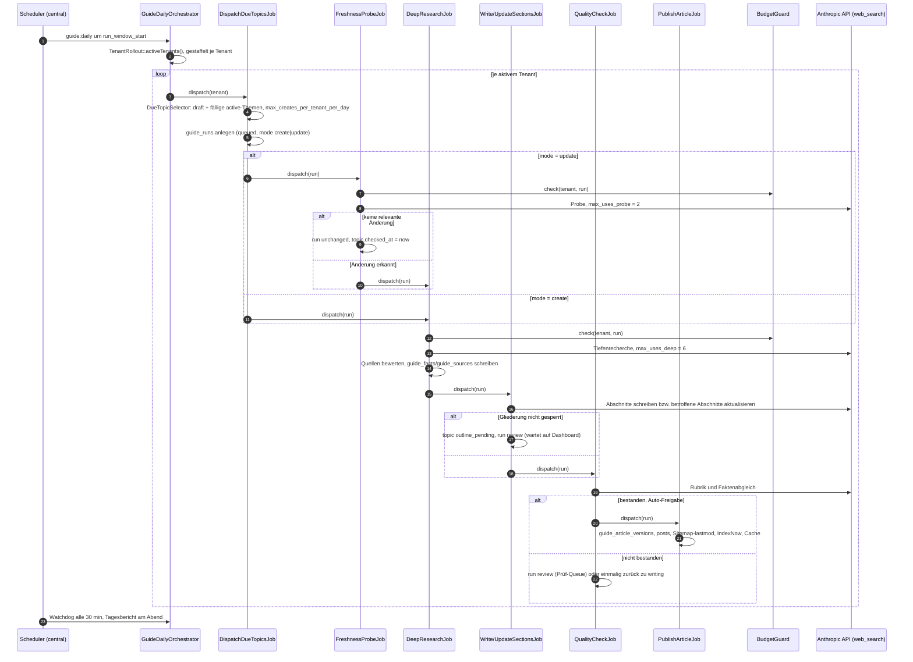

# Themengetriebenes Ratgebersystem — Architektur, Rückbau und Kosten

Status: **Architektur-Freeze, Freigabe durch Uwe ausstehend**
Ticket: SUN-RG-001 (#2)
Stand: 2026-09-21

Dieses Dokument löst `docs/content-pipeline.md` (SUN-RC) als maßgebliche Architektur ab.
Die alte Pipeline suchte sich ihre Themen selbst (Quellen, Scoring, Tagesauswahl) und
schrieb jeden Tag neue Artikel. Das neue System arbeitet eine **feste, importierte
Themenliste** ab: Jedes Thema bekommt einmal einen Artikel entlang einer gesperrten
Gliederung und wird danach regelmäßig auf Aktualität geprüft und abschnittsweise
fortgeschrieben.

Alle Folgetickets (#3–#21) verwenden die hier festgelegten Modulgrenzen, Enums, Tabellen,
URLs und Budgets. Abweichungen brauchen ein eigenes Ticket.

Ticketzuordnung: SUN-RG-*n* entspricht Ticket #*n+1* (SUN-RG-002 = #3, SUN-RG-018 = #19).

---

## 1. Modulstruktur

Neuer Code lebt ausschließlich unter `app/Guide/`. `app/Content/` wird nicht mehr
erweitert; was daraus übernommen wird, bleibt bis zum Rückbau (#19) an seinem Ort und wird
von `app/Guide/` aus direkt benutzt. #19 verschiebt die überlebenden Bausteine per
Namespace-Umzug ohne Logikänderung nach `app/Guide/` und löscht danach `app/Content/`.
So läuft die alte Pipeline bis zur Abschaltung unverändert weiter.

```
app/Guide/
├── Enums/          TopicStatus, RunStatus, RunMode (final, §3); weitere nur additiv
├── Models/         Topic, OutlineSection, Run, Fact, Source, ArticleVersion (Tenant)
│   └── Central/    TopicList, TopicListItem, SourcePolicy
├── Import/         TopicImporter, CsvReader, XlsxReader, PasteReader, PlaceholderResolver   (#6)
├── Llm/            GuideLlmClient: Web-Search, strukturierte Ausgabe, Kostenbuchung     (#5)
├── Research/       FreshnessProbe, DeepResearch, SourceRater, FactSetBuilder             (#8)
├── Scheduling/     DueTopicSelector, ChangeDetector, AffectedSectionsResolver            (#9)
├── Writing/        OutlineProposer, SectionWriter, SectionUpdater, FaqWriter,
│                   ShortAnswerWriter, MetaWriter, ChangelogWriter, HtmlAssembler         (#10)
├── Quality/        GuideQualityGate (SEO-Lint, Faktenabgleich, Link-Check, Rubrik)       (#11)
├── Publishing/     Publisher, VersionStore, RollbackService                               (#12)
├── Orchestration/  GuideDailyOrchestrator, RunWatchdog, GuideDailyReport                 (#13)
├── Jobs/           die sieben Kettenglieder (§2)
├── Dto/            ProbeResult, FactSet, OutlineDto, SectionDraft, QualityVerdict
├── Support/
└── Exceptions/
```

Außerhalb von `app/Guide/`, analog zum Rest der Anwendung:

| Ort | Inhalt |
|---|---|
| `config/guide.php` | Modell, Web-Search, Budgets, Zeitfenster, Schalter, Queues, Resilienz |
| `app/Filament/Content/` | Panel `content` (bleibt), Seiten des Dashboards (#14–#16) |
| `app/Console/Commands/Guide/` | Befehle mit Präfix `guide:` (`guide:daily`, `guide:import`, `guide:run --topic=`) |
| `resources/views/ratgeber/` | Frontend-Templates (#17), übernommene Partials |
| `database/migrations/` / `database/migrations/tenant/` | Tabellen nach §4 (#3) |
| `deploy/supervisor/guide-{research,write,publish}.conf` | Worker für die `guide-*`-Queues (#13) |

**Regeln** (übernommen aus SUN-RC, weil sie sich bewährt haben):

* Jobs enthalten keine Fachlogik. Sie laden den Lauf, rufen genau einen Service und
  schreiben den Folgestatus über `canTransitionTo()`.
* Kein Service spricht selbst HTTP. Jeder externe Aufruf geht durch einen Provider-Client
  mit Budget-Guard, Retry und Circuit Breaker (§6).
* Services sind zustandslos und werden per Container injiziert.
* Nicht übernommen wird alles, was zur **Themenfindung** gehört: Quell-Connectoren,
  Themen-Scoring, Keyword-/SERP-APIs, Trends, Reserve-Kandidaten (entfernt mit #23). Themen
  kommen ausschließlich über den Import (#6).

---

## 2. Job-Kette

```
DispatchDueTopicsJob → FreshnessProbeJob → ┬→ DeepResearchJob → WriteArticleJob   ┬→ QualityCheckJob → PublishArticleJob
                                           └→ DeepResearchJob → UpdateSectionsJob ┘
```

| Job | Queue | Läuft je | Tut | RunStatus danach |
|---|---|---|---|---|
| `DispatchDueTopicsJob` | `guide-dispatch` | Tenant | wählt fällige Themen (#9), legt je Thema einen `guide_runs`-Eintrag an | `queued` |
| `FreshnessProbeJob` | `guide-research` | Lauf | nur `update`: Kurzrecherche, max. 2 Suchen, vergleicht mit dem Fakten-Set | `unchanged` oder `researching` |
| `DeepResearchJob` | `guide-research` | Lauf | Tiefenrecherche, max. 6 Suchen, Quellenbewertung, neues Fakten-Set (#8) | `writing` |
| `WriteArticleJob` | `guide-write` | Lauf | `create`: Gliederung vorschlagen/verwenden, alle Abschnitte, FAQ, Kurzantwort, Meta (#10) | `checking` (oder `review`, solange die Gliederung nicht gesperrt ist) |
| `UpdateSectionsJob` | `guide-write` | Lauf | `update`: nur betroffene Abschnitte, Changelog-Eintrag (#10) | `checking` |
| `QualityCheckJob` | `guide-write` | Lauf | SEO-Lint, Faktenabgleich, Link-Check, Rubrik (#11) | `published`-Freigabe, `review` oder einmalig zurück zu `writing` |
| `PublishArticleJob` | `guide-publish` | Lauf | neue Artikelversion, Post, Sitemap-lastmod, IndexNow, Cache (#12) | `published` |

Weichen:

* **Neues Thema** (`draft`, keine veröffentlichte Fassung): Lauf mit `RunMode::CREATE`,
  die Probe entfällt, der Lauf beginnt mit `researching`.
* **Veröffentlichtes Thema**: Lauf mit `RunMode::UPDATE`. Findet die Probe keine relevante
  Änderung, wird der Modus `unchanged`, der Lauf endet mit `RunStatus::UNCHANGED` und
  nur das Geprüft-Datum am Thema wird fortgeschrieben.
* **`force_rewrite = true`**: Erkennt die Probe eine Änderung, wird der Modus auf
  `create` gehoben und der ganze Artikel entlang der gesperrten Gliederung neu
  geschrieben (`WriteArticleJob` statt `UpdateSectionsJob`).
* **Gliederung**: `WriteArticleJob` schlägt beim ersten Lauf die Gliederung vor. Mit
  `auto_lock_outline = false` geht das Thema auf `outline_pending`, der Lauf auf
  `review`; nach dem Sperren im Dashboard setzt er mit `review → writing` fort. Mit
  `auto_lock_outline = true` wird sofort gesperrt und das Thema `active`.

Verdrahtung wie in SUN-RC bewährt: **kein `Bus::chain()`**. Jeder Job persistiert den
Zielstatus und stößt dann seinen Nachfolger an. Ein gescheiterter Lauf reißt so keine
anderen Themen mit, und jeder Schritt ist aus der Datenbank heraus wiederaufsetzbar.
Job-Eigenschaften: `$tries = 1` (Wiederholungen macht der Provider-Client),
`ShouldBeUnique` auf `run_id`, Tenant-Kontext über `tenant_id` am Lauf.

### Umgesetzt in #8: Aktualitätsrecherche

* `App\Guide\Jobs\FreshnessProbeJob` (nur `update`): `queued → probing`; `changed = false`
  und `confidence ≥ guide.research.probe_confidence_min` (0,7) → Modus und Status
  `unchanged`, `last_checked_at`, `next_due_at` (+ Prüfabstand), `facts_hash`, keine weiteren
  LLM-Aufrufe. Sonst `researching` und `DeepResearchJob`. Ohne Fakten-Set entfällt die Probe.
* `App\Guide\Jobs\DeepResearchJob`: `queued|researching → researching`, Fakten-Set, dann
  `writing` und Event `App\Guide\Events\ResearchCompleted` — den Schreib-Job hängt #10 per
  Listener daran. Ohne belegten Fakt → `failed`.
* Fachlogik in `App\Guide\Research\ResearchService`; Quellen: `SourceEvaluator`
  (Blacklist → verworfen, Whitelist → deren Stufe, sonst `guide.research.trust_patterns`,
  sonst `other`; die Selbstauskunft des Modells zählt nicht); Speichern: `FactStore`
  (versioniert, siehe Klassenkommentar); Hash: `FactsHasher`.
* Belegt wird ein Fakt nur durch eine Quelle der Stufe `official|trade|press`, deren URL in
  den Suchergebnissen des Laufs stand. Quellen älter als `stale_after_months` (24) nur ohne
  neuere Alternative (`guide_facts.stale_source`). Mehrere Werte je Schlüssel: höhere Stufe,
  dann neueres `published_at`; Protokoll in `research_json.conflicts[]`, Verworfenes in
  `research_json.rejected[]`.
* Web-Search: `allowed_domains` = Whitelist, wenn sie ≥ `allowed_domains_min` (10) Domains
  hat, sonst nur `blocked_domains` = Blacklist.
* Fehler: Budget (Tag/Tenant) → `release()` nach einer Stunde, Lauf-Budget und alles andere
  → `failed` mit `guide_alert` `run_failed`.
* Einzeln ausführen: `php artisan guide:research {id|slug} --tenant= [--deep] [--replace]`.

### Umgesetzt in #9: Fälligkeit und Änderungserkennung

* `App\Guide\Scheduling\DueTopicSelector::select($date)` (Tenant-Kontext): `Topic::due()` bis
  Tagesende (`guide.timezone`), ohne Themen mit heutigem Lauf. Reihenfolge: ohne Artikel
  zuerst, dann `priority` aufsteigend (1 = höchste, 0 = ohne Angabe zuletzt), dann ältestes
  `last_checked_at`. Neuanlagen höchstens `max_creates_per_tenant_per_day` (heutige
  create-Läufe zählen mit). Reicht das Tagesbudget (Tenant: `tenant_guide_settings.daily_budget_usd`
  bzw. Vorgabe, und gesamt) nicht, laufen Themen ohne Artikel und `priority` 1 bis
  `guide.schedule.preferred_priority_max` (2) zuerst. Schätzung: `guide.estimates.create_usd`
  bzw. `check_usd`. `defer($selection)` setzt `next_due_at` der übrigen auf morgen und
  schreibt je Tenant und Tag einen `guide_alert` `topics_deferred` (`context_json.topics`
  für den Tagesbericht, #13). Ergebnis: `App\Guide\Dto\DueSelection`.
* `Topic::due($at)`: Status `draft|active`, `consecutive_failures` <
  `guide.schedule.max_consecutive_failures` (5), `next_due_at` erreicht; ohne `next_due_at`
  sofort, wenn kein Artikel oder nie geprüft, sonst `last_checked_at` + Prüfabstand
  (`refresh_interval_days` bzw. Vorgabe).
* Fehlgeschlagener Lauf (`HandlesGuideRun::failRun` → `Topic::recordFailure()`):
  `consecutive_failures + 1`, `next_due_at` = morgen 00:00; ab 5 in Folge wird ein aktives
  Thema `paused` und ein `guide_alert` `topic_paused` entsteht. „Fortsetzen“ im Dashboard
  setzt den Zähler zurück. Erfolgreicher Lauf: `next_due_at` = Laufdatum + Prüfabstand.
* `App\Guide\Research\ChangeDetector` (aus `ResearchService::deepResearch()`): vergleicht das
  Fakten-Set vor und nach der Tiefenrecherche auf Normalform (`FactNormalizer`: Zahlenformat,
  Einheiten, Spannen, Whitespace; `1.500 €` = `1500 Euro`). `FactStore` vergleicht ebenso,
  reine Schreibvarianten erzeugen also keine neue Faktversion. Ergebnis
  (`App\Guide\Dto\ChangeSet`) → `research_json.changed_facts[]`,
  `research_json.change_detection`, `guide_topic_runs.changed_section_ids_json`.
* `App\Guide\Research\SectionFactMap` in `guide_article_details.section_fact_map_json`:
  `sections` (Abschnitt → `used_fact_keys`, schreibt der Writer #10 über `withSection()`),
  `key_facts`, `assigned`. Geänderte Fakten ohne Abschnitt gehen in die Key-Facts-Tabelle und
  per `structured()` (`guide.assign_facts`) in den thematisch nächsten Abschnitt; die
  Zuordnung wird gespeichert. Scheitert der Aufruf, bleibt es bei der Key-Facts-Tabelle
  (`change_detection.assignment_error`).
* RunMode: `create` ohne Artikel; `unchanged` ohne geänderten Fakt (Lauf
  `researching → unchanged`); sonst `update` mit den betroffenen Abschnitten.
  **`force_rewrite = true`** überspringt die Probe und erzwingt `update` für alle Abschnitte,
  unabhängig vom Hash (weicht bewusst von „auf create heben“ oben ab, Ticket #9).

### Umgesetzt in #10: Artikel-Writer

* Jobs (Queue `guide-write`): `ProposeOutlineJob` (je Thema, ohne Lauf), `WriteArticleJob`
  (`create`) und `UpdateSectionsJob` (`update`), beide `writing → checking` und danach Event
  `App\Guide\Events\ArticleWritten` (Schlüssel + `versionId`) für das Qualitätsgate #11.
  Fachlogik in `App\Guide\Writing\ArticleWriter`; Bausteine `OutlineService`, `SectionWriter`,
  `KeyFactsBuilder`, `ShortAnswerWriter`, `FaqWriter`, `MetaWriter`, `ChangelogWriter`,
  `HtmlAssembler`, `InternalLinkResolver`, `FactMentions`, `WritingContext`.
* Listener (registriert in `ContentServiceProvider`, `app/Guide/Listeners` liegt außerhalb der
  Event-Discovery): `TopicCreated` mit `outline_pending` → `ProposeOutlineJob`;
  `ResearchCompleted` → Write/Update je Modus; `OutlineLocked` → Läufe in `review` ohne Fassung
  gehen `review → writing` weiter (`rewrite` hebt `update` auf `create`).
* Gliederung: 4–7 H2, je H2 höchstens 4 H3 (`guide.writing.outline`); die ids vergibt der Code.
  Ohne Sperre wird nie geschrieben; mit `auto_lock_outline` sofort gesperrt und `active`,
  sonst `outline_pending` und Lauf `review`. `store()` wirft bei gesperrter Gliederung.
* `body_html`: Segmente `<hN id="…">Text aus outline_json</hN>` + Abschnitts-HTML. Die H2/H3
  setzt nur der `HtmlAssembler`; jede H2 beginnt mit `<p><strong>Fazit-Satz</strong></p>`
  (Feld `summary_sentence`). Whitelist `guide.writing.allowed_tags`, externe Links nur auf
  `guide_sources`-URLs mit `rel="noopener"`, interne nur auf Ziele des `InternalLinkResolver`.
  `HtmlAssembler::violations()` prüft vor dem Speichern Überschriften, Tags/Attribute und
  Fazit-Sätze; Verstoß → Lauf `failed`.
* Update: `HtmlAssembler::replace()` übernimmt alle nicht betroffenen Segmente als Bytefolge.
  Neu geschrieben werden nur `changed_section_ids_json` (Modell sagt `changed=false` → Segment
  bleibt) und Abschnitte, die im Bestand fehlen. Key-Facts nur für geänderte Schlüssel;
  Kurzantwort, FAQ, Titel und Meta nur, wenn ihr Text den alten Wert eines geänderten Fakts
  nennt (`FactMentions`, Normalform `FactNormalizer`). Changelog-Eintrag
  `{date, summary, changed_section_ids, source_urls, source}`, ein Satz je Änderung, jüngster
  zuerst; `summary` auch in `guide_topic_runs.change_summary`.
* Links: CTA-Ziel aus `category_cta_mapping_json[kategorie-slug].url` zuerst, dann `/firmen`,
  größte Stadtseite, `/kategorien` — mindestens `guide.writing.links.min_portal` (2); dazu bis zu
  `max_related` (3) veröffentlichte Themen derselben Kategorie. Verteilung auf die H2, fehlende
  Ziele hängt `HtmlAssembler::ensureLinks()` an den Abschnitt an.
* Titel ≤ 60 (`posts.title` = `meta_title`), Meta-Description ≤ 155; das laufende Jahr steht im
  gespeicherten Titel als `{{year}}`.
* Ergebnis ist eine `guide_article_versions`-Zeile; seit Migration
  `2026_09_22_000010_add_draft_columns_to_guide_article_versions_table` mit `short_answer`,
  `meta_title`, `meta_description`, `changelog_json` (vollständige Liste) und
  `section_fact_map_json`. `posts`/`guide_article_details` schreibt der Publisher (#12).
  Protokoll des Schreibschritts in `research_json.writing` (u. a. `edited_sentences`).
* Fehler (Schema, Budget jeder Stufe, Regelverstoß) → `failed` mit `error`,
  `consecutive_failures + 1` (Schreib-Jobs überschreiben `releaseOnBudget()` mit `false`).
  Erfolg: `consecutive_failures = 0`, `next_due_at` = heute + Prüfabstand.

### Umgesetzt in #11: Qualitätsgate

* Kette: `ArticleWritten` → Listener `CheckQualityOnArticleWritten` → `App\Guide\Jobs\QualityCheckJob`
  (Queue `guide-write`, unique je Lauf **und** Fassung). Fachlogik in
  `App\Guide\Quality\QualityGate`, Bausteine `Linter`, `FactChecker`, `LinkChecker`,
  `RubricEvaluator`, `ReadabilityScorer`; Regeln und Gewichte in `config/guide_lint.php`.
* Prüfungen: (1) Lint über den ganzen Artikel — Titel 20–60 und Meta-Description 100–155 Zeichen
  (gerendert, `{{year}}` ersetzt), keine H1 im `body_html` (die H1 ist der Titel),
  H2/H3 = gesperrte `outline_json`, Fazit-Satz je H2, FAQ 4–6, Kurzantwort, ≥ 2 interne Links,
  Tag-Whitelist, bei `is_ymyl` Pflicht-Disclaimer (Muster `guide_lint.ymyl_disclaimer.patterns`);
  (2) Faktenabgleich über den ganzen Artikel inkl. Kurzantwort, FAQ, Meta und Key-Facts: Zahlen
  (deutsches Format, Einheiten, Prozente, „Mio.“) und Daten (`TT.MM.JJJJ`, `1. März 2026`,
  `MM/JJJJ`, `März 2026`) gegen `is_current`-Fakten (Wert, `valid_from`, Veröffentlichungsdatum
  der Quelle), Toleranz 2 %; Jahreszahlen, Aufzählungen/Ordinalia, Zählungen < 13 ohne Einheit
  und Kennungen (`DIN`, `§`, …) ausgenommen. Status `belegt|gerundet|widerspruch|unbelegt`;
  `widerspruch` = Wert eines abgelösten Fakts bzw. Key-Facts-Zeile ≠ aktueller Fakt
  (`FactNormalizer`); (3) Link-Check aller `guide_sources` des Themas und externer Links im Text
  per HEAD (5 s, GET-Nachfrage bei 403/405/501, Cache 6 h): 4xx/5xx setzt
  `guide_sources.broken_at` (Migration `2026_09_22_000011_…`) und blockiert, solange die Quelle
  einen aktuellen Fakt belegt oder verlinkt ist; ein späterer OK-Check leert `broken_at`;
  Zeitüberschreitung = Warnung; (4) Rubrik `guide.quality_rubric` (Version 2): `create` ganzer
  Artikel, `update` nur `research_json.writing.changed_section_ids` + fehlende Abschnitte +
  im Fix-Durchlauf nachgebesserte + neu geschriebene Kurzantwort/FAQ/Meta; ohne geänderten Teil
  entfällt die Rubrik. Lesbarkeit Flesch-Amstad, Ziel ≥ 50, nie blockierend.
* `guide_topic_runs.quality_report_json`: `version_id`, `mode`, `checked_at`, `is_ymyl`,
  `threshold`, `final_score`, `scores{lint,fact,rubric,readability}`, `decision`, `fix_runs`,
  `blocking_issues[]` (`source`, `code`, `section_id`, `message`, `fixable`), `lint[]`
  (`rule`, `passed`, `blocking`, `fixable`, `message`, `section_id`), `fact_check[]` (`wert`,
  `fact_key`, `status`, `section_id`, `sentence`, `fact_value`), `link_check[]` (`url`,
  `source_id`, `status`, `code`, `referenced`, `blocking`, `message`), `rubric` (`scope`,
  `section_ids`, `score`, `per_criterion`, `blocking_issues`, `fix_instructions`, `template`),
  `readability`, `fix_plan`, nach einem Fix-Durchlauf `previous`. `quality_score` = gerundeter
  `final_score` (gewichtet: Rubrik 60, Fakten 20, Lint 15, Lesbarkeit 5 %).
* Entscheidung: **publish** nur ohne blockierenden Befund und mit `final_score` ≥
  `tenant_guide_settings.auto_publish_threshold` (ohne Wert 80, YMYL 90) → Lauf bleibt
  `checking`, Event `App\Guide\Events\ArticleApproved` für den Publisher (#12). **fix**, wenn
  noch kein Fix-Durchlauf lief und alle blockierenden Befunde nachbesserbar sind →
  `checking → writing`, `FixSectionsJob` → `ArticleWriter::fix()` bessert nur die Teile aus
  `fix_plan` nach (Abschnitte über `guide.fix_section`, Kurzantwort/FAQ/Meta/Key-Facts neu),
  neue Fassung, `writing → checking`, erneut Gate. **review** sonst (auch nach dem Fix-Durchlauf,
  bei kaputter Quelle, Gliederungs- oder Tag-Verstoß). Das Gate schreibt nie in `posts`: eine
  durchgefallene Aktualisierung lässt die veröffentlichte Fassung unverändert online.
* Nach dem Deploy: `php artisan tenants:migrate --force` und
  `php artisan db:seed --class=GuidePromptTemplateSeeder`.

### Umgesetzt in #13: Tages-Orchestrator

* Befehle: `php artisan guide:daily [--tenant= --date= --stage=dispatch|watchdog|report --sync --now --no-mail --mail-to= --json]`
  und `php artisan guide:run {topic} --tenant= [--topic=…] [--force] [--json]`. `--force` führt die ganze
  Kette sofort im selben Prozess aus (Queue-Verbindung `sync`) und setzt einen heute begonnenen,
  nicht beendeten Lauf fort; ein heute beendeter Lauf bleibt beendet (ein Lauf je Thema und Tag).
* Scheduler (`routes/console.php`, `guide.timezone`, alle mit `withoutOverlapping()->onOneServer()`):
  `--stage=dispatch` um `guide.run_window_start`, `--stage=watchdog` alle
  `guide.orchestrator.watchdog.every_minutes` (10), `--stage=report` um `guide.orchestrator.report_at` (20:00).
* `App\Guide\Orchestration\DailyOrchestrator`: je Tenant mit `tenant_guide_settings.is_active` ein
  `App\Guide\Jobs\DispatchDueTopicsJob` (Queue `guide-dispatch`); jeder Tenant in eigenem try/catch.
  Der Job wählt über `DueTopicSelector`, legt je Thema den Lauf des Tages an (Unique-Index, bei
  Kollision wird der bestehende genommen) und setzt nicht beendete Läufe des Tages fort (außer `review`).
  Staffelung: `delay = Fensterlänge / Anzahl * Index + Zufallsversatz je Tenant`; Fenster aus
  `tenant_guide_settings.run_window_start/end`, sonst config; vor Fensterbeginn ab Fensterbeginn, nach
  Fensterende (manuell) sofort.
* `App\Guide\Jobs\TopicChainFactory`: Einstieg nach Status (queued → Probe bzw. Tiefenrecherche,
  probing/researching/writing/checking → Job dieses Status, Fix-Durchlauf und freigegebene Fassung
  berücksichtigt), `Bus::chain([$job])->catch()` setzt den Lauf bei endgültigem Scheitern auf `failed`.
  Die Folgeglieder stoßen weiter die Jobs/Listener selbst an (Verzweigungen). Doppelte Jobs verhindert
  die vorab belegte `ShouldBeUnique`-Sperre (`uniqueFor` = 1 h + Verzögerung). `RunRequested` startet
  über `StartChainOnRunRequested` die Kette (Dashboard „Jetzt ausführen“).
* Parallelität: `App\Guide\Jobs\Middleware\LimitGuideConcurrency` (Redis-Funnel) um alle Jobs mit
  Modellaufruf, `guide.concurrency.per_tenant` (3) und `total` (12); ohne freien Platz `release()`.
  HTTP 429 → `release()` mit exponentiellem Backoff (`guide.concurrency.rate_limit_backoff`);
  Provider-Ausfall (toter Zugang, 5xx, Verbindungsfehler) ebenso, plus Alarm `provider_down` — beides
  zählt nicht als Fehlschlag des Themas.
* `App\Guide\Orchestration\RunWatchdog`: In-Flight-Läufe mit `updated_at` älter als
  `guide.schedule.stuck_after_minutes` (20) werden neu angesetzt (Alarm `run_stuck`, `occurrences` =
  Neuansätze); nach `guide.orchestrator.watchdog.max_restarts` (2) → `failed`. Ist die Unique-Sperre
  belegt, wartet der Job nur (Budget, 429, Funnel) und zählt nicht. Alarm `failure_rate`, wenn mehr als
  10 % der Läufe eines Tenants am Tag fehlschlugen.
* Tagesbericht: `App\Guide\Orchestration\DailyReportBuilder` → central `guide_daily_reports`
  (Migration `2026_09_22_000013_…`, Modell `App\Guide\Models\Central\GuideDailyReport`, für das
  Dashboard #16), Mail `App\Guide\Mail\DailyGuideReport` an `users.guide_role = owner` (nicht gesperrt).
  Je Tenant: geprüft, unverändert, aktualisiert, neu, review, fehlgeschlagen, verschoben, offen, Kosten;
  dazu alle Alarme des Tages (budget_exceeded, provider_down, topic_paused, failure_rate, run_stuck, …).
* Worker: `deploy/supervisor/guide-research.conf` (4), `guide-write.conf` (4), `guide-publish.conf`
  (1, zusätzlich `guide-dispatch`); Task `deploy:supervisor-content`, Horizon `supervisor-guide-*`,
  `artisan:queue:restart` nach jedem Deploy.
* Nach dem Deploy: `php artisan migrate --force` (central, `guide_daily_reports`).

### Umgesetzt in #16: Dashboard (Heute, Prüfung, Verlauf, Einstellungen, Kosten)

* Seiten unter `app/Guide/Filament`, im `ContentPanelProvider` ausdrücklich registriert
  (ersetzt die Platzhalter aus #14): `Pages\DailyRunMonitor` (Heute, Startseite `/content`),
  `Resources\ReviewRunResource` (Prüfung, `/content/pruefung/{tenant}-{lauf}`),
  `Pages\ArticleVersions` (Verlauf › Versionen, `?thema=`), `Pages\Costs` (Verlauf › Kosten,
  nur Inhaber), `Pages\TenantGuideSettings` (Einstellungen › Portal, nur Inhaber),
  `Resources\PromptTemplateResource` (Einstellungen › Prompts, bestehender Editor auf `guide.%`).
* Zahlen: `Services\RunOverviewService` (je Portal über `$tenant->run()`, nur Aggregate, 60 s
  Cache, `forget()` nach Entscheidungen); Polling 15 s nur im Laufzeitfenster oder solange
  Läufe unterwegs sind. Kosten ausschließlich aus `llm_usage_logs` (`Services\CostReport`).
* Prüf-Queue (`Services\ReviewService`): *Freigeben* → `PublishArticleJob` mit der jüngsten
  Fassung des Laufs; *Mit Hinweis neu schreiben* → `review → writing`,
  `UpdateSectionsJob(..., fixInstructions:)` → `ArticleWriter::revise()` (Fix-Weg, nur die
  Abschnitte des Laufs); *Verwerfen* → `failed` mit Grund, veröffentlichte Fassung bleibt.
  Wer entschieden hat, steht in `research_json.review`. Diff abschnittsweise über die
  Abschnitts-ids (`HtmlAssembler::split()` + `ArticleDiffRenderer`).
* Rollback (`Services\VersionHistory`) ruft `GuidePublisher::rollback()`, nur auf Fassungen
  mit `published_at` (ein Prüf-Entwurf kann die Prüfung nicht umgehen), mit Bestätigung.
* Vorschau: Route `guide.preview` (`/ratgeber/fassung/{version}` auf der Portaldomain),
  signiert über `Support\GuidePreviewLink`, Middleware `EnsureContentPreviewAccess`
  (eigener Guard `content` existiert nicht, Panel-Guard ist `web`), View `guide.show` mit
  `GuidePageData::previewArticle()`, noindex.

### Sequenzdiagramm des Tageslaufs



Neue Läufe werden nur zwischen `run_window_start` und `run_window_end` angestoßen
(Vorgabe 02:00–07:00 Europe/Berlin). Läufe, die bei Fensterende noch in der Kette stecken,
laufen zu Ende. Ist das Budget erschöpft, werden kostenpflichtige Jobs mit Alarm
zurückgestellt (`release`), nicht abgebrochen; der Lauf holt im nächsten Fenster nach.

---

## 3. Status-Enums (final)

Diese drei Enums sind verbindlich. Folgetickets dürfen keine eigenen Statuswerte für
Themen oder Läufe einführen. Statuswechsel gehen ausschließlich über `canTransitionTo()`.

### `App\Guide\Enums\TopicStatus`

| Wert | Bedeutung | Erlaubte Folgezustände |
|---|---|---|
| `draft` | importiert, noch keine gesperrte Gliederung | `outline_pending`, `active`, `archived` |
| `outline_pending` | Gliederung vorgeschlagen, wartet auf Sperre im Dashboard | `active`, `draft`, `archived` |
| `active` | Gliederung gesperrt, wird geschrieben bzw. regelmäßig geprüft | `paused`, `archived` |
| `paused` | vorübergehend aus dem Tageslauf genommen, Artikel bleibt online | `active`, `archived` |
| `archived` | aus dem System genommen; Artikel wird nach #12 zurückgezogen | `draft` |

### `App\Guide\Enums\RunStatus`

| Wert | Bedeutung | Erlaubte Folgezustände |
|---|---|---|
| `queued` | angelegt vom Dispatcher | `probing`, `researching`, `failed` |
| `probing` | Freshness-Probe läuft | `researching`, `unchanged`, `failed` |
| `researching` | Tiefenrecherche läuft | `writing`, `failed` |
| `writing` | Schreiben oder Abschnittsaktualisierung läuft | `checking`, `review`, `failed` |
| `checking` | Qualitätsgate läuft | `published`, `review`, `writing`, `failed` |
| `review` | wartet im Dashboard (Gliederung oder Prüf-Queue) | `writing`, `published`, `failed` |
| `published` | neue Version veröffentlicht | — (terminal) |
| `unchanged` | Probe ohne relevante Änderung | — (terminal) |
| `failed` | Retries erschöpft oder abgelehnt, Alarm gesetzt | — (terminal) |

`probing`, `researching`, `writing`, `checking` sind In-Flight-Zustände
(`isInFlight()`); hängt ein Lauf länger als `guide.schedule.stuck_after_minutes` darin,
meldet der Watchdog ihn. Ein Neustart ist immer ein neuer Lauf, damit die Kosten je Lauf
sauber bleiben. Der Rücksprung `checking → writing` ist auf einen Nachbesserungsversuch je
Lauf begrenzt (#11).

### `App\Guide\Enums\RunMode`

| Wert | Bedeutung | Erlaubter Wechsel |
|---|---|---|
| `create` | Tiefenrecherche + ganzer Artikel | — |
| `update` | Probe, bei Änderung Tiefenrecherche + betroffene Abschnitte | `unchanged` (Probe ohne Befund), `create` (`force_rewrite`) |
| `unchanged` | Ergebnis einer Probe ohne Änderung | — |

---

## 4. Tabellenverantwortung: Central vs. Tenant

Regel aus SUN-RC bleibt: **Was der Betreiber mandantenübergreifend steuert, liegt central.
Was zum Inhalt eines Mandanten gehört, liegt beim Tenant.** Neue Tabellen tragen das
Präfix `guide_`. Spalten und Indizes legt #3 fest.

### Central (`database/migrations/`)

| Tabelle | Zweck | Herkunft |
|---|---|---|
| `guide_topic_lists` | importierte Themenlisten (Name, Branche, Quelle) | neu (#3/#6) |
| `guide_topic_list_items` | Themen-Vorlagen mit Platzhaltern (`{branche}`, `{leistung}`), Kategorie-Name | neu |
| `guide_topic_list_tenant` | Zuweisung Liste → Tenant | neu |
| `guide_source_policies` | Quellen-Whitelists und -Gewichte je Branche (#7/#8) | neu |
| `prompt_templates` | Prompts und Styleguides, neue Stufen mit Präfix `guide.` | übernommen |
| `llm_usage_logs` | Kosten je Aufruf, `operation` mit Präfix `guide.`, `reference_type = guide_run`; Spalte für Web-Search-Anzahl ergänzt #5 | übernommen |
| `provider_states` | Circuit Breaker und Budget-Pause je Provider | übernommen |
| `content_alerts`, `content_daily_reports` | Alarme und Tagesbericht | übernommen, Umbau #13 |

Budget und Kosten liegen central, weil das Tagesbudget eine globale Größe ist; eine
Prüfung über 23 Tenant-Datenbanken wäre zu teuer.

### Tenant (`database/migrations/tenant/`)

| Tabelle | Zweck | Herkunft |
|---|---|---|
| `guide_topics` | Thema des Mandanten (aus Listen-Item aufgelöst): Status, Slug, Kategorie, gesperrte Gliederung, `next_probe_at`, `checked_at`, `published_version_id`, `post_id` | neu |
| `guide_outline_sections` | feste Gliederung je Thema (Schlüssel, H2, Reihenfolge, Sperre) | neu |
| `guide_runs` | ein Lauf je Thema und Anlass: Modus, Status, Kosten, Fehler, Zeitstempel je Schritt | neu |
| `guide_facts` | Fakten-Set je Thema, versioniert je Lauf, Bezug auf Abschnitte | neu, ersetzt `fact_snippets` |
| `guide_sources` | bewertete Quellen je Lauf/Fakt | neu, ersetzt `draft_sources` |
| `guide_article_versions` | jede veröffentlichte oder geprüfte Fassung (HTML je Abschnitt, FAQ, Meta, Changelog) — Grundlage für Diff und Rollback | neu, ersetzt `article_drafts` |
| `post_categories` | Ratgeber-Kategorien; der Import legt fehlende automatisch an | übernommen, Erweiterung in #3 |
| `posts` | Frontend-Tabelle des Portals; der Publisher schreibt die aktuelle Version hinein | übernommen |
| `tenant_content_settings` | Rollout-Schalter `is_active`, Autor, Styleguide-Overrides | übernommen, Themenfindungs-Spalten fallen in #19 |

Entscheidung **Frontend liest weiter `posts`**: Sitemap, Feed, `llms.txt`, Suche,
Verwaltung und `PublicBlogController` hängen an `posts`. Die Historie lebt in
`guide_article_versions`, die aktuelle Fassung wird bei jeder Veröffentlichung und jedem
Rollback in den verknüpften Post geschrieben. Das hält #17 und #18 klein und lässt
handgeschriebene Beiträge aus der Verwaltung unberührt.

### 4.1 Umgesetzte Tabellen (#3)

Die Ticketfassung von #3 präzisiert die Namen aus der Tabelle oben; maßgeblich ist ab
jetzt diese Liste. Migrationen:
`database/migrations/2026_09_22_000001_create_guide_central_tables.php`,
`database/migrations/tenant/2026_09_22_000002_create_guide_tables.php`,
`database/migrations/tenant/2026_09_22_000003_add_guide_columns_to_articles_table.php`.

| Oben genannt | Umgesetzt | Modell |
|---|---|---|
| `guide_topic_lists`, `guide_topic_list_items` | unverändert; #6 ergänzt `guide_topic_list_items.outline_json` (vorgegebene Gliederung) und `question_normalized` (Duplikaterkennung) | `App\Guide\Models\Central\TopicList`, `TopicListItem` |
| `content_alerts` (Umbau #13) | eigene Tabelle `guide_alerts` | `App\Guide\Models\Central\GuideAlert` |
| `prompt_templates`, `llm_usage_logs` | bestehen; die Migration legt sie nur an, falls sie fehlen, und entfernt sie in `down()` nie | `App\Content\Models\Central\*` |
| `guide_topic_list_tenant` | angelegt mit #6 (`2026_09_22_000006_add_import_columns_to_guide_topic_lists.php`), `last_assigned_at` je Zuweisung | `TopicList::tenants()` |
| `guide_source_policies` | **noch nicht angelegt** — Quellenregeln je Branche zu #7/#8; je Portal gibt es `tenant_guide_settings.source_whitelist_json`/`source_blacklist_json` | — |
| `guide_topics` | unverändert; Gliederung als `outline_json` statt eigener Tabelle `guide_outline_sections` | `App\Guide\Models\Topic` |
| `guide_runs` | `guide_topic_runs`, Unique auf (`guide_topic_id`, `run_date`) | `App\Guide\Models\TopicRun` |
| `guide_facts`, `guide_sources` | unverändert, je Thema (nicht je Lauf) | `Fact`, `Source` |
| `guide_article_versions` | unverändert, zusätzlich `guide_topic_id` für Fassungen vor dem ersten Post | `ArticleVersion` |
| — | `guide_article_details` (1:1 zu `posts`: Kurzantwort, FAQ, Key-Facts, Changelog, Geprüft-/Änderungsdatum) | `ArticleDetail` |
| `post_categories` | eigene Tabelle `guide_categories`; `posts.category_id` wird über gleichen Slug weiter belegt | `Category` |
| `tenant_content_settings` | eigene Tabelle `tenant_guide_settings` (Seeder `TenantGuideSettingSeeder`) | `TenantGuideSetting` |

Festlegungen:

* `guide_topics.outline_json`:
  `[{id: 's1', level: 2, heading: '…', children: [{id: 's1-1', level: 3, heading: '…'}]}]`.
  Die `id` ist stabil und adressiert abschnittsweise Updates
  (`guide_topic_runs.changed_section_ids_json`) und HTML-Anker.
* `guide_topics.slug` ist je Tenant eindeutig und nach der Anlage unveränderlich
  (`Topic::booted()` wirft beim Ändern eine `LogicException`).
* `guide_topics.facts_hash` = `sha1` über die sortierten Tupel
  (`key`, `value`, `unit`, `valid_from`) aller `is_current`-Fakten
  (`Topic::calculateFactsHash()`).
* `Topic::due($at)`: Status `draft` oder `active` und `next_due_at` leer oder erreicht
  (seit #9 zusätzlich Fehlerzähler und Prüfabstand, siehe §2 „Umgesetzt in #9“).
  `Topic::active()`: Status `active`.
* `guide_sources.trust_level`: `official|trade|press|other` (`App\Guide\Enums\TrustLevel`).
* `tenant_guide_settings`: `is_active` Vorgabe `false`, `auto_publish_threshold` 80,
  bei YMYL 90. Leere Werte bei `daily_budget_usd` und `run_window_start/end` bedeuten
  Vorgabe aus `config/guide.php`.
* `guide_topics.list_item_id` zeigt in die Central-DB und hat keinen Fremdschlüssel.
  Beim Löschen eines Posts werden `guide_topics.article_id` und
  `guide_article_versions.article_id` geleert, `guide_article_details` gelöscht.

### 4.2 Reale Spalten der Artikel-Tabelle `posts`

Ausgelesen per `Schema::getColumns('posts')` in der Tenant-DB
`9ef0044c-5467-4b64-843e-1efff72fd4d8` am 2026-09-21, vor #3. Angelegt von
`database/migrations/tenant/2026_03_04_000003_create_blog_tables.php`, Modell
`App\Models\Portal\Post`.

| Spalte | Typ | Null | Vorgabe | Belegung durch `App\Guide\Services\ArticleMapper` |
|---|---|---|---|---|
| `id` | bigint unsigned | nein | auto | — |
| `title` | varchar(255) | nein | — | Titel der Fassung |
| `slug` | varchar(255), unique | nein | — | Slug des Themas, bei Kollision mit Zähler; bei Updates unverändert |
| `excerpt` | text | ja | — | Kurzantwort, sonst gekürzter Fließtext (297 Zeichen) |
| `body` | longtext | nein | — | `body_html` der Fassung |
| `featured_image` | varchar(255) | ja | — | nicht belegt, Titelbild kommt mit #20 |
| `category_id` | bigint unsigned, FK `post_categories` | ja | — | `post_categories` mit gleichem Slug wie die Ratgeber-Kategorie, sonst leer |
| `author_id` | bigint unsigned (Central-`users`) | nein | — | `config('content.publishing.author_user_id')`, nur beim Anlegen |
| `status` | varchar(20) | nein | `draft` | `published` beim Anlegen |
| `published_at` | timestamp | ja | — | Zeitpunkt der Erstveröffentlichung, bei Updates unverändert |
| `meta_title` | varchar(255) | ja | — | Meta-Titel, sonst Titel |
| `meta_description` | varchar(500) | ja | — | Meta-Beschreibung, sonst Anrisstext (155 Zeichen) |
| `reading_time_minutes` | smallint unsigned | nein | 0 | `Post::calculateReadingTime()` (das Modell rechnet nur beim Update nach) |
| `view_count` | int unsigned | nein | 0 | — |
| `created_at`, `updated_at` | timestamp | ja | — | Eloquent |

Indizes: `slug` unique, `status`, `published_at`, `author_id`, `category_id` (FK),
Volltext über `title`, `body`.

Ergänzt durch #3 (beide nullable, `nullOnDelete`, handgeschriebene Beiträge bleiben leer):
`guide_topic_id` → `guide_topics.id`, `guide_category_id` → `guide_categories.id`.

---

## 5. URL-Struktur

| URL | Inhalt | Ticket |
|---|---|---|
| `/ratgeber` | Übersicht mit Kategorien | #17 |
| `/ratgeber/{kategorie}` | Kategorieseite | #17 |
| `/ratgeber/{kategorie}/{thema}` | Artikel | #17 |
| `/ratgeber/feed`, `/ratgeber/suche`, `/ratgeber/redaktion`, `/ratgeber/vorschau/{…}` | bleiben | — |
| `/sitemap-ratgeber.xml` | Artikel und Kategorien mit `lastmod` = letzte inhaltliche Änderung | #18 |

> **Umgesetzt in #17 (abweichend von der Tabelle oben, Vorgabe der Ticketfassung #17):**
> `guide.index` `/ratgeber`, `guide.category` `/ratgeber/kategorie/{slug}`, `guide.show`
> `/ratgeber/{slug}` — die bisherigen Pfade bleiben, es gibt heute keine 301. Die Routennamen
> `portal.blog.index|category|show` heißen seitdem `guide.*`. Portale ohne veröffentlichte
> Ratgeber-Kategorie bekommen auf Übersicht und Kategorie weiter die Blog-Seiten des
> `PublicBlogController`. Seiten-Cache: `App\Guide\Support\GuidePageCache` (Tag
> `<tenant>.guide`), der Publisher (#12) ruft nach jeder Veröffentlichung/jedem Rollback
> `GuidePageCache::flush()`. Ob die verschachtelte Form `/ratgeber/{kategorie}/{thema}` noch
> kommt, entscheidet #18.

> **Entscheidung #18:** Die URL-Struktur aus #17 bleibt (`/ratgeber/kategorie/{slug}`,
> `/ratgeber/{slug}`); die verschachtelte Form kommt nicht, es gibt keine Massen-301.
> Weiterleitungen gibt es nur einzeln über `guide_redirects`
> (`App\Guide\Models\Redirect`): ein geänderter Kategorie-Slug legt sie automatisch an
> (`Category::booted`, Ketten werden verkürzt, Schleifen verhindert), zusammengelegte
> Altartikel per `Redirect::record($alt, $neu, Redirect::REASON_ARTICLE_MERGE)`.
> `App\Guide\Http\Middleware\HandleGuideRedirects` liegt auf `guide.category` und
> `guide.show` und greift nur, wenn die Route 404 liefert — vor der 404-Seite, nie über
> einer bestehenden Seite; die Query wandert mit.
>
> SEO-Dateien (#18):
> * `/sitemap-ratgeber.xml` (Route `guide.sitemap`) liefert `App\Guide\Seo\GuideSitemapGenerator`
>   dynamisch aus dem `GuidePageCache` (1 h); `GenerateTenantSitemapJob` und
>   `tenants:generate-sitemap` nehmen sie in den Sitemap-Index auf. Enthalten: Übersicht,
>   Redaktionsseite, sichtbare Kategorien mit mindestens `GuideController::MIN_INDEXABLE_TOPICS`
>   Artikeln, alle veröffentlichten Beiträge; lastmod = `content_changed_at`.
> * `/llms.txt` (`LlmsTxtBuilder`, text/plain, 1 h): Ratgeber-Abschnitt je sichtbarer Kategorie
>   (`### Name`), Zeilen `- [Frage](URL): Kurzantwort` aus `guide_topics.question` und
>   `guide_article_details.short_answer`; Beiträge ohne sichtbare Kategorie unter
>   „Weitere Ratgeber“.
> * `GuidePageCache::flush()` verwirft Seiten, Sitemap und llms.txt in einem Schritt; der
>   Publisher (#12) muss nur diese eine Methode rufen. Jede Änderung an einer Kategorie
>   ruft sie ebenfalls.
> * robots.txt: `App\Services\RobotsTxtBuilder` (bestehende Regeln plus KI-Crawler-Gruppe)
>   schreiben jetzt Job **und** Befehl.
> * `<x-guide.related :category="…"/>` (`App\View\Components\Guide\Related`): drei zuletzt
>   inhaltlich geänderte Artikel. Zuordnung über `category_cta_mapping_json` rückwärts: passend
>   sind die Ratgeber-Kategorien, deren CTA-`url` auf `/kategorien/{portal-slug}` zeigt. Ohne
>   Portal-Kategorie (Stadtseite ohne Filter) alle sichtbaren Kategorien; Portal-Kategorie ohne
>   Zuordnung zeigt nichts.

* Slugs von Kategorien und Themen sind je Tenant eindeutig und ändern sich nach der ersten
  Veröffentlichung nicht mehr. Reserviert (nie Kategorie-Slug): `feed`, `suche`,
  `redaktion`, `vorschau`, `kategorie`, `tag`.
* Alte Adressen leiten mit 301 um (#18/#19):
  `/ratgeber/kategorie/{slug}` → `/ratgeber/{slug}`, alte Artikel `/ratgeber/{slug}` →
  `/ratgeber/{kategorie}/{slug}`. Auflösung von `/ratgeber/{x}`: erst Kategorie, dann
  alter Artikel-Slug (301), sonst 404.
* `lastmod`, Stand- und Geprüft-Datum: `unchanged`-Läufe setzen nur das Geprüft-Datum,
  nie `lastmod` — sonst meldet die Sitemap Änderungen, die es nicht gibt.

> **Umgesetzt in #12 (Publisher):** `App\Guide\Jobs\PublishArticleJob` (Queue `guide-publish`,
> Listener `PublishOnArticleApproved` auf `ArticleApproved`; die Prüf-Queue #16 dispatcht den Job
> direkt) ruft `App\Guide\Publishing\GuidePublisher::publish($run, $version)`. Eine Transaktion
> auf der Tenant-Verbindung: Fassung (`VersionStore::markPublished`: `article_id`, `published_at`)
> → `posts` (`ArticleMapper`) → `guide_article_details` (`published_version_id`) → Thema
> (`article_id`, `last_checked_at`, `draft` → `active`) → Lauf (`published`, `publish_json`).
> * Aktion `create` ohne Post zum Thema (Slug vom Thema, `published_at` = jetzt), `update` bei
>   vorhandenem Post — auch einem per Slug-Übernahme verknüpften Altartikel ohne Details; Slug,
>   Autor, Status und `published_at` bleiben. `unchanged`, wenn der Fingerabdruck
>   (`VersionStore::fingerprint`: Titel, Meta, Kurzantwort, Body, FAQ, Key-Facts) der
>   veröffentlichten Fassung gleicht: nur `last_checked_at`, die Fassung bleibt ohne `published_at`.
> * `content_changed_at` (dateModified, Sitemap-lastmod) setzen `create`, `update` und ein
>   inhaltlich wirksamer Rollback; `last_checked_at` jeder erfolgreiche Lauf — Läufe ohne
>   Änderung über `GuidePublisher::markChecked()` aus `FreshnessProbeJob`/`DeepResearchJob`.
> * Danach immer `GuidePageCache::flush()` (Seiten, Sitemap, llms.txt des Tenants, keine globale
>   Leerung) und bei `create`/`update`/Rollback IndexNow (`App\Guide\Publishing\IndexNowClient`,
>   gleiche HMAC-Ableitung wie SUN-RC-020, `/<key>.txt` über `IndexNowKeyController`). Gemeldet
>   wird der Artikel, bei `create` zusätzlich Kategorie und Übersicht. Fehler werden geloggt
>   (`Ratgeber: IndexNow …`) und in `publish_json.indexnow` protokolliert, nie geworfen.
> * `GuidePublisher::rollback(Post, ArticleVersion, ?note)` kopiert die alte Fassung als neue
>   Nummer (`change_summary` „Rollback auf Version n“) und schreibt Inhalt, Meta, Kurzantwort,
>   FAQ, Key-Facts, Changelog und SectionFactMap zurück. Braucht den Tenant-Kontext.
> * `php artisan guide:versions:prune [--tenant=] [--keep=] [--dry-run]` (täglich 01:50) hält je
>   Artikel höchstens `guide.publishing.keep_versions` (30) Fassungen; die erste und die
>   veröffentlichte bleiben immer. Migration
>   `2026_09_22_000012_add_publishing_columns_to_guide_tables`.

---

## 6. Provider, Retry, Circuit Breaker

Beibehalten je externem Provider (Anthropic, fal.ai, IndexNow):

* **Retry:** 3 Versuche, exponentiell (2 s → 6 s → 18 s) plus Jitter; nur 429, 5xx und
  Verbindungsfehler. Werte in `config('guide.resilience.retry')`.
* **Circuit Breaker:** nach 5 Fehlern in Folge `provider_states.status = open` für
  15 Minuten; Jobs werden released statt zu scheitern.
* **BudgetGuard:** vor jedem kostenpflichtigen Aufruf; Grenzen aus `config('guide.budget')`,
  gezählt über `llm_usage_logs` mit `operation LIKE 'guide.%'`. Die globale Grenze der alten
  Pipeline (`content.budget.daily_usd`) zählt weiterhin alles und bleibt bis #19 die
  äußere Notbremse.
* **Web-Search:** serverseitiges Werkzeug `web_search_20260209` mit `max_uses` aus
  `guide.web_search.max_uses_probe` bzw. `max_uses_deep`. Fehler kommen als HTTP 200 mit
  Fehlerobjekt im `web_search_tool_result` und müssen dort ausgewertet werden (#5).
  Umgesetzt in `App\Guide\Llm\LlmClient::research()` (#5): erster Turn mit
  `tool_choice = auto`, beide Werkzeuge (`web_search`, `emit`) in `tools[]`; `pause_turn`
  wird mit der Teilantwort fortgesetzt (höchstens `guide.anthropic.max_continuations`);
  ruft das Modell `emit` nicht selbst, wird es im selben Verlauf erzwungen. Quellen kommen
  aus den `web_search_tool_result`-Blöcken (url, title, page_age), Suchfehler werden
  geloggt. `llm_usage_logs` trägt je HTTP-Anfrage `guide_topic_id`, `template_key` und
  `search_count`; `cost_usd` enthält die Suchen (0,01 USD je Suche). Das Guide-Budget
  pausiert `provider_states` nicht, sondern wirft `BudgetExceededException` und legt einen
  `guide_alert` (`budget_exceeded`, je Tag und Bereich einer) an; der Tag läuft nach
  `guide.timezone`. Diagnose: `php artisan guide:llm:ping`.

---

## 7. Security: Zugangsdaten und Panel

### API-Keys nur über `.env`/config

* Alle Zugangsdaten stehen ausschließlich in `.env` und werden nur in `config/guide.php`
  gelesen (`env('ANTHROPIC_API_KEY')` ohne Vorgabewert). Im Code nur `config('guide.…')`.
* Keine Keys in der Datenbank, in Panel-Feldern, Livewire-Payloads, Blade-Views oder Logs.
  Konfigurierbar im Panel sind Budgets, Zeitfenster, Schalter, Prompts, Whitelists — nie
  Credentials.
* Treiber (#42, Vorgabe Enes 21.09.2026, hebt die frühere Festlegung „nur API“ auf):
  `GUIDE_LLM_DRIVER=cli` (Vorgabe) ruft das Modell über die Claude-CLI mit dem Abo auf
  (`App\Guide\Llm\ClaudeCliTransport`), `api` über die Messages API. Beim Treiber `cli`
  bucht das Kosten-Log `total_cost_usd` der CLI als rechnerischen Betrag, damit Budget
  und Kostenabgleich weiter greifen; `llm_usage_logs.driver` weist den Treiber aus.
  Die Recherche nutzt die Websuche der CLI (nur `WebSearch`/`WebFetch`, sonst keine
  Werkzeuge). Die Zitate sind die Treffer der tatsächlich ausgeführten Suchen, gelesen
  aus dem `stream-json`-Verlauf; so bleibt die Prüfung `not_in_search_results` wirksam.
  Suchgrenze und Domainlisten stehen im Prompt, Treffer außerhalb der Domainlisten
  fallen aus den Zitaten. Token, Binary und HOME kommen aus `config('guide.cli')`,
  `ANTHROPIC_API_KEY` wird dem Prozess entzogen.

### Panel `content`: eigene Zugangsgrenze, Guard `web`

Das Ticket verlangt die Entscheidung „eigener Guard“. Festgelegt wird:

* Das Dashboard bleibt das **eigene Filament-Panel `content`** unter
  `<CENTRAL_DOMAIN>/content`, nie auf einer Portaldomain.
* **Kein separater Auth-Guard.** Das Panel meldet sich über den SaaSykit-Login an
  (Guard `web`, `App\Models\User`); die Zugangsgrenze ist
  `App\Models\User::canAccessPanel()` für die Panel-ID `content` — nur `is_admin`, nie
  gesperrte Konten, sonst HTTP 403.
* Begründung: Der eigene Guard samt Tabelle `content_users` wurde bereits eingeführt und
  mit Commit `5d41ba9` bewusst zurückgebaut, weil ein zweiter Satz Zugangsdaten dazu
  führte, dass niemand hineinkam. Die Tabellen sind gedroppt. Ein erneuter Wechsel würde
  alle Admins aussperren und bestehende Sessions brechen. Die fachliche Absicht — kein
  Portal-Nutzer kommt ins Dashboard — ist über die eigene Panel-ID und `canAccessPanel()`
  erfüllt.
* #14 baut auf diesem Stand auf („umbauen aus SUN-RC-003“), nicht auf einem neuen Guard.
  Soll doch ein eigener Guard her, ist das ein eigenes Ticket mit Migrationsplan für die
  Konten. **Diese Abweichung vom Ticketwortlaut braucht Uwes Freigabe.**
* Umsetzung #14: Rollen über `users.guide_role` (`App\Guide\Enums\GuideRole`): `owner`
  darf alles inkl. Einstellungen und Kosten, `editor` Themen und Prüfung. Administratoren
  ohne eigene Rolle gelten als `owner`. `php artisan guide:user:create <email> [--role=]`
  legt ein Konto ohne `is_admin` und ohne Tenant an (oder setzt die Rolle eines
  bestehenden). `/content/login` leitet auf den SaaSykit-Login weiter (2FA/Captcha
  greifen) und danach zurück ins Panel.

---

## 8. Kostenmodell

### Preise (Anthropic-Preisliste, abgerufen 2026-09-21)

Quelle: <https://platform.claude.com/docs/en/about-claude/pricing>

| Posten | Preis |
|---|---:|
| `claude-sonnet-5` Input | 2,00 USD / 1 Mio. Tokens |
| `claude-sonnet-5` Output | 10,00 USD / 1 Mio. Tokens |
| Cache-Write 5 min / 1 h | 2,50 / 4,00 USD / 1 Mio. Tokens |
| Cache-Read | 0,20 USD / 1 Mio. Tokens |
| Web-Search | 10,00 USD / 1.000 Suchen (= 0,01 USD je Suche), Suchergebnisse zusätzlich als Input-Tokens |
| Web-Fetch | ohne Aufpreis, nur Tokens |
| Batch API | 50 % Rabatt (für die Kette nicht genutzt, siehe Hebel) |

Die 2/10-USD-Preise für Sonnet 5 waren zum Start als Einführungspreis bis 31.08.2026
angekündigt; laut Preisliste sind sie jetzt der Standardpreis, die geplante Erhöhung auf
3/15 USD entfällt. Hinterlegt in `config('guide.pricing')`.

### Token-Annahmen je Schritt

Tokenzahlen sind Schätzungen auf Basis der gemessenen SUN-RC-Läufe (~0,21–0,26 USD je
Artikel bei 10–11 Aufrufen, #14) und müssen nach den ersten 50 Läufen gegen
`llm_usage_logs` nachgezogen werden. Sonnet 5 zählt rund 30 % mehr Tokens als Sonnet 4.6;
das ist eingerechnet. Suchergebnisse sind mit ~5.000 Tokens je Suche angesetzt, dazu das
erneute Lesen des Kontexts je Suchrunde.

| Schritt | Input | Output | Suchen | Rechnung | USD |
|---|---:|---:|---:|---|---:|
| Freshness-Probe | 22.000 | 1.500 | 2 | 0,044 + 0,015 + 0,020 | **0,079** |
| Tiefenrecherche | 90.000 | 6.000 | 6 | 0,180 + 0,060 + 0,060 | **0,300** |
| Schreiben (Gliederung, ~8 Abschnitte, FAQ, Kurzantwort, Meta) | 110.000 (40 % frisch, 60 % Cache-Read, 8.000 Cache-Write) | 18.000 | — | 0,088 + 0,013 + 0,020 + 0,180 | **0,301** |
| Qualitätsgate nach Neuanlage | 25.000 | 3.000 | — | 0,050 + 0,030 | **0,080** |
| Abschnittsupdate (~2 von 8 Abschnitten, Changelog) | 35.000 (14.000 frisch, 21.000 Cache-Read, 6.000 Cache-Write) | 4.000 | — | 0,028 + 0,004 + 0,015 + 0,040 | **0,087** |
| Qualitätsgate nach Update | 20.000 | 2.000 | — | 0,040 + 0,020 | **0,060** |

### Kosten je Lauf und je Thema

Aufschlag 15 % für Retries und Nachbesserungen im Qualitätsgate.

| Lauf | Schritte | Netto | inkl. 15 % |
|---|---|---:|---:|
| `create` (einmalig je Thema) | Tiefenrecherche + Schreiben + Gate | 0,681 | **0,783** |
| `unchanged` | Probe | 0,079 | **0,091** |
| `update` | Probe + Tiefenrecherche + Abschnittsupdate + Gate | 0,526 | **0,605** |
| Erwartungswert je Prüfung | 90 % unchanged, 10 % update | 0,124 | **0,142** |

Die Änderungsquote von 10 % je Prüfung ist eine Annahme; sie ist der zweitgrößte
Kostentreiber und wird im Tagesbericht (#13) als Kennzahl geführt. Titelbild (#20,
einmal je Thema, fal.ai) ist kein Anthropic-Posten und hier nicht enthalten; nach
`config('content.providers.images.fal.pricing.per_image')` liegt es im Cent-Bereich.

Laufende Kosten je Thema und Monat (30 Tage):

| Prüfabstand | Prüfungen/Monat | USD je Thema und Monat |
|---|---:|---:|
| 7 Tage (Vorgabe `probe_interval_days`) | 4,29 | **0,61** |
| 3 Tage | 10 | 1,42 |
| täglich | 30 | 4,27 |

### Szenarien

Tenants: 23 Produktionsportale (Stand 14.09.2026).

| | A: 100 Themen gesamt | B: 100 Themen je Tenant (2.300) |
|---|---:|---:|
| Aufbau einmalig (`create`) | 78 USD | 1.801 USD |
| Laufend, Prüfabstand 7 Tage | **61 USD/Monat** (2,03/Tag) | **1.403 USD/Monat** (46,77/Tag) |
| Laufend, Prüfabstand 3 Tage | 142 USD/Monat (4,74/Tag) | 3.275 USD/Monat (109,17/Tag) |
| Laufend, täglich | 427 USD/Monat (14,24/Tag) | 9.826 USD/Monat (327,52/Tag) |

Folgerung: **Tägliche Prüfung aller Themen ist in Szenario B nicht tragbar.** Der
Tageslauf prüft jeden Tag nur die fälligen Themen; der Regelabstand ist 7 Tage, #9 darf ihn
je Kategorie (Förderung, Recht, Preise) bis auf 1 Tag verkürzen. Die Budgets unten
begrenzen, was dabei tatsächlich ausgegeben wird.

### Tagesbudgets (Festlegung)

| Schlüssel | Wert | Herleitung |
|---|---:|---|
| `guide.budget.daily_usd_total` | **60,00 USD** | B laufend 46,77 USD/Tag + ~28 % Puffer für verkürzte Prüfabstände. In der Aufbauphase deckelt der Wert B auf ~76 Neuanlagen/Tag → Aufbau aller 2.300 Themen in ~30 Tagen, Monat 1 max. 1.800 USD. A läuft darin mit großem Abstand. |
| `guide.budget.daily_usd_per_tenant` | **5,00 USD** | B laufend 2,03 USD je Tenant und Tag; der Rest erlaubt ~3–6 Neuanlagen je Tenant und Tag. Verhindert, dass ein frisch zugewiesener Tenant das Gesamtbudget leert. |
| `guide.budget.max_usd_per_run` | **1,50 USD** | ~2× der erwarteten Neuanlage; greift sie, ist die Prompt-Kette kaputt, nicht das Thema teuer. |
| `guide.schedule.max_creates_per_tenant_per_day` | **5** | Staffelung der Aufbauphase, passt zu 5 USD je Tenant. |
| `guide.budget.warn_threshold` | 0,80 | Warnung im Dashboard und Tagesbericht. |

Monatsobergrenze damit 1.800 USD (60 × 30). Freigabe des Budgets erfolgt im Go-Live (#21);
bis dahin bleibt `tenant_content_settings.is_active` je Portal aus.

### Kostenhebel (nicht Teil des Freeze)

* **Recherche teilen:** Dieselbe Themenvorlage auf mehreren Tenants gleicher Branche
  braucht dieselben Fakten. Eine Probe je Listen-Item statt je Tenant senkt Szenario B
  laufend grob um den Faktor der Mehrfachzuweisung. Entscheidung in #8/#9.
* **Batch API** (−50 %) für die Probe, weil sie nicht zeitkritisch ist; Web-Search in
  Batches vorher prüfen.
* `max_uses_probe = 1` halbiert den Suchanteil der Probe.

---

## 9. Bestand SUN-RC: übernehmen, umbauen, löschen

Stand des Repos 2026-09-21 (Commit `653a080`). „Löschen“ ist mit #23 umgesetzt (Abschnitt
unten), samt Migrationen zum Droppen der Tabellen, Befehlen, Scheduler-Einträgen,
Supervisor-Programmen und Config-Blöcken.

> **Umgesetzt in #19, Teil 1 (Migration der Bestandsartikel):** Altartikel sind Beiträge
> ohne Thema (`posts.guide_topic_id` leer). `php artisan guide:legacy:categorize --tenant=*
> [--smart]` setzt `posts.guide_category_id` auf „Allgemein“ (Slug `allgemein`, wird bei Bedarf
> angelegt) bzw. mit `--smart` auf die per `structured()` und Template `guide.legacy_category`
> gewählte vorhandene Kategorie; Slug, Status und `category_id` bleiben, `/ratgeber/{slug}`
> hängt nicht an der Kategorie. Der Befehl prüft danach je Portal, dass jeder veröffentlichte
> Altartikel eine Kategorie hat und kein Slug von einer festen Seite verdeckt wird.
> `php artisan guide:legacy:overlaps --tenant= [--threshold=60]` vergleicht Themenfrage und
> Titel (`App\Guide\Legacy\LegacyArticleMatcher`: Normalform des `QuestionNormalizer`,
> Mittel aus `similar_text` und Levenshtein-Quote) und schreibt je Paar einen Alarm
> `legacy_overlap` (Stufe `info`, `context_json` mit `can_adopt_slug`/`can_redirect`) in
> `guide_alerts`. Die Entscheidung trifft `App\Guide\Legacy\LegacyOverlapResolver`:
> `adoptSlug()` verknüpft Thema und Altartikel (`guide_topics.article_id`,
> `posts.guide_topic_id`) — nur ohne veröffentlichten Artikel des Themas, der Publisher
> schreibt dann in diesen Beitrag; `redirect()` archiviert den Altartikel und legt die 301
> auf den veröffentlichten Artikel des Themas an (`Redirect::REASON_ARTICLE_MERGE`).
> Der Rückbau (Liste unten) folgte als eigener Pull Request (#23).

### Übernehmen (Logik unverändert, Umzug nach `app/Guide/` in #19)

| Baustein | Ort | Verwendung |
|---|---|---|
| `LlmUsageLog` / `llm_usage_logs` | `app/Content/Models/Central/` | Kostenbuchung (#5) |
| `ProviderState` / `provider_states` | `app/Content/Models/Central/` | Circuit Breaker, Budget-Pause (§6) |
| `ProviderAccountGuard`, `SchemaValidator`, `PromptRenderer`, `LlmContext`, Exceptions | `app/Content/Llm/` | #5 |
| `IndexNowClient` samt `/<key>.txt`-Route und HMAC-Schlüssel | `app/Content/Providers/` | #12 |
| `FalClient` | `app/Content/Providers/` | Titelbild (#20) |
| `SeoLinter`, `LinkChecker`, `ReadabilityScorer`, `config/content_seo_rules.php` | `app/Content/Quality/` | #11 |
| `YmylGuard` | `app/Content/Services/` | Auto-Freigabe-Schwelle (#11) |
| `TenantRollout` + `tenant_content_settings.is_active` | `app/Content/Services/` | gestaffelter Rollout (#21) |
| `ContentTenantContext`, `InitializeContentTenant`, `InteractsWithContentPanel`, `ContentPanelProvider`, `ContentPage`, `TenantSwitcher` | Panel | Grundgerüst (#14) |
| `LlmsTxtBuilder` (`RatgeberSitemapGenerator` ersetzt durch `App\Guide\Seo\GuideSitemapGenerator`, #18), `TocBuilder`, `SlugService`, `ContentPreviewLink` | `app/Content/Services/` | #12, #17, #18 |
| Ratgeber-Partials `toc`, `faq`, `sources`, `changelog`, `jsonld`, `organization-jsonld`, `author`, `cta`, Autorenseite | `resources/views/ratgeber/` | #17 |
| `Withdrawable`-Prinzip (Zurückziehen mit Grund, Person, Zeitpunkt) | `app/Content/Concerns/` | Archivieren eines Themas (#12) |
| Mail-Vorlagen `ContentAlertRaised`, `DailyContentReport` | `app/Content/Mail/` | #13 |

> **Umgesetzt in #35 (Namespace-Umzug, ohne Verhaltensänderung):** Die Bausteine oben liegen
> jetzt unter `app/Guide/`: `App\Guide\Models\Central\{LlmUsageLog,ProviderState,PromptTemplate,ContentAlert}`,
> `App\Guide\Llm\{ProviderAccountGuard,SchemaValidator,LlmContext}`, der alte Vorlagen-Renderer als
> `App\Guide\Llm\TemplateRenderer`, der alte Budget-Guard als `App\Guide\Llm\ContentBudgetGuard`
> (Ausnahmen `Exceptions\ContentBudgetExceededException`, `Exceptions\ProviderAccountException`),
> `App\Guide\Events\ProviderAlarmRaised`, `App\Guide\Mail\ContentAlertRaised`,
> `App\Guide\Services\{ContentTenantContext,TenantRollout,TocBuilder,PortalProfileService,ArticleDiffRenderer}`,
> `App\Guide\Seo\LlmsTxtBuilder`, `App\Guide\Support\{ContentPreviewLink,BranchResolver}`,
> `App\Guide\Http\Middleware\{InitializeContentTenant,EnsureContentPreviewAccess}`,
> `App\Guide\Concerns\InteractsWithContentPanel`, `App\Guide\Livewire\TenantSwitcher` (Livewire-Name
> `content.tenant-switcher` unverändert). Gelöscht, weil seit #23 ohne Aufrufer oder durch
> Guide-Klassen ersetzt: der alte `LlmClient` samt `ClaudeCliTransport` und Befehl `content:llm:ping`
> (Ersatz `guide:llm:ping`), `LlmSchemaException`/`CliStructuredOutputException` der alten Pipeline,
> `YmylGuard` samt `content.topics.ymyl`, der alte `FalClient`, `ImageOptimizer`, `IndexNowClient` und
> `ReadabilityScorer` (Guide hat eigene), `PromptSchemaContract`, `SlugService`, `ProviderQuotaException`,
> die Hilfsklassen `EvidenceMarks`/`GenerationStart`/`PipelineCardKey`/`TextFold`/`UmlautSpelling`,
> `ContentDailyReport`-Modell und `DailyContentReport`-Mail (ersetzt durch `guide:daily --stage=report`),
> der Befehl `content:rollout` (gültiger Schalter: `tenant_guide_settings.is_active`) und
> `config/content_seo_rules.php` (las nur der alte `ReadabilityScorer`; das Ratgebersystem liest
> `config/guide_lint.php`). `config/content.php` enthält nur noch Panel, Budget-Notbremse,
> Search Console/AdSense/Metriken, Alarm-Mail, alte Einstellungsseite und Panel-Farben.
> In `App\Content` bleiben die Leistungsdaten und, bis #34, die Altartikel-Klassen.

### Umbauen

| Baustein | Umbau | Ticket |
|---|---|---|
| `LlmClient`, `BudgetGuard` | Web-Search-Werkzeug, Kosten je Suche, Budget nur `guide.*`; Treiber `cli`/`api` | #5, #42 |
| `ClaudeCliTransport` | bleibt nur für die alte Pipeline; im Ratgebersystem nicht verwendet, entfällt mit #19 | #5/#19 |
| `PromptTemplate` + `PromptTemplateSeeder` | neue Stufen `guide.probe`, `guide.deep_research`, `guide.outline`, `guide.section_write`, `guide.section_update`, `guide.faq`, `guide.short_answer`, `guide.meta`, `guide.changelog`, `guide.rubric` | #7 |
| `docs/styleguides/` | Branchen-Styleguides fürs Ratgebersystem | #7 |
| `OutlineStep`, `SectionStep`, `FaqStep`, `ShortAnswerStep`, `MetaStep`, `FixSectionsStep`, `HtmlAssembler` | arbeiten gegen gesperrte Gliederung und Fakten-Set statt SERP/Snippets; `FixSectionsStep` wird Basis von `SectionUpdater` | #10 |
| `ContextAssembler`, `GenerationContext` | neu gegen `guide_facts`/`guide_outline_sections` | #10 |
| `FactChecker`, `RubricEvaluator` | Abgleich gegen `guide_facts` statt `fact_snippets` | #11 |
| `Publisher`, `ArticleMapper` | schreibt aus `guide_article_versions` in `posts`, Versionierung, Rollback, lastmod nur bei Inhaltsänderung | #12 |
| `ReviewQueueService`, `ArticleDiffRenderer`, `ArticleBlockPresenter`, `QualityReportPresenter` | Prüf-Queue je Lauf, Diff zwischen Versionen | #16 |
| `ContentDailyOrchestrator`, `SlotWatchdog`, `DailyReportBuilder`, `ContentAlert`, `ContentDailyReport` | Tageslauf nach §2, Kennzahlen je Lauf/Modus, Änderungsquote | #13 |
| `TenantContentSetting` | Themenfindungs-Spalten fallen weg | #3/#19 |
| `PortalDataProvider` | Eigendaten des Portals (Betriebe, Bewertungen, gefragte Leistungen) als interne Quelle ins Fakten-Set statt in `fact_snippets` | #8 |
| `InternalLinkResolver` | verwandte Ratgeber über Kategorie/Themenliste statt Embeddings aus `content_fingerprints`; Kategorie- und Stadtseiten-Links bleiben | #10 |
| `ContentPipelineService` | Tenant-übergreifende Lauf- und Artikellisten fürs Dashboard statt Board/Kalender | #16 |
| Panel-Seiten `Overview`, `Review`, `Settings`, Livewire `ReviewQueue`, `ArticleList` | neue Inhalte nach Dashboard-Design | #14–#16 |
| `ratgeber/partials/key-facts` | aus `guide_facts` statt `fact_snippets` | #17 |
| `GenerateAssetsJob` | nur noch Titelbild einmal je Thema, Branchen-Fallback | #20 |
| `deploy/supervisor/content-generate.conf`, `content-publish.conf` | werden zu `guide.conf` mit den `guide-*`-Queues | #13 |
| `config/content.php` | Blöcke für LLM/Budget/Qualität bleiben bis #19, danach nur noch `config/guide.php` | #19 |

### Löschen — umgesetzt in #23

Die Themenfindung und alles, was nur ihr diente, ist entfernt: Quell-Connectoren samt
Registry/Runner und Hilfsklassen, die Clients für Keyword-/SERP-Daten, Bildsuche und
Embeddings, Themen-Scoring, Clusterung, Dublettenprüfung, SERP-Analyse, Fingerprints,
Slot-Planung und Refresh-Loop, die alte Job-Kette (Themenfindung bis Veröffentlichung,
Lernschleife, altes Qualitätsgate, Assets), die alte Generierung (`app/Content/Generation`),
der alte Tages-Orchestrator mit Wachhund und Tagesbericht, der alte Publisher/Mapper, die
Panel-Seiten Übersicht/Produktion/Prüfung/Quellen samt Livewire-Board, -Kalender,
-Artikelliste und -Prüf-Queue, die Entwurfsvorschau `/ratgeber/vorschau/{draft}`, die
Befehle `content:sources:*`, `content:topics:discover`, `content:serp`,
`content:regions:normalize`, `content:draft:generate`, `content:refresh:run`,
`content:publish:due`, `content:learning:run`, `content:daily`, `content:report:daily`,
`content:quality:check`, `content:assets:generate`, `content:golive:check`, die Seeder
`GeoRegionSeeder`/`SeasonalTopicSeeder`/`PromptTemplateSeeder`, `database/data/geo_cities_de.php`,
`config/content_feeds.php`, `config/content_statistics.php`, die Config-Blöcke für
Keyword-/SERP-API, Embeddings, Bildsuche, Trends, Scoring, Refresh und Quellen, die
zugehörigen `.env.example`-Variablen, die Partials `regional-block`/`infographic`, die
Supervisor-Programme `content-sources/-generate/-publish` und die Horizon-Supervisoren
`supervisor-content-*`. Der Metrik-Collector läuft seitdem auf `supervisor-guide-publish`
(Queue `content-metrics`). `spatie/robots-txt` und `symfony/dom-crawler` stehen nicht mehr in
`composer.json` (bleiben transitiv über `spatie/laravel-sitemap`).

Tabellen: `database/migrations/tenant/2026_09_22_000005_drop_legacy_content_pipeline_tables.php`
droppt `fact_snippets`, `topic_candidates`, `keyword_clusters`, `source_items`,
`seasonal_topics`, `geo_regions` (Fremdschlüssel von `article_drafts.topic_candidate_id` und
`draft_sources.source_item_id` fallen, die Spalten bleiben),
`database/migrations/2026_09_22_000014_drop_legacy_content_central_tables.php` droppt
`content_source_settings`, `content_fingerprints`. Beide sichern vorher per
`App\Guide\Legacy\LegacyPipelineBackup` als NDJSON nach
`storage/app/backups/legacy-content/<datum>/` und brechen ohne Sicherung ab; `down()` legt
die Tabellen mit dem alten Schema leer an, `php artisan guide:legacy:backup --restore=<datum>`
spielt die Daten zurück. `posts` wird nie angefasst.

Abweichungen von der ursprünglichen Liste:

* **`article_drafts`/`draft_sources`** blieben zunächst stehen und fallen mit #34 (Teil 3):
  `tenant/2026_09_23_000001` legt `guide_legacy_articles` an (Modell
  `App\Guide\Models\LegacyArticle`, eine Zeile je Altartikel: Body-HTML, Kurzantwort, FAQ,
  Key-Facts, zitierte Quellen, Changelog, Regionalblock/HowTo, Titelbild-Bericht, Meta,
  Backlinks, `content_updated_at` für dateModified/lastmod). `tenant/2026_09_23_000002`
  sichert `article_drafts`, `draft_sources`, `article_metrics` als NDJSON, übernimmt je
  Beitrag die jüngste live stehende Fassung (idempotent über `article_id`, mit Prüfung),
  entfernt `article_metrics.article_draft_id` und droppt beide Tabellen; Rückweg:
  `tenants:rollback`, dann `guide:legacy:backup --restore=<datum> --tables=<tabellen>`.
  `tenant/2026_09_23_000003` entfernt die Themenfindungs-Spalten aus
  `tenant_content_settings`. Mitgelöscht: `DraftStatus`, `DisplayStatus`, `Withdrawable`,
  Events `ContentWithdrawn`/`ContentRepublished`, `BranchKeywordSeeder`. Leser seitdem:
  `GuidePageData`, `PublicBlogController`, `GuideSitemapGenerator`, `LlmsTxtBuilder` über
  `ArticleBlockPresenter`/`ArticleSeoService`.
* **Namespace-Umzug der „Übernehmen“-Bausteine** nach `app/Guide/` ist nicht Teil von #23
  (reiner Refactor, eigener PR): #35.
* Die alte Einstellungsseite (`/content/alt/einstellungen`) bleibt, reduziert auf
  Schwerpunktregion, Autor/Organisation und Search-Console-Property, bis #16 sie ablöst.
* `content:metrics:collect` bleibt eingeplant (06:30); `content:report:daily` ist entfallen,
  den Tagesbericht schreibt `guide:daily --stage=report` (#13).

### Außerhalb des Ratgeber-Kerns

`SearchConsoleClient`, `AdSenseClient`, `CollectArticleMetricsJob`, `ArticleMetric`,
`ArticleMetricRaw`, `PerformanceDashboardService`, Seite `Performance`, Befehle
`content:metrics:*`, `content:gsc:property`: Leistungsdaten der Ratgeber-URLs. Sie bleiben,
bis #16 über eine Leistungsseite entscheidet. Seit #34 hängen die Metrikzeilen nur noch an
`posts.id` (alle veröffentlichten Beiträge unter `/ratgeber/`, Themen wie Altartikel); Titel und
Status kommen aus `posts`, die Region aus `guide_legacy_articles`. Die Refresh-Markierung
(`needs_refresh`) und die Liste „Kandidaten für eine Aktualisierung“ sind mit den
Entwurfstabellen entfallen. Die Search-Console-Rohzeilen, die früher der
Gap-Connector nebenbei ablegte, holt seit #23 der Collector selbst
(`App\Content\Services\SearchConsoleRawFetcher`); die Cluster-Auswertung der Leistungsseite
ist mit der Themenfindung entfallen.

---

## 10. Was dieses Dokument für die Folgetickets festlegt

* **#3** legt die Tabellen nach §4 an, `guide_topics.status`/`guide_runs.status`/`guide_runs.mode`
  als Strings mit den Werten aus `App\Guide\Enums\*`.
* **#5** baut den LLM-Zugang nach §6 mit `config('guide.model')`, `config('guide.web_search')`,
  `config('guide.pricing')`, `config('guide.budget')`.
* **#8/#9/#10/#11/#12** implementieren genau die Jobs aus §2 und setzen Status nur über
  `canTransitionTo()`.
* **#13** plant `guide:daily` im Fenster `guide.run_window_start`–`run_window_end`.
* **#14** baut auf Panel `content`, Guard `web`, `canAccessPanel()` auf (§7).
* **#17/#18** setzen die URL-Struktur aus §5 samt 301-Regeln um.
* **#19/#23** entfernen alles aus §9 „Löschen“ (umgesetzt in #23, Rest `article_drafts` in #34); „Übernehmen“ zieht #35 nach `app/Guide/` um.
* **#21** gibt die Budgets aus §8 frei.
