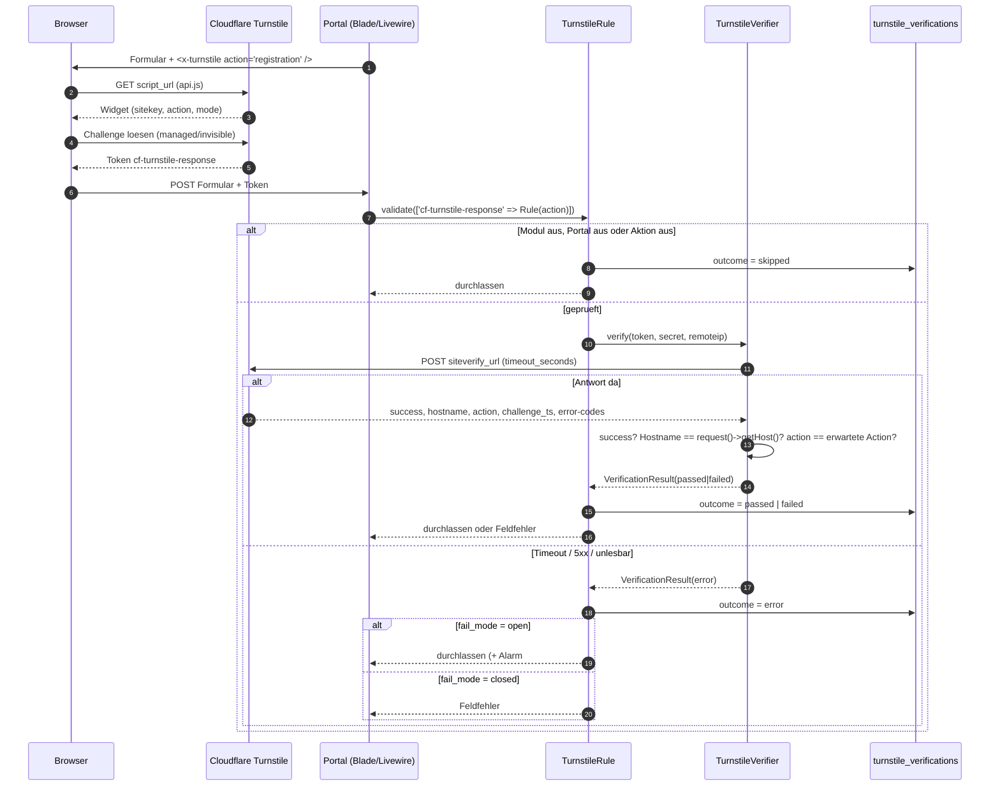

# Cloudflare Turnstile auf den SUN-Portalen

Verbindliche Architektur fuer Epic #1. Dieses Dokument ist die einzige Quelle
fuer Modulgrenzen, Enums, Konfiguration, Widget-Gruppen und Rollout-Reihenfolge.
Alle Folgetickets (#3 bis #13) richten sich danach; Abweichungen gehoeren erst
hier hinein, dann in den Code.

Stand: 08.10.2026. Erstellt in #2.

Durchfuehrung und Abnahme stehen nicht hier, sondern in
`docs/turnstile-golive.md` (Checkliste, gestaffelter Rollout, Notbremse) und
`docs/turnstile-security-review.md` (Befunde und getragene Restrisiken), beide #13.

---

## 1. Analyse: was in den Daten tatsaechlich steht

Ausgewertet wurde read-only per SQL gegen die Produktion (zentrale Datenbank
`sun` und die Tenant-Datenbanken der betroffenen Portale), Zeitraum 30 Tage
(08.09. bis 08.10.2026), zum Vergleich zusaetzlich 90 Tage.

### 1.1 Kennzahlen je Portal, 30 Tage

Registrierungen stehen zentral in `users`, die Portalzuordnung in `tenant_user`.
"ohne DOI" heisst `email_verified_at IS NULL`.

| Portal | Anmeldungen | davon DOI bestaetigt | ohne DOI | Selbsteintragungen | Anfragen | Bewertungen |
|---|---|---|---|---|---|---|
| fahrschulefinder.de | 24 | 8 | 66,7 % | 6 | 0 | 41 |
| elektrikerportal.com | 14 | 8 | 42,9 % | 9 | 728 | 43 |
| sanitaerfinden.com (Tenant 28) | 5 | 1 | 80,0 % | 3 | 0 | 13 |
| sanitaerfinder.com (Tenant 49) | 0 | 0 | – | 0 | 0 | 0 |
| **alle Portale zusammen** | **142** | **44** | **69,0 %** | – | – | – |

Hinweis zur Benennung: Es gibt zwei aehnliche Portale. `sanitaerfinden.com`
(Tenant 28, 19.646 Betriebe) ist das betriebene Portal und zugleich
`CENTRAL_DOMAIN`; `sanitaerfinder.com` (Tenant 49, 7.159 Betriebe) hat bislang
keine einzige Registrierung und keine Selbsteintragung. Das im Ticket genannte
"sanitaerfinder" ist fuer die Analyse als Tenant 28 gelesen worden.

90 Tage zum Vergleich: fahrschulefinder 49 Anmeldungen (36 ohne DOI),
elektrikerportal 33 (23 ohne DOI), sanitaerfinden 13 (8 ohne DOI). Die Zahlen
wachsen gleichmaessig, es gibt keinen Ausschlag.

### 1.2 Was NICHT in den Daten steht

Eine automatisierte Massenregistrierung laesst sich fuer die letzten 30 Tage
**nicht** belegen. Alle klassischen Bot-Merkmale fehlen:

* **Keine Stosszeiten.** Ueber 30 Tage gibt es genau eine Minute mit mehr als
  einer Anmeldung (09.09.2026 14:40, zwei Eintraege mit identischem Namen
  "Robin Ledl" — ein doppelt abgeschicktes Formular). Die Tagesmengen liegen
  zwischen 1 und 10.
* **Keine Wegwerf-Domains.** Haeufigste Mail-Domains: gmail.com 62, gmx.de 10,
  icloud.com 7, web.de 5, dazu rund 40 echte Firmendomains mit je einem
  Eintrag. Kein einziger Treffer auf mailinator, tempmail, guerrillamail,
  10minutemail, yopmail oder Vergleichbares. Ein einzelner mail.ru-Eintrag.
* **Keine Zufallsnamen.** 0 von 142 Namen enthalten eine Ziffer, 0 sind gleich
  der E-Mail-Adresse, 0 enthalten eine URL. 28 sind ein einzelnes
  kleingeschriebenes Wort (ein Vorname — bei einem Pflichtfeld "Name" normal),
  7 laenger als 24 Zeichen (lange, echte Namen).
* **Menschliche Tageskurve.** Anmeldungen zwischen 01 und 22 Uhr UTC mit Gipfel
  08–11 Uhr UTC (10–13 Uhr MESZ). Kein gleichmaessiges Rauschen ueber 24 Stunden.

Die hohe Quote ohne Double-Opt-in (69 %) erklaert sich damit nicht durch Bots,
sondern durch Abbrecher: 97 % der Angemeldeten haben sich mindestens einmal
eingeloggt (`last_seen_at` gesetzt), also war ein Mensch am Formular.

### 1.3 Die Muster, die wirklich da sind

**A) Zweckverfehlte Eintraege bei fahrschulefinder.de.** Alle 6
Selbsteintragungen der letzten 90 Tage sind Privatpersonen, die ihren eigenen
Namen als Firmennamen eingetragen haben — `companies.name` ist identisch zu
`users.name`, und Konto und Eintrag entstehen in derselben Sekunde (das
Eintragsformular legt beides in einem Schritt an). Alle 6 stehen auf
`is_active = 0`, 4 von 6 ohne DOI. Beispiele: "Lara Hartig", "Vilk Jaquelin",
"Mohammed Dereih", "Ahmad Halak", "Fiona Ollári", "Lea Biewald". Das sind
Fahrschueler, die `/eintragen` fuer eine Schueleranmeldung halten. Turnstile
aendert daran nichts — das ist eine Text- und Fuehrungsfrage am Formular
(eigenes Ticket).

**B) Mehrfaches Abschicken ohne Sperre.** sanitaerfinden.com hat am 13.08.2026
zehn identische Eintraege "Gutachten-Franken" (IDs 59417–59426) innerhalb von
23 Sekunden, am 08.10.2026 zwei identische Eintraege "SHI Sanitär Heizung
Installation" innerhalb von 4 Minuten. Turnstile hilft hier teilweise (ein
Token ist einmal verwendbar), die eigentliche Luecke ist eine fehlende
Doppelpruefung beim Anlegen (eigenes Ticket).

**C) Echter Bot-Verkehr existiert — aber auf GET, nicht auf Formularen.**
`tracking_events` ist die einzige Stelle mit IP und User-Agent. Auf
elektrikerportal.com stehen dort 530.152 Ereignisse in 30 Tagen, darunter klar
maschinell:

| User-Agent | Ereignisse | /24-Netze |
|---|---|---|
| `Mozilla/5.0 (compatible; HIMZO-DataQuality/1.0; B2B HR data verification…)` | 24.480 | 1 |
| `Mozilla/5.0` (nackt, ohne alles) | 11.241 | 48 |
| `Mozilla/5.0 (compatible; NoscienceLeadResearch/1.0; …)` | 5.523 | 1 |
| `webapp-mapper-authorized-probe/0.1` | 5.482 | 17 |
| `Mozilla/5.0 (compatible; Google-Apps-Script; beanserver; …)` | 5.048 | 7 |
| `python-httpx/0.28.1`, `Python-urllib/3.x`, `aiohttp`, `axios/1.x` | ~250 | je 1–10 |
| diverse `*LeadResearch/1.0` (Cloppenburger, Vexara, Bilbao, PRYX) | ~70 | je 1 |

Dazu die Netze `47.79.200.0`–`47.79.207.0` (Alibaba Cloud) mit zusammen rund
123.000 Ereignissen, die sich als Android-Chrome ausgeben und je Netz 9.000 bis
10.500 verschiedene Firmenprofile abrufen — ein Scraper, kein Nutzer.

Turnstile schuetzt Formulare, nicht Seitenabrufe. Dieser Verkehr gehoert in die
Cloudflare-WAF bzw. Bot Fight Mode, nicht in dieses Epic (#17). Abgearbeitet in
**docs/bot-traffic.md**: dort stehen die fertigen WAF-Ausdruecke samt Ausnahme
fuer Suchmaschinen und IndexNow, die Entscheidung, dass dieser Verkehr nicht
mehr in die Statistik der Betriebe einfliesst (eine Liste in
`config/antispam.php` `bot_traffic`, ausgewertet von
`App\AntiSpam\Support\BotTraffic`), und die Begruendung der /24-Kuerzung von
`tracking_events.ip_address`.

**D) Anfragen sind unauffaellig.** Die 728 Anfragen auf elektrikerportal.com in
30 Tagen kommen als Kopien aus dem Leadsystem (`lead_uuid`), nicht aus einem
Portalformular. 13 bis 60 pro Tag, hoechstens 3 pro Mailadresse, 105 ohne
Kontaktmail (anonymer Marktplatzweg). Kein Spam-Muster.

### 1.4 Luecken in der Datenlage (Auftrag an #8)

Diese Dinge liessen sich nicht auswerten, weil sie nicht erhoben werden:

* `users` hat **keine IP, keinen User-Agent, keinen Referrer, keine
  Ausfuellzeit**. Die Analyse der Registrierungen stuetzt sich daher allein auf
  Name, Mail-Domain und Zeitstempel. **Die Ausfuellzeit konnte nicht gemessen
  werden** — die Regel "unter 3 Sekunden" in §7 ist deshalb erst ab #8
  anwendbar und wirkt nur nach vorn, nicht auf den Bestand.
* `tracking_events.ip_address` ist auf /24 gekuerzt: in 7 Tagen enden
  221.913 von 221.913 Adressen auf `.0`. Eine ASN-Zuordnung oder ein Limit je
  Einzel-IP ist aus dieser Quelle nicht moeglich; #8 braucht eigenes Logging.
* Eine ASN-Auflistung wurde nicht erstellt, weil nur /24-Netze vorliegen.

### 1.5 Schlussfolgerung

Turnstile wird gebaut — als Vorsorge und als Teil der Tiefenverteidigung, nicht
als Reaktion auf eine laufende Bot-Welle. Daraus folgt fuer die Abnahme:

* **Erfolg wird nicht an "weniger Bot-Registrierungen" gemessen**, sondern an
  DOI-Quote, Doppeleintragsquote und Blockierungsquote (#12). Steigt die
  Blockierungsquote nach dem Rollout ueber 5 %, ist das ein Verdacht auf einen
  Konfigurationsfehler, nicht auf Bots.
* **Fail-Mode open ist Pflicht, nicht Geschmack** (§5). Bei dieser Bedrohungslage
  waere es nicht zu rechtfertigen, einen Cloudflare-Ausfall in einen Ausfall
  aller Registrierungen aller Portale zu verwandeln.
* Die Bestandsbereinigung (#10) findet nach diesen Daten **keine Bot-Accounts**,
  sondern zweckverfehlte Eintraege und Dubletten. Sie muss deshalb
  Quarantaene + menschliche Sichtung sein und darf nichts automatisch loeschen.

---

## 2. Modulstruktur

Alles unter `app/Turnstile/`, nach dem Vorbild von `app/Guide/` und
`app/Content/`: kein Code in `app/Services/`, `app/Rules/` oder `app/Jobs/`.

```
app/Turnstile/
├── Enums/
│   ├── TurnstileAction.php          # registration, company_listing, lead_request, contact
│   ├── TurnstileMode.php            # managed, non_interactive, invisible
│   └── VerificationOutcome.php      # passed, failed, skipped, error
├── Dto/
│   └── VerificationResult.php       # Outcome, Hostname, Action, Fehlercodes, Dauer
├── Services/
│   └── TurnstileVerifier.php        # einziger Siteverify-Aufruf (#4)
├── Rules/
│   └── TurnstileRule.php            # EINZIGE Enforcement-Stelle (#4)
├── Config/
│   ├── TurnstileConfigResolver.php  # Tenant > config > Code-Vorgabe (#3)
│   └── ResolvedTurnstileConfig.php  # fertig aufgeloest, unveraenderlich (#3)
├── Support/
│   ├── TurnstileLogger.php          # schreibt turnstile_verifications (#4)
│   ├── HostnameMatcher.php          # erlaubte Hostnames des Portals (#4)
│   ├── CircuitBreaker.php           # Siteverify-Ausfaelle zaehlen (#4)
│   ├── SiteverifyProbe.php          # Secret mit Dummy-Token pruefen (#9, #14)
│   ├── BotProtectionAccess.php      # wer darf die Admin-Seiten sehen (#9)
│   ├── TurnstileAdminPortal.php     # Portalauswahl im Admin (#9)
│   ├── TurnstileLogConnection.php   # Verbindung `tenant` umhaengen (#9)
│   ├── BotProtectionRecipients.php  # Empfaenger der Alarm-Mails (#12)
│   └── TurnstileStats.php           # eine Aggregation fuer Widget, Monitor, Bericht (#9, #12)
├── Monitoring/
│   ├── VerificationMonitor.php      # stuendliche Pruefung je Portal (#12)
│   ├── VerificationAlert.php        # ein fertig formulierter Alarm (#12, #19)
│   └── DailyReport.php             # Tagesbericht je Portal (#12)
│   # Der Listener liegt ausserhalb des Moduls, damit die Event-Discovery
│   # greift: app/Listeners/Turnstile/AlertOnSiteverifyUnreachable.php (#19)
├── Mail/
│   ├── BotProtectionAlert.php       # Alarm-Mail (#12)
│   └── BotProtectionDailyReport.php # Tagesbericht-Mail (#12)
├── Events/
│   └── SiteverifyUnreachable.php    # Alarm SUN-TS-011 (Listener: #19, s.u.)
├── Models/
│   ├── TenantTurnstileSetting.php   # central, Secret 'encrypted' (#3)
│   └── TurnstileVerification.php    # Tenant-DB, Log je Pruefversuch (#3)
├── View/Components/
│   └── Turnstile.php                # <x-turnstile /> (#5)
└── Exceptions/
    ├── TurnstileException.php
    └── TurnstileNotConfiguredException.php  # kein echter Secret in Produktion (#3)
```

Dazu `app/Turnstile/TurnstileServiceProvider.php` (Bindungen, eingetragen in
`bootstrap/providers.php`).

Artisan-Commands liegen wie im ganzen Repo unter `app/Console/Commands/` und
nicht im Modul — nur dort greift die automatische Erkennung:
`TurnstileVerify.php` (`turnstile:verify`, #4),
`TurnstileKeysCheck.php` (`turnstile:keys:check`, #14) sowie `turnstile:monitor`,
`turnstile:report` und `turnstile:prune` aus #12 (§15).

Dazu:

* `config/turnstile.php` — globale Vorgaben (§6).
* `resources/views/components/turnstile.blade.php` — Markup der Komponente (#5).
* `app/Filament/Admin/…` — Admin bleibt im Filament-Baum (#9), liest aber
  ausschliesslich ueber `TurnstileConfigResolver`, die Models und
  `TurnstileStats`: `Pages/BotProtectionSettings.php`,
  `Resources/TurnstileVerifications/`, `Widgets/BotProtectionStatsWidget.php`
  (§12).

**Regel:** Ausser `TurnstileRule` ruft niemand `TurnstileVerifier` auf. Wer ein
Formular schuetzen will, haengt die Rule an die Validierung — so wie es
`App\Validator\RegisterValidator` heute mit `recaptchaRuleName()` tut. Das hält
die Enforcement an einer Stelle und macht sie testbar.

---

## 3. Ablauf: Widget → Token → Rule → Siteverify → Hostname/Action-Check



Die drei Pruefungen in Schritt "success? Hostname? action?" sind alle drei
Pflicht, und zwar in dieser Reihenfolge:

1. **`success === true`.** Sonst `failed`, Fehlercodes mitloggen.
2. **Hostname.** `response.hostname` muss gleich `request()->getHost()` sein
   (Vergleich kleingeschrieben, ohne Port). **Dieser Vergleich ist der Kern der
   Sicherheit**, weil ein Widget fuer bis zu zehn Portale gilt: ohne ihn liesse
   sich ein auf fahrschulefinder.de erzeugtes Token auf elektrikerportal.com
   einreichen. Abschaltbar nur ueber `turnstile.verify_hostname`, und nur um
   einen Zwischenfall zu entschaerfen.
3. **Action.** `response.action` muss gleich dem Wert der erwarteten
   `TurnstileAction` sein. Verhindert dasselbe zwischen zwei Formularen
   desselben Portals — etwa ein Token aus dem offenen Kontaktformular im
   Registrierungsformular.

Ein Token ist bei Cloudflare einmal verwendbar; ein zweiter Siteverify-Aufruf
mit demselben Token liefert `timeout-or-duplicate`. Das zaehlt als `failed`,
nicht als `error`. Nach jedem `failed` muss das Widget im Frontend
zurueckgesetzt werden (`turnstile.reset()`, #5), sonst kann der Nutzer nicht
erneut abschicken.

### Ausnahme: Hostname und Action mit Testschluesseln

Mit den Cloudflare-Testschluesseln sind die Pruefungen 2 und 3 nicht
durchfuehrbar. Siteverify antwortet dort immer mit `hostname: example.com` und
**ohne** `action`, egal von welcher Domain der Aufruf kam (gegen den lebenden
Endpunkt geprueft, 08.10.2026). Ein Vergleich wuerde auf local und staging
jedes geschuetzte Formular blockieren und nichts belegen. `TurnstileRule`
ueberspringt die beiden Vergleiche deshalb genau dann, wenn
`ResolvedTurnstileConfig::$usesTestKeys` gesetzt ist. In Produktion kann der
Fall nicht eintreten: dort wirft der Resolver bei einem Testschluessel
(§4, `TurnstileNotConfiguredException`).

### Circuit Breaker light

Faellt Siteverify aus, soll nicht jede Anfrage erst `timeout_seconds` warten,
bevor der Fail-Mode greift. `App\Turnstile\Support\CircuitBreaker` zaehlt die
Ausfaelle: nach `circuit_breaker.threshold` (5) Fehlern innerhalb von
`window_seconds` (60) ist der Schalter fuer `cooldown_seconds` (60) offen, der
Verifier ruft gar nicht mehr an und liefert sofort `error` mit dem Code
`siteverify_breaker_open`. Eine erfolgreiche Antwort schliesst ihn sofort.

Der Zaehler liegt im Cache-Store `circuit_breaker.store`, Vorgabe `file` —
bewusst nicht der Standard-Store: in Produktion ist das `database`, und im
Tenant-Kontext zeigt die Standardverbindung auf die Tenant-DB, die keine
`cache`-Tabelle hat. Der file-Store wechselt je Portal
(`App\Listeners\Tenant\SetTenantStorageUrl`), der Breaker zaehlt also je
Portal. Jeder Cache-Zugriff ist gekapselt: ein kaputter Cache darf kein
Formular blockieren.

### Wo das im Code steht (#4)

| Datei | Aufgabe |
|---|---|
| `app/Turnstile/Rules/TurnstileRule.php` | **einzige** Durchsetzung; Konfiguration, Token, Hostname, Action, Fail-Mode, Log |
| `app/Turnstile/Services/TurnstileVerifier.php` | **einziger** Siteverify-Aufruf; Timeout, ein Retry, Breaker |
| `app/Turnstile/Dto/VerificationResult.php` | `success`, `hostname`, `action`, `challenge_ts`, `error-codes`, Dauer, Urteil |
| `app/Turnstile/Support/HostnameMatcher.php` | erlaubte Hostnames eines Portals (Domain + www-Variante + Anfrage-Host) |
| `app/Turnstile/Support/CircuitBreaker.php` | Zaehler und Sperre |
| `app/Turnstile/Support/SiteverifyOutageCounter.php` | Ausfaelle je Portal im 5-Minuten-Fenster, Ruhezeit nach der Meldung (#19) |
| `app/Turnstile/Support/TurnstileLogger.php` | genau eine Zeile je Versuch in `turnstile_verifications` |
| `app/Turnstile/Events/SiteverifyUnreachable.php` | Alarm **SUN-TS-011** |
| `app/Listeners/Turnstile/AlertOnSiteverifyUnreachable.php` | Listener dazu: zaehlt, meldet ab der Schwelle (#19) |
| `app/Turnstile/TurnstileServiceProvider.php` | Bindungen, Resolver-Cache beim Portalwechsel |
| `app/Console/Commands/TurnstileVerify.php` | `turnstile:verify` |
| `lang/de/turnstile.php` | die beiden Meldungen und der Hinweistext |

Zwei Dinge sind im Code festgenagelt, nicht nur in dieser Doku:

* `TurnstileVerifier::verify()` prueft den Aufrufer und wirft eine
  `LogicException`, wenn er nicht aus `TurnstileRule` kommt. Wer ein Formular
  schuetzen will, nimmt die Rule.
* `TurnstileRule` ist eine **implizite** Rule (`public bool $implicit = true`).
  Ohne das ruft Laravel eine Objekt-Rule bei leerem Wert gar nicht auf — ein
  weggelassener Token wuerde die Pruefung umgehen.

---

## 4. Tenant-Konfiguration

> **Korrektur gegenueber dem Freeze aus #2:** zunaechst war `tenants.data`
> vorgesehen. #3 hat stattdessen eine eigene zentrale Tabelle festgelegt, weil
> der Secret je Portal verschluesselt liegen muss (`encrypted` cast) — in
> `tenants.data` waere er im Klartext in jeder Datenbanksicherung. Gleichzeitig
> wanderte das Log in die Tenant-DB (Begruendung unten).

Gespeichert wird in der zentralen Tabelle `tenant_turnstile_settings`, genau
eine Zeile je Tenant (`tenant_id` unique, `cascadeOnDelete`). Fehlt die Zeile,
gilt ausschliesslich `config/turnstile.php` — es gibt keinen Zustand "halb
konfiguriert". Weil die Tabelle central liegt, liest das Admin-Panel (#9) alle
Portale in einer Abfrage, und der Rollout-Schalter braucht keine
Tenant-Migration.

| Spalte | Bedeutung |
|---|---|
| `tenant_id` | unique, Fremdschluessel auf `tenants` |
| `is_enabled` | Rollout-Schalter je Portal, Vorgabe `true` |
| `site_key` | eigenes Widget des Portals; leer = `.env`-Vorgabe |
| `secret_key` | dito, Model-Cast `encrypted`, `$hidden` |
| `fail_mode` | `open`/`closed`; `null` = `config('turnstile.fail_mode')` |
| `actions_json` | je Aktion `{enabled, mode}` |
| `blocklist_domains_json` | portaleigene Mail-Domains zusaetzlich zur netzweiten Wegwerf-Sperrliste (#8 liest, #9 pflegt) |
| `rate_limits_json` | je Aktion `{per_ip_per_hour, per_email_per_day}`; fehlender Schluessel = netzweite Vorgabe aus #8 |
| `updated_by` | `users.id`, wer im Admin (#9) zuletzt gespeichert hat |

```json
{
  "registration":    { "enabled": true,  "mode": "managed" },
  "company_listing": { "enabled": true,  "mode": "managed" },
  "lead_request":    { "enabled": false, "mode": "non_interactive" },
  "contact":         { "enabled": false, "mode": "non_interactive" }
}
```

`rate_limits_json` ist genauso geschnitten, nur mit Zahlen. Gelesen wird es
ausschliesslich ueber `TenantTurnstileSetting::rateLimitsFor()` und
`blocklistDomains()` — dort faellt `0`, leer und Unsinn auf `null`, also auf die
netzweite Vorgabe:

```json
{
  "registration":    { "per_ip_per_hour": 10, "per_email_per_day": 3 },
  "company_listing": { "per_ip_per_hour": 5 }
}
```

Auflösung durch `App\Turnstile\Config\TurnstileConfigResolver::for(TurnstileAction)`,
Ergebnis ist ein unveraenderliches `ResolvedTurnstileConfig`. Rangfolge streng
von oben:

| Wert | 1. Tenant (`tenant_turnstile_settings`) | 2. `config/turnstile.php` | 3. Vorgabe im Code |
|---|---|---|---|
| Modul an | — (nur global) | `enabled` | `true` |
| Portal an | `is_enabled` | — | `true` |
| Aktion an | `actions_json.<action>.enabled` | `actions.<action>.enabled` | `true` |
| Darstellung | `actions_json.<action>.mode` | `actions.<action>.mode` | `TurnstileAction::defaultMode()` |
| Fail-Mode | `fail_mode` | `fail_mode` | `open` |
| Sitekey/Secret | `site_key` + `secret_key` | Paar der Widget-Gruppe zum Hostnamen, sonst `site_key` / `secret_key` (beide aus `.env`, §8) | Testschluessel (nur local/staging) |

Regeln dazu:

* `null` heisst "nicht gesetzt" und faellt eine Stufe weiter. Ein fehlender
  Schluessel verhaelt sich gleich.
* `enabled` ist das UND aus Modul-, Portal- und Aktionsschalter. Ein `false` auf
  irgendeiner Stufe heisst `VerificationOutcome::Skipped`.
* Ein unbekannter Modus faellt auf `managed`, also auf die strengste Variante
  (`TurnstileMode::resolve()`). Ein Tippfehler darf kein Formular oeffnen.
* Sitekey und Secret gelten nur als Paar. Hat ein Portal nur einen der beiden
  Werte, gilt fuer beide die `.env`-Vorgabe — nie ein gemischter Satz.
* Ohne Tenant-Kontext (zentrale Domain, Artisan, Filament-Admin) gilt
  ausschliesslich `config/turnstile.php`.
* **In Produktion** wirft der Resolver `TurnstileNotConfiguredException`, wenn
  die Aktion aktiv ist und kein echter Secret vorliegt — auch dann, wenn noch
  ein Cloudflare-Testschluessel hinterlegt ist (Liste in
  `TurnstileConfigResolver::TEST_SECRET_KEYS`). In local und staging greift
  stattdessen der Testschluessel, damit kein Formular blockiert. `TurnstileRule`
  (#4) fangt die Ausnahme, loggt `Error` und wendet den Fail-Mode an — bis #14
  die Produktionsschluessel liefert, blockiert also nichts.
* Der Secret steht nie im Log, nie in einer Filament-Tabelle (dort nur
  `secretState()`: "gesetzt" / "nicht gesetzt") und nie in `toArray()`.
* Gecacht wird je Request in einer statischen Map (Tenant + Aktion);
  `TurnstileConfigResolver::flush()` nach Aenderungen im Admin und in Tests.

Vorgabezeilen fuer alle bestehenden Portale legt
`Database\Seeders\TenantTurnstileSettingSeeder` an (idempotent):
`php artisan db:seed --class=TenantTurnstileSettingSeeder`.

### Verifikations-Log

Die Tabelle `turnstile_verifications` liegt in der **Tenant-DB**: alle vier
geschuetzten Formulare laufen im Portalkontext, damit wandern die Daten bei
einer Portalabgabe mit und eine DSGVO-Loeschung trifft genau eine Datenbank.
Das Kennzahlen-Widget in #9 summiert je Portal und legt die Reihen zusammen.

Spalten: `action` (`TurnstileAction`), `outcome` (`VerificationOutcome`),
`error_codes_json`, `hostname_reported`, `hostname_expected`, `ip_hash`,
`user_agent` (255), `email_hash`, `duration_ms`, `created_at` (kein
`updated_at` — eine Logzeile wird nie geaendert). Index auf
`(action, outcome, created_at)`, dazu `(created_at)` fuer das Pruning und
`(ip_hash)` fuer die Rate-Limit-Korrelation in #8.

**Kein Token, keine Klartext-IP, keine Klartext-E-Mail.** `ip_hash` und
`email_hash` sind HMAC-SHA256 mit dem App-Key als Schluessel
(`TurnstileVerification::hashIp()` / `hashEmail()`, E-Mail vorher
kleingeschrieben). Der Hash reicht fuer Korrelation und Auswertung, laesst sich
aber nicht zurueckrechnen. Aufbewahrung 90 Tage
(`config('turnstile.log.retention_days')`), geraeumt von `turnstile:prune` (#12).

---


## 5. Fail-Mode open — Begruendung

`config('turnstile.fail_mode') = 'open'`. Faellt Siteverify aus (Timeout nach
`timeout_seconds`, 5xx, unlesbare Antwort), laeuft die Anfrage weiter; das
Ergebnis wird als `VerificationOutcome::Error` geloggt und loest in #12 einen
Alarm aus.

Dafuer:

* **Die Schadenshoehe ist asymmetrisch.** Nach §1 gibt es derzeit keine
  Bot-Welle. Ein paar durchgelassene Anfragen in einem Cloudflare-Ausfall
  kosten fast nichts. Umgekehrt wuerde `closed` bei einem Ausfall jede
  Registrierung und jede Firmeneintragung auf allen 23 Portalen gleichzeitig
  stilllegen — der zentrale Umsatzweg der Plattform.
* **Turnstile ist nicht die einzige Huerde.** `CompanySignup` hat heute schon
  ein Honeypot-Feld (`website_url`) und ein Limit von 5 Versuchen pro Stunde je
  IP; #8 ergaenzt Mindest-Ausfuellzeit, Wegwerf-Sperrliste und weitere Limits.
  Jeder Eintrag entsteht ausserdem mit `is_active = 0` und wird von Hand
  freigeschaltet. Turnstile ist eine Schicht, kein Tor.
* **Der Ausfall ist sichtbar.** `error` ist ein eigener Zustand im Log und
  loest Alarm aus. Ein stiller Dauer-Fail-Open kann nicht entstehen; faellt
  Siteverify laenger aus, ist das eine Betriebsentscheidung, keine Nebenwirkung.

Dagegen (und darum abwaegbar gehalten): bei einer echten Welle ist `open` eine
offene Tuer. Deshalb ist `fail_mode` je Portal uebersteuerbar (§4) und laesst
sich binnen einer Minute ohne Deployment auf `closed` stellen.

**Nicht verhandelbar:** Ein *fehlender* oder *leerer* Token ist kein Ausfall.
Er ist immer `failed`, auch bei `fail_mode = open`. Fail-open gilt
ausschliesslich fuer die Nichterreichbarkeit von Siteverify.

---

## 6. Enums und Konfiguration (verbindlich fuer alle Folgetickets)

Angelegt in #2, von #3 bis #13 ohne Aenderung zu verwenden:

| Enum | Werte |
|---|---|
| `App\Turnstile\Enums\TurnstileAction` | `registration`, `company_listing`, `lead_request`, `contact` |
| `App\Turnstile\Enums\TurnstileMode` | `managed`, `non_interactive`, `invisible` |
| `App\Turnstile\Enums\VerificationOutcome` | `passed`, `failed`, `skipped`, `error` |

Die Werte landen in der Datenbank (`turnstile_verifications.action`,
`tenant_turnstile_settings.actions_json`) — sie werden nie
umbenannt, nur ergaenzt.

`config/turnstile.php` enthaelt: `enabled` (Vorgabe `true`), `site_key`,
`secret_key` (beide ausschliesslich aus der .env, **ohne** Vorgabewert im
Code — ein Literal als zweiter `env()`-Parameter wird von
`scripts/secret-scan.php` abgewiesen), `fail_mode` (`closed|open`, Vorgabe
`open`), `timeout_seconds` (5), `verify_hostname` (`true`), `verify_action`
(`true`), `actions[]` mit Modus und Schalter je Aktion, `script_url`,
`siteverify_url`, dazu `log.enabled` und `log.retention_days` fuer #3/#12
sowie `default_group` und `groups` (die drei Widget-Gruppen mit ihren
Hostnames, §8).

Wie ueberall im Repo gilt: `env()` **nur** in `config/`. Im Modul wird
ausschliesslich `config('turnstile.…')` gelesen, sonst liefert der Wert nach
`php artisan config:cache` auf Produktion `null`.

### Testschluessel

Gelten auf jeder Domain einschliesslich localhost und erzeugen den Dummy-Token
`XXXX.DUMMY.TOKEN.XXXX`. In `.env.example` sind "besteht immer" als Vorgabe
gesetzt, damit eine frische Installation kein Formular blockiert.

| Zweck | Schluessel |
|---|---|
| Sitekey, sichtbar, besteht immer | `1x00000000000000000000AA` |
| Sitekey, sichtbar, scheitert immer | `2x00000000000000000000AB` |
| Sitekey, unsichtbar, besteht immer | `1x00000000000000000000BB` |
| Sitekey, unsichtbar, scheitert immer | `2x00000000000000000000BB` |
| Sitekey, erzwingt die interaktive Aufgabe | `3x00000000000000000000FF` |
| Secret, besteht immer | `1x0000000000000000000000000000000AA` |
| Secret, scheitert immer | `2x0000000000000000000000000000000AA` |
| Secret, Token schon verbraucht | `3x0000000000000000000000000000000AA` |

### Token von Hand pruefen: `turnstile:verify` (#4)

Zeigt die aufgeloeste Konfiguration, die rohe Siteverify-Antwort und das Urteil
der Rule — getrennt, damit sich eine Abweisung zuordnen laesst, ohne ein
Formular abzuschicken. Es laeuft genau **ein** Siteverify-Aufruf: ein Token ist
bei Cloudflare einmal einloesbar, ein zweiter Aufruf wuerde
`timeout-or-duplicate` liefern. Der Command holt die Rohantwort deshalb aus der
Rule (`TurnstileRule::lastResult()`), statt selbst zu verifizieren.

```bash
php artisan turnstile:verify XXXX.DUMMY.TOKEN.XXXX --action=registration
php artisan turnstile:verify <token> --action=company_listing --tenant=fahrschulefinder.de
```

`--tenant` nimmt Domain, UUID oder ID. Ohne die Option gilt nur
`config/turnstile.php`, es gibt keinen Portalkontext und keine Zeile in
`turnstile_verifications`. Das Token wird nie geloggt, der Secret erscheint nur
als "gesetzt / nicht gesetzt".

**Abnahme gegen den lebenden Endpunkt** (08.10.2026, Dummy-Token
`XXXX.DUMMY.TOKEN.XXXX`, Aktion `registration`). Auf Staging dieselben Aufrufe
mit `TURNSTILE_SITE_KEY`/`TURNSTILE_SECRET_KEY` in der `.env`, danach
`php artisan config:cache`:

| Schluesselpaar | Siteverify | `error-codes` | Urteil | Rule |
|---|---|---|---|---|
| `1x…AA` / `1x…AA` (besteht immer) | `success: true`, `hostname: example.com` | — | `passed` | laesst durch |
| `2x…AB` / `2x…AA` (scheitert immer) | `success: false` | `invalid-input-response` | `failed` | weist ab, "… ist fehlgeschlagen." |
| `1x…AA` / `3x…AA` (Token verbraucht) | `success: false` | `timeout-or-duplicate` | `failed` | weist ab, "… ist fehlgeschlagen." |
| `3x…FF` (erzwingt die Aufgabe) | wie `1x…AA`, der Unterschied liegt im Widget (#5) | — | `passed` | laesst durch |

Dazu die beiden Stoerfaelle, erzeugt mit
`TURNSTILE_SITEVERIFY_URL=http://127.0.0.1:9/siteverify`:

| Fail-Mode | `error-codes` | Urteil | Rule |
|---|---|---|---|
| `open` (Vorgabe) | `siteverify_unreachable` | `error` | laesst durch, Alarm SUN-TS-011 |
| `closed` | `siteverify_unreachable` | `error` | weist ab, "… ist gerade nicht erreichbar." |

Nach fuenf Ausfaellen in 60 s steht in der Ausgabe
`Circuit Breaker: offen (Siteverify wird uebersprungen)`, der Code wechselt auf
`siteverify_breaker_open` und die Dauer fallt auf 0 ms.

---

## 7. Erkennungsregeln fuer die Bestandsbereinigung (#10)

Jede Regel markiert **nur** in Quarantaene zur Sichtung in Filament. Kein
Automatismus loescht, kein Automatismus sperrt. Soft-Delete erst nach
menschlicher Bestaetigung — es sind durchweg Indizien, keine Beweise.

**Belegte Regeln** (Treffer in den Produktionsdaten vorhanden):

| # | Regel | Belegt durch |
|---|---|---|
| R1 | `companies.name` ist (bis auf Gross-/Kleinschreibung und Leerzeichen) gleich `users.name` des Eigentuemers **und** `google_places_id IS NULL` | 6 von 6 Selbsteintragungen bei fahrschulefinder.de |
| R2 | Mehr als ein Eintrag desselben `user_id` mit gleichem `name` innerhalb von 15 Minuten (Dubletten; der aelteste bleibt) | 10× "Gutachten-Franken" in 23 s, 2× "SHI …" in 4 min |
| R3 | `email_verified_at IS NULL` **und** `created_at` aelter als 7 Tage **und** `last_seen_at IS NULL` (nie eingeloggt) | 69 % ohne DOI, davon die Teilmenge ohne Login |
| R4 | Konto ohne DOI aelter als 7 Tage **und** ohne Firmeneintrag **und** ohne Claim-Antrag | ~70 Konten in 30 Tagen |
| R5 | `companies` ohne Places-ID, `is_active = 0`, aelter als 30 Tage und nie bearbeitet (Eintrag ist liegengeblieben) | Bestandsrest bei sanitaerfinden.com |

**Vorsorgliche Regeln** (derzeit 0 Treffer, trotzdem einzubauen — sie sind der
Grund, aus dem spaeter eine Welle schnell greifbar ist):

| # | Regel | Lage heute |
|---|---|---|
| R6 | Mail-Domain auf der Wegwerf-Sperrliste (mailinator.com, tempmail.*, guerrillamail.*, 10minutemail.*, yopmail.com, trashmail.*, sharklasers.com, dropmail.me, mohmal.com, getnada.com; Liste in #8 gepflegt) | 0 Treffer in 30 Tagen |
| R7 | Name ist ein Zufallsstring: enthaelt Ziffern, oder ≥ 12 Zeichen ohne Vokal, oder ≥ 3 aufeinanderfolgende Konsonantenwechsel ohne Leerzeichen | 0 Treffer (0 Namen mit Ziffer) |
| R8 | `name` ist gleich der E-Mail-Adresse oder enthaelt `http`/`www.` | 0 Treffer |
| R9 | ≥ 3 Registrierungen in derselben Minute, oder ≥ 5 aus demselben /24-Netz in einer Stunde | max. 2 pro Minute in 30 Tagen |
| R10 | Ausfuellzeit unter 3 Sekunden (Zeit zwischen Formularaufruf und POST) | **nicht messbar bis #8**; siehe §1.4 |
| R11 | Kein Referrer und User-Agent leer, nackt (`Mozilla/5.0`) oder aus der Bot-Liste (`*bot*`, `*crawl*`, `python-*`, `curl`, `axios/*`, `*LeadResearch*`, `*-probe*`) | **nicht messbar bis #8** (users ohne IP/UA); auf GET-Verkehr dagegen reichlich belegt, §1.3 C |

Bedienung in Filament (#10): je Datensatz Regelnummern und ein Vertrauenswert
(Anzahl greifender Regeln). Ab zwei gleichzeitig greifenden Regeln gilt ein
Datensatz als sichtungswuerdig; eine einzelne Regel reicht nur bei R1 und R2.

Umsetzung dieser Regeln samt Gewichtung, Befehlen und Sichtung in Filament:
siehe §16.

---

## 8. Cloudflare-Widgets: Gruppen, Hostnames, Tenants

### Subdomain-Verhalten (gegen die Doku geprueft, 08.10.2026)

Laut [Hostname management](https://developers.cloudflare.com/turnstile/additional-configuration/hostname-management/):
"When you add a hostname, the widget will work on that exact hostname and all of
its subdomains." Und: "Free users are entitled to a maximum of 10 hostnames per
widget" (Enterprise: 200).

Daraus folgen zwei Dinge:

1. **`www.` muss nicht eingetragen werden.** `elektrikerportal.com` deckt
   `www.elektrikerportal.com` und `www1.elektrikerportal.com` mit ab.
2. **`firmenfreund.de` deckt alle fuenf Portal-Subdomains ab**
   (`apotheke.`, `arztfinder.`, `klempner.`, `unfallarzt.`, `zahnarzt.`). Sie
   zaehlen zusammen als **ein** Hostname, nicht als fuenf.

Damit bleiben aus 23 Tenants **18 eintragungspflichtige Hostnames**, also drei
Widgets mit Luft nach oben. Die Gruppen sind nach der Rollout-Reihenfolge
geschnitten, damit ein Schluesselwechsel in Welle 1 die uebrigen Portale nicht
beruehrt.

### Gruppe A — "SUN Welle 1" (3 von 10 Hostnames belegt)

.env: `TURNSTILE_SITE_KEY` / `TURNSTILE_SECRET_KEY`
(Gruppe A ist zugleich die Vorgabe: ihr Paar `TURNSTILE_SITE_KEY` /
`TURNSTILE_SECRET_KEY` gilt fuer jeden Hostnamen, der in keiner Gruppenliste
steht — lokal und auf `*.test` also die Testschluessel.)

| Hostname | Tenant-ID | Tenant |
|---|---|---|
| `fahrschulefinder.de` | 29 | FahrschuleFinder |
| `elektrikerportal.com` | 30 | ElektrikerPortal |
| `sanitaerfinden.com` | 28 | SanitärFinden (= `CENTRAL_DOMAIN`) |

### Gruppe B — "SUN Welle 2" (10 von 10 Hostnames belegt)

.env: `TURNSTILE_SITE_KEY_B` / `TURNSTILE_SECRET_KEY_B`

| Hostname | Tenant-ID | Tenant |
|---|---|---|
| `sanitaerfinder.com` | 49 | SanitaerFinder |
| `malerfinder.de` | 33 | Malerfinder.de |
| `fliesenleger.io` | 46 | Fliesenleger |
| `kfzwerkstatt.io` | 44 | kfzwerkstatt |
| `findegutachter.de` | 45 | FindeGutachter |
| `bodenlegerfinden.com` | 27 | BodenlegerFinden |
| `tierarztportal.com` | 43 | Tierarztportal.com |
| `energieberaterportal.net` | 55 | Energieberater |
| `firmenfreund.net` | 51 | Solar – Photovoltaik |
| `firmenfreund.de` (deckt alle Subdomains mit ab) | 24 | Hoch- und Tiefbauunternehmen |
| ↳ `apotheke.firmenfreund.de` | 50 | ApothekeFinden |
| ↳ `arztfinder.firmenfreund.de` | 56 | ArztFinder |
| ↳ `klempner.firmenfreund.de` | 54 | Klempner |
| ↳ `unfallarzt.firmenfreund.de` | 52 | Unfallchirurgie in der Nähe |
| ↳ `zahnarzt.firmenfreund.de` | 53 | Zahnarzt in der Nähe |

Die mit ↳ markierten Zeilen sind **keine eigenen Hostname-Eintraege** im Widget
— sie laufen ueber `firmenfreund.de` mit. Im Widget stehen genau die 10
Hostnames ohne ↳.

### Gruppe C — "SUN Welle 3" (5 von 10 Hostnames belegt)

.env: `TURNSTILE_SITE_KEY_C` / `TURNSTILE_SECRET_KEY_C`

| Hostname | Tenant-ID | Tenant |
|---|---|---|
| `geruestbauer.gmbh` | 37 | Gerüstbauer.GmbH |
| `metallbauer.io` | 38 | Metallbauer.io |
| `mjet.net` | 47 | Gartenbauer |
| `schluesseldienstportal.com` | 58 | Schlüsseldienst |
| `speditionportal.com` | 57 | SpeditionPortal |

### Entwicklung und Test

**Kein eigenes Widget.** Die Cloudflare-Testschluessel gelten auf jeder Domain
einschliesslich `*.test` und `localhost`; `.env.example` setzt sie als Vorgabe.
Damit braucht kein Entwickler Zugriff auf Produktionsschluessel, und ein
versehentlich lokal genutzter Produktionsschluessel kann gar nicht entstehen.

### Zuordnung Hostname → Gruppe (im Code, #14)

Die Listen oben stehen **einmal** in `config/turnstile.php` unter `groups`
(`A|B|C` mit `name`, `site_key`, `secret_key`, `hostnames`). Welche Gruppe gilt,
entscheidet der Hostname der laufenden Anfrage, nicht der Tenant:
`TurnstileConfigResolver::groupForHost()` kuerzt den Namen Label fuer Label von
links, bis ein Eintrag passt. Damit findet `www.elektrikerportal.com` die
Gruppe A und `apotheke.firmenfreund.de` die Gruppe B, genau wie Cloudflares
Subdomain-Regel oben — ohne dass diese Namen im Widget stehen.

Rangfolge der Schluessel:

1. eigene Werte in `tenant_turnstile_settings` (#9, regulaer leer),
2. das Paar der Gruppe zum Hostnamen,
3. die Vorgabe `TURNSTILE_SITE_KEY` / `TURNSTILE_SECRET_KEY` (= Gruppe A).

Ein **halbes** Paar wird nie gemischt: hat eine Gruppe nur einen der beiden
Werte, gilt sie als nicht konfiguriert. Ausserhalb der Produktion faellt der
Resolver dann auf die Vorgabe (Testschluessel) zurueck, **in Produktion** fliegt
stattdessen eine `TurnstileNotConfiguredException` mit der Gruppe im Text —
denn Gruppe A kennt den Hostnamen nicht, das Token wuerde erst im
Hostname-Check scheitern und die Ursache waere verdeckt.

Die Zuordnung und die Schluessel pruefen, ohne ein Formular abzuschicken:

```bash
php artisan turnstile:keys:check                # Schluesselzustand und Hostnames
php artisan turnstile:keys:check --siteverify   # zusaetzlich jedes Secret bei Cloudflare
php artisan turnstile:keys:check --json
```

Der Befehl meldet je Gruppe `ok` / `Testschluessel` / `fehlt`, zaehlt die
Hostnames (Soll: 3 + 10 + 5 = 18), zeigt Namen, die in der falschen Gruppe
landen, und prueft drei Subdomains gegen ihren Elterneintrag. Rueckgabe 0 nur
bei durchweg echten Schluesseln — lokal ist ein roter Lauf der Normalfall. Das
ist die Abnahme von #14, solange #5 und #6/#7 noch keine Stelle im Frontend
haben, an der ein Widget sichtbar wird.

### Einstellungen je Widget (alle drei gleich)

* Widget-Modus: **Managed**.
* Pre-Clearance: aus (wir nutzen kein Cloudflare-Pre-Clearance-Cookie).
* "Allow a domain to be added automatically": **aus** — sonst wandern fremde
  Hostnames ins Widget und der Hostname-Check in §3 verliert seinen Sinn.

### Ablage der Schluessel

**Nicht im Repo.** Pro Gruppe ein Eintrag im Passwort-Manager:
`SUN / Cloudflare Turnstile / Gruppe A|B|C`, Felder `sitekey` und `secret`,
dazu die Hostname-Liste als Notiz. Im Repo steht nur der Variablenname in
`.env.example` (ohne Wert, siehe §6). Auf Produktion werden die Werte in
`/home/sanitaerfinden/htdocs/sanitaerfinden.dev/.env` eingetragen; danach
`php artisan config:cache`, `systemctl reload php8.5-fpm` und
`supervisorctl restart sanitaerfinden-horizon`, sonst wirkt die Aenderung nicht.

### Anlage: was ein Skript macht, was ein Mensch macht (#14)

Das Anlegen der Widgets ist der **einzige Schritt, der nicht aus dem Repo heraus
geht**: es gibt im Projekt keinen Cloudflare-API-Token mit Turnstile-Berechtigung
(geprueft in `.env`, `.env.example`, `config/`, `docs/` und in der
Produktions-`.env`). Die Gruppen, Hostnames und Einstellungen oben sind die
vollstaendige Arbeitsanweisung; der Maschinenanteil liegt in zwei Skripten.

Als Menschenschritt bleibt **nur noch das Erzeugen des Tokens im Dashboard**
(#18): die Account-ID holt sich `scripts/turnstile-widgets-anlegen.sh` seit
08.10.2026 selbst, solange der Token genau ein Konto sieht, und abgelegt wird er
einmalig mit `scripts/cloudflare-token-ablegen.sh` (Schritt 0) — danach laufen
alle weiteren Laeufe ohne Eingabe. Auf dem Entwicklungsrechner laesst sich das Konto
unabhaengig vom Dashboard nachweisen — `~/.cloudflared/cert.pem` (aus
`cloudflared login`) enthaelt base64-kodiert `accountID`, `zoneID` und einen
`cfut_`-Token. Dieser Token taugt **nicht** fuer Turnstile: er ist auf die
Tunnel-/DNS-Endpunkte seiner Zone begrenzt, `GET
/accounts/<id>/challenges/widgets` antwortet mit `10000: Authentication error`
und `GET /user/tokens/permission_groups` mit `9109`. Ein neuer Token mit
"Account / Turnstile: Edit" ist also unvermeidbar.

**0. Token erzeugen und ablegen** (#18) — der einzige Schritt, der eine
Dashboard-Anmeldung braucht: My Profile → API Tokens → Create Token → Custom,
Berechtigung **Account / Turnstile: Edit**, auf das SUN-Konto begrenzt
(`Kul@widimedia.com's Account`, `f276d90490cc9334981e533367b650b9`). Den Wert
danach einmal einfuegen:

```bash
scripts/cloudflare-token-ablegen.sh            # abfragen, pruefen, ablegen
scripts/cloudflare-token-ablegen.sh --pruefen  # nur pruefen, aendert nichts
pbpaste | scripts/cloudflare-token-ablegen.sh  # ohne Tastatureingabe
```

Das Skript weist den Token **vor** der Ablage nach (gueltig → genau ein Konto →
Turnstile-Endpunkt antwortet) und legt ihn erst dann als Zeile
`CLOUDFLARE_API_TOKEN_SUN_TURNSTILE` in `/root/sun-zugang.txt` am Ursprung ab
(chmod 600, dieselbe Ablage wie `/root/minber-zugang.txt`), zusammen mit
`CLOUDFLARE_ACCOUNT_ID_SUN`. Ein zu eng geschnittener Token landet dort gar
nicht erst, und das Skript nennt die fehlende Berechtigung beim Namen.

Der Ablageweg selbst ist am Ursprung geprueft (08.10.2026, mit einem
Platzhalterwert in `/root/sun-zugang-probe.txt`, danach geloescht): die Datei
wird mit Kopfzeile und `chmod 600` angelegt, ein zweiter Lauf **ersetzt** die
beiden Zeilen statt sie zu verdoppeln, fremde Zeilen bleiben stehen, und der
Lesepfad gibt den Wert zurueck. Am Handgriff haengt also keine ungetestete
Stelle mehr.

Der Token gehoert **nicht** ins Repo und **nicht** in eine `.env`: er darf
Widgets anlegen und loeschen, die Anwendung braucht ihn nie. Ab hier ist der
Rest Werkzeugarbeit — `scripts/turnstile-widgets-anlegen.sh` liest den Token von
dort und kommt ohne Eingabe aus.

**1. Widgets anlegen** — mit einem Token (Berechtigung "Account / Turnstile:
Edit"):

```bash
scripts/turnstile-widgets-anlegen.sh            # anlegen
scripts/turnstile-widgets-anlegen.sh --pruefen  # nur vergleichen

CF_ACCOUNT_ID=… scripts/turnstile-widgets-anlegen.sh   # nur bei mehreren Konten
```

Vor dem ersten Aufruf prueft das Skript den Token gegen
`GET /user/tokens/verify` und nennt die fehlende Turnstile-Berechtigung beim
Namen, statt Cloudflares nackten `Authentication error` weiterzugeben.

Das Skript legt die drei Widgets mit genau den Hostnames, `mode: managed` und
`clearance_level: no_clearance` an, laesst vorhandene Widgets unangetastet,
vergleicht deren Einstellungen und Hostnames mit den Tabellen oben und gibt
Sitekey und Secret je Gruppe aus. Ohne Token: dieselben Angaben im Dashboard
klicken, Schritt 2 ueberspringen.

**2. Im Dashboard nachziehen** (von Hand, die API kennt den Schalter nicht):
"Allow a domain to be added automatically" **ausschalten**. Bleibt er an,
wandern fremde Hostnames ins Widget und der Hostname-Check aus Abschnitt 3
verliert seinen Sinn.

**3. Passwort-Manager** (von Hand): je Gruppe ein Eintrag
`SUN / Cloudflare Turnstile / Gruppe A|B|C`, Felder `sitekey` und `secret`,
Hostname-Liste als Notiz. Nichts davon ins Repo.

**4. Schluessel auf Produktion**:

```bash
scripts/turnstile-schluessel-eintragen.sh            # eintragen und scharfschalten
scripts/turnstile-schluessel-eintragen.sh --pruefen  # nur die Proben
```

Das Skript fragt die sechs Werte ab (ein leerer Wert laesst die Zeile in der
`.env` unangetastet), weist Testschluessel ab, sichert die `.env`, baut den
Config-Cache neu, laedt `php8.5-fpm` nach, startet `sanitaerfinden-horizon`
durch und faehrt je Gruppe die Siteverify-Probe: Cloudflare mit einem erfundenen
Token antworten lassen — `invalid-input-response` heisst "Secret gilt",
`invalid-input-secret` heisst "falscher Schluessel". So ist jedes Secret
geprueft, ohne ein Formular abzuschicken.

**5. Abnahme ohne Frontend**:

```bash
sudo -u sanitaerfinden /usr/bin/php8.4 artisan turnstile:keys:check --siteverify
```

Erst wenn der Befehl fuer alle drei Gruppen `ok` meldet und 18 Hostnames zaehlt,
ist der Maschinenanteil von #14 abgenommen.

Dieselbe Pruefung haengt seit 08.10.2026 als Sperre vor dem Rollout: in
**Produktion** bricht `php artisan turnstile:rollout --wave=N|--activate=…` ab,
solange ein betroffenes Portal kein benutzbares Paar hat (Gruppenschluessel
fehlen oder sind noch Testschluessel und die Tenant-Zeile hat kein eigenes
Widget). Lokal und auf staging bleibt es eine Warnung. Herausnehmen ist nie
gesperrt. Ein Go-Live (#13) kann damit nicht mehr an fehlenden Schluesseln
vorbeilaufen — die Reihenfolge Schluessel → Welle erzwingt der Befehl selbst.
Quelle des Zustands ist fuer beide Wege
`TurnstileConfigResolver::groupKeyState()`.

**Stand 08.10.2026:** die drei Widgets sind **nicht** angelegt (kein Token in
`/root/sun-zugang.txt`, `scripts/cloudflare-token-ablegen.sh --pruefen` → Exit
1), auf Produktion stehen nur die Testschluessel der Gruppe A. Offen sind damit
genau die Handgriffe 0, 2 und 3 oben (Dashboard und Passwort-Manager); die
Schritte 1, 4 und 5 laufen danach ohne Eingabe.

**6. Sichtpruefung im Frontend** geht erst, wenn #5 (Blade-Komponente) und
#6/#7 (Formulare) drin sind — vorher gibt es keine Stelle, die das Widget
einbaut. Bis dahin laufen Entwicklung und Tests auf den Testschluesseln aus
`.env.example`.

Wer die API lieber direkt bedient:

```bash
curl -s -X POST \
  "https://api.cloudflare.com/client/v4/accounts/$CF_ACCOUNT_ID/challenges/widgets" \
  -H "Authorization: Bearer $CF_API_TOKEN" \
  -H 'Content-Type: application/json' \
  -d '{"name":"SUN Welle 1","mode":"managed","domains":["fahrschulefinder.de","elektrikerportal.com","sanitaerfinden.com"],"clearance_level":"no_clearance","offlabel":false}'
```

Der Secret kommt danach aus
`GET /accounts/$CF_ACCOUNT_ID/challenges/widgets/$SITEKEY` (Feld `secret`).

---

## 9. Rollout-Reihenfolge

Der Rollout laeuft **ueber den Tenant-Schalter**, nicht ueber die
Widget-Gruppen: ein Widget darf Hostnames enthalten, bei denen Turnstile noch
aus ist. `config('turnstile.enabled')` bleibt die ganze Zeit `true`, je Portal
entscheidet `tenant_turnstile_settings.is_enabled`.

| Welle | Portale | Warum / wann |
|---|---|---|
| 0 | lokal + `sanitaerfinden.com` nur `company_listing` | Testschluessel, dann einmal mit echtem Schluessel auf dem kleinsten Portal (5 Anmeldungen in 30 Tagen) — Fehlkonfiguration faellt dort am wenigsten auf |
| 1 | `fahrschulefinder.de`, `elektrikerportal.com`, `sanitaerfinden.com` — beide Aktionen | die drei im Ticket genannten Portale; Gruppe A; 48 Stunden Beobachtung von Blockierungs- und Fehlerquote (#12) |
| 2 | Gruppe B (10 Hostnames, 15 Tenants) | erst wenn Welle 1 48 Stunden ohne Anstieg der `failed`-Quote ueber 5 % laeuft |
| 3 | Gruppe C (5 Tenants) | direkt nach Welle 2, gleiche Bedingung |
| 4 | `lead_request` und `contact` auf allen Portalen | separat, weil hier der Leadfluss haengt; `actions` in `config/turnstile.php` steht bis dahin auf `enabled => false` |

Gestellt wird der Schalter im Admin je Portal (#9) oder fuer alle 23 Portale auf
einmal mit `turnstile:rollout` (#13): `--wave=1|2|3` schaltet die N-te
Widget-Gruppe scharf, `--activate=`/`--deactivate=` ein einzelnes Portal,
`--deactivate-all` ist die Notbremse, `--mode=` setzt die Darstellung beider
geschuetzten Aktionen. Ohne Schalter zeigt der Befehl nur den Zustand.
Vorsicht: die Spalte hat den Vorgabewert `true`, ein Portal ohne Zeile gilt also
als geschuetzt — der gestaffelte Rollout nimmt die Portale erst heraus
(`--deactivate-all`) und holt sie dann wellenweise zurueck.

Abbruchkriterium in jeder Welle: steigt `failed` ueber 5 % der Pruefungen oder
`error` ueber 1 %, wird `tenant_turnstile_settings.is_enabled` fuer die Welle
zurueckgesetzt — ohne Deployment, ohne Code-Aenderung.

Reihenfolge der Tickets: #3 (Datenmodell) → #4 (Kern) → #5 (Frontend) →
#6/#7 (Registrierung, Eintragung) → #8 (Tiefenverteidigung) → #9 (Admin) →
#11 (CSP, Datenschutz) → #12 (Monitoring) → #10 (Bereinigung, braucht #9 fuer
die Sichtung) → #13 (Go-Live).

---

## 10. Frontend: `<x-turnstile />` (#5)

Drei Teile, mehr gibt es nicht:

* `App\Turnstile\View\Components\Turnstile` — liest den
  `TurnstileConfigResolver` und rendert nichts, wenn Modul, Portal oder Aktion
  aus sind. In `BladeProvider` als `turnstile` angemeldet, weil die Klasse im
  Modul liegt und nicht unter `App\View\Components`.
* `resources/views/components/turnstile.blade.php` — Markup.
* `resources/js/turnstile.js` — Verhalten im Browser; eigener Vite-Eintrag,
  damit das Modul nur dort geladen wird, wo die Komponente rendert.

### Einbinden

```blade
{{-- klassisches POST-Formular --}}
<x-turnstile action="registration" />

{{-- Livewire: Token zusaetzlich in einer Property --}}
<x-turnstile action="company_listing" wire="turnstileToken" field="turnstileToken" />
```

| Attribut | Vorgabe | Wofuer |
|---|---|---|
| `action` | — | Pflicht, Wert einer `TurnstileAction` |
| `wire` | `null` | Livewire-Property, in die das Token geschrieben wird |
| `field` | `cf-turnstile-response` | Schluessel, unter dem die Meldung der Rule erwartet wird; bei Livewire der Property-Name |
| `gate` | sichtbares Widget = `true` | Submit sperren, bis ein Token da ist |
| `size` | `normal` | Cloudflare-Groesse (`normal`, `flexible`, `compact`) |

Der Hidden-Input heisst immer `cf-turnstile-response` — daraus liest die Rule
das Token bei einem klassischen POST. Cloudflares eigenes Antwortfeld ist
abgeschaltet (`response-field: false`), sonst stuenden zwei gleichnamige Felder
im Formular.

### Was das Modul macht

Das Widget wird **explizit** gerendert (`api.js` mit
`?render=explicit&onload=onTurnstileLoad`), der Container traegt `wire:ignore`:
nur so ueberlebt es einen Livewire-Re-Render, und nur so kennen wir die
Widget-Id fuer `turnstile.reset()`.

Zurueckgesetzt wird, weil ein Token einmal verwendbar ist (§3):

* `expired-callback` und `timeout-callback` — Token abgelaufen,
* nach **jedem** Livewire-Commit, der ein Token mitgenommen hat (Hook `commit`),
  also nach jedem fehlgeschlagenen Submit,
* auf das Fensterereignis `turnstile:reset` — serverseitig per
  `$this->dispatch('turnstile:reset')`, mit `['action' => '…']` nur fuer ein
  bestimmtes Formular.

Solange kein Token da ist, sind die Submit-Knoepfe des Formulars gesperrt
(`gate`); nur selbst gesperrte Knoepfe werden wieder freigegeben, fremde
`wire:loading.attr`-Zustaende bleiben unberuehrt. Die Fehlermeldung der Rule
steht direkt unter dem Widget im Stil der uebrigen Feldfehler, nicht als Toast.

Keine Inline-Handler, alles haengt an `data`-Attributen — die CSP (#11) kommt
ohne `unsafe-inline` aus. In die CSP gehoert `challenges.cloudflare.com` fuer
`script-src` und `frame-src`.

---


## 11. Registrierung: alle Wege zur Kontoanlage (#6)

Durchgesetzt wird nichts in dieser Liste selbst, sondern in `TurnstileRule`
(§3). Die Pflicht haengt an **einer** Stelle: SaaSykit validiert jede
Registrierung ueber `App\Validator\RegisterValidator`, und
`App\Turnstile\Support\TurnstileRegisterValidator` haengt dort die Rule mit
`TurnstileAction::Registration` an. Die Unterklasse ist im
`TurnstileServiceProvider` an den Container gebunden
(`bind(RegisterValidator::class, …)`), ein neuer Weg ueber denselben Validator
ist damit automatisch geschuetzt und kann die Rule nicht vergessen.

Der Feldname ist immer der Hidden-Input von Cloudflare
(`Turnstile::FIELD` = `cf-turnstile-response`). Bei einem klassischen POST
steckt er von selbst in den validierten Daten; Livewire-Formulare schreiben ihre
Property `turnstileToken` dort hinein. Weil die Rule implizit ist, faellt ein
fehlendes Feld durch — ein weggelassenes Token oeffnet keinen Weg.

`email_hash` steht in jeder Logzeile: die Rule liest `email` aus den
mitvalidierten Daten (`DataAwareRule`), und das Feld ist auf allen Wegen dabei.
Damit kann #9 Treffer einer E-Mail zuordnen, ohne dass die Adresse im Log steht.

### Bestandsaufnahme: jeder Weg, auf dem ein `users`-Datensatz entsteht

| Weg | Einstieg | Absicherung |
|---|---|---|
| Klassisches Formular | `POST /register` → `RegisterController` (`RegistersUsers`) | Rule ueber `RegisterValidator`; Widget in `resources/views/auth/partials/traditional-registration-form.blade.php` |
| OTP-Registrierung (nur bei `app.otp_login_enabled`) | Livewire `auth.register.one-time-password-registration` | Rule ueber `RegisterValidator`; Property `turnstileToken`, Widget in `resources/views/livewire/auth/register/registration-form.blade.php` |
| Konto im Checkout ("Account wird mitangelegt") | Livewire `CheckoutForm::registerUser()` und der OTP-Zweig, benutzt von allen vier Checkout-Formularen | Rule ueber `RegisterValidator`; Property `turnstileToken` in `CheckoutForm`, Widget in `livewire/checkout/partials/login-or-register.blade.php` (Vorgabe **und** Theme sun-v2) |
| Profil uebernehmen | Livewire `Portal\ClaimModal::register()` | Rule in einer eigenen `validate()`-Stufe zuletzt (eigener Validator, nicht `RegisterValidator`), Widget im Registrierungs-Tab von `livewire/portal/claim-modal.blade.php`; AntiSpam-Schicht seit #26, siehe §17 |
| Firmeneintragung mit Konto | Livewire `Portal\CompanySignup` | Rule mit `TurnstileAction::CompanyListing` in derselben Absendung (#7, §12) — das Konto entsteht dort als Teil der Eintragung, ein zweites Widget waere doppelt |
| Social Login | `GET /auth/{provider}/callback` → `OAuthController::callback()` | **gesperrt**: der Callback kann kein Token tragen. Eine unbekannte E-Mail legt kein Konto an, sondern landet mit Meldung auf `/register`. Schalter `config('turnstile.oauth_registration')` (`TURNSTILE_ALLOW_OAUTH_REGISTRATION`, Vorgabe `false`) |
| Einladung / Seats | `GET /invitations`, `MyInvitations::acceptInvitation()` | kein Registrierungsweg: beide Routen stehen hinter `auth`, der Eingeladene registriert sich vorher ueber `/register` |
| API / JSON | `routes/api.php` | kein Registrierungsendpunkt vorhanden (nur Bot-API mit Firmendaten und die Zahlungs-Webhooks) |
| Magic Link | `OneTimePasswordLogin` | nur Anmeldung bestehender Konten, legt niemanden an |
| Filament-Admin, Artisan, Seeder | `/admin`, Konsole | kein oeffentlicher Weg; Turnstile greift dort bewusst nicht (ohne Portalkontext gilt nur `config/turnstile.php`, und im Admin steht kein Widget) |

Der Login bekommt **kein** Turnstile (UX-Entscheidung aus #2); dort wirkt das
Throttling aus #8. Im Checkout steht das Widget auch fuer Gaeste, die sich nur
anmelden — das Token bleibt dann einfach unbenutzt, weil `LoginValidator` die
Rule nicht fuehrt.

### Abschalten je Portal, ohne Deployment

`tenant_turnstile_settings.actions_json` → `registration.enabled = false`
(Admin in #9, oder `is_enabled = false` fuer das ganze Portal). Geprueft:
mit `false` liefert der Resolver `enabled = false`, die Rule loggt `Skipped`
und besteht. Global bleibt `TURNSTILE_ENABLED` der Notschalter.

### SaaSykit-Overrides

Aenderungen an Code, der aus dem Starterkit kommt — bei einem Update gegen die
neue Fassung pruefen:

| Datei | Aenderung | Warum kein Override |
|---|---|---|
| `app/Turnstile/Support/TurnstileRegisterValidator.php` | **neu**, Unterklasse von `RegisterValidator`, im Provider gebunden | — das ist der Override; `App\Validator\RegisterValidator` selbst bleibt unberuehrt |
| `app/Livewire/Auth/Register/OneTimePasswordRegistration.php` | Property `turnstileToken`, wird in `$userFields` unter `Turnstile::FIELD` gelegt | Eine Livewire-Unterklasse muesste `register()` vollstaendig nachbauen, um das Token in die Felder zu bekommen; drei Zeilen im Original sind weniger Risiko |
| `app/Livewire/Checkout/CheckoutForm.php` | Property `turnstileToken`, in beiden Registrierungszweigen unter `Turnstile::FIELD` in die Felder gelegt | Basisklasse der vier Checkout-Formulare — ein Override brauchte vier Unterklassen und vier Livewire-Umregistrierungen |
| `app/Http/Controllers/Auth/OAuthController.php` | Kontoanlage im Callback gesperrt, solange `turnstile.oauth_registration` nicht gesetzt ist | Der Provider-Token ist nur einmal einloesbar, eine Unterklasse koennte die E-Mail nicht vorab lesen, ohne `callback()` zu kopieren |
| `resources/views/auth/partials/traditional-registration-form.blade.php` | `<x-turnstile action="registration" />` vor dem Submit | Das View ist im Projekt ohnehin komplett neu gestaltet |
| `resources/views/livewire/auth/register/registration-form.blade.php` | `<x-turnstile … wire="turnstileToken" />` | dito |
| `resources/views/livewire/checkout/partials/login-or-register.blade.php` (+ sun-v2) | `<x-turnstile … wire="turnstileToken" />` im Kontoschritt | dito |
| `phpunit.xml` | `TURNSTILE_ENABLED=false` | Die Testsuite schickt kein Token und soll Cloudflare nicht anrufen; das Modul wird ueber eigene Tests geprueft, nicht ueber die Registrierungstests |

`app/Livewire/Portal/ClaimModal.php` und das Claim-Modal-View sind eigener
Code, kein SaaSykit.

---

## 12. Admin-Panel (#9)

Drei Stellen im Panel `admin`, alle nur fuer Betreiber: Administratoren mit dem
Recht `update settings` (`App\Turnstile\Support\BotProtectionAccess`).
Redaktionsrollen kommen nicht heran — die Ratgeber-Rollen owner/editor haben
dieses Recht nicht und ueberdies keinen Zugang zum Admin-Panel
(`App\Models\User::canAccessPanel()`).

| Stelle | Datei | Was |
|---|---|---|
| Einstellungen › Bot-Schutz | `app/Filament/Admin/Pages/BotProtectionSettings.php` | alle Werte aus `tenant_turnstile_settings` des gewaehlten Portals, dazu "Verbindung testen" |
| Einstellungen › Sicherheitspruefungen | `app/Filament/Admin/Resources/TurnstileVerifications/` | `turnstile_verifications` eines Portals, nur lesend, Filter nach Portal, Formular, Ergebnis und Zeitraum |
| Uebersicht (Widget) | `app/Filament/Admin/Widgets/BotProtectionStatsWidget.php` | Kennzahlen 24 h / 7 Tage ueber alle Portale |

**Eine Seite, keine Resource.** Es gibt genau eine Zeile je Portal; eine Liste
mit Anlegen und Loeschen waere nur eine Huelle um ein Formular. Fehlt die Zeile,
legt das Speichern sie mit den Vorgaben aus
`TenantTurnstileSetting::defaultActions()` an.

**Der Secret.** Das Feld ist immer leer, daneben steht "gesetzt" oder "nicht
gesetzt". Leer speichern behaelt den bisherigen Wert, entfernt wird er nur ueber
den eigenen Haken. Angezeigt, geloggt oder in `toArray()` ausgegeben wird er
nie (`$hidden` + Cast `encrypted`).

**Sofort wirksam.** Die Werte stehen in der Datenbank, der Resolver cacht nur
innerhalb einer Anfrage und wird beim Speichern zusaetzlich geleert
(`TurnstileConfigResolver::flush()`). Kein Deployment, kein Cache-Clear.

**Verbindung testen.** Schickt einen erfundenen Token an Siteverify
(`App\Turnstile\Support\SiteverifyProbe`, dieselbe Stelle, die
`turnstile:keys:check --siteverify` benutzt). Erwartet wird `success=false` mit
`invalid-input-response`: dann ist Cloudflare erreichbar und das Secret gilt.
`invalid-input-secret` heisst "falscher Schluessel", `success=true` heisst
"Testschluessel, schuetzt nichts". Geprueft wird der Schluessel, der fuer das
Portal wirksam waere — ein gerade eingetragener, sonst der gespeicherte, sonst
der der Widget-Gruppe zur Portal-Domain.

**Portalauswahl und Tenant-DB.** Das Panel laeuft zentral und ohne Tenancy, das
Log liegt je Portal. `App\Turnstile\Support\TurnstileAdminPortal` haelt die
Auswahl in der Sitzung (geteilt von Einstellungsseite und Pruefliste),
`TurnstileLogConnection` haengt **nur** die Verbindung `tenant` auf dieses
Portal um. `tenancy()->initialize()` waere hier falsch: es wuerde
`database.default` umstellen und damit das ganze Panel samt Benutzern, Cache und
Sitzung auf die Portal-Datenbank ziehen. `Tenant::run()` reicht ebenfalls nicht
— eine Filament-Tabelle fuehrt ihre Abfrage erst beim Rendern aus, lange nach
dem Bauen des Builders.

**Kennzahlen.** `App\Turnstile\Support\TurnstileStats::network()`: je Portal
genau eine gruppierte Abfrage ueber sieben Tage, aus der alle drei Zeitfenster
(1 h, 24 h, 7 Tage) fallen; Ergebnis 60 Sekunden gecacht. Portale, deren
Datenbank oder Tabelle nicht lesbar ist, zaehlen nicht mit und werden namentlich
genannt, statt die Auswertung scheitern zu lassen. Liegt der Anteil der
`error`-Outcomes der letzten Stunde ueber 30 %
(`TurnstileStats::ERROR_ALERT_SHARE`), steht als erste Kachel ein roter Hinweis
— dann antwortet Siteverify nicht verlaesslich und bei `fail_mode=open` laufen
Anfragen ungeprueft durch (Alarm SUN-TS-011; die Mail dazu schickt der Listener
binnen Minuten, §15.1).

Darunter steht, **nur solange ueberhaupt Fehler anliegen**, eine Kachel je
betroffenem Portal mit dessen Fehlerquote der letzten Stunde
(`TurnstileStats::errorPortals()`, hoechstens drei, die meisten Fehler zuerst).
Die Portalwerte fallen aus derselben Abfrage wie die netzweite Summe, kosten
also keine weitere Runde ueber alle Portale. Noetig, weil die netzweite Quote
einen Ausfall verwaescht, der nur eine Widget-Gruppe oder ein Portal mit eigenem
Secret trifft — 40 % Fehler auf einem Portal gehen in 20 Portalen unter.

Es wird nichts geloescht und nichts geaendert: eine Logzeile hat kein
`updated_at`, geraeumt wird ueber `turnstile:prune` (#12). Angezeigt werden
ausschliesslich Hashes.

**Abnahme (#20).** Ablauf und Pruefliste stehen in
`docs/qa/turnstile-abnahme.md`. Den Maschinenanteil — Schalter und Darstellung
eines Portals umstellen, Wirkung an Widget, Log und Kennzahlen ablesen, Zeile
danach zurueckstellen — faehrt `php artisan turnstile:acceptance
--portal=<domain> --siteverify`; im Browser bleibt nur, was ein Auge braucht.

---

## 12. Firmeneintragung und Uebernahme: alle oeffentlichen Wege (#7)

Durchgesetzt wird auch hier nichts in dieser Liste, sondern in `TurnstileRule`
(§3) mit `TurnstileAction::CompanyListing`. Anders als bei der Registrierung
gibt es keinen gemeinsamen Validator, durch den alle Wege laufen — die
Eintragsformulare sind eigene Livewire-Komponenten. Darum haengt die Rule an
jeder Komponente einzeln, und diese Tabelle ist die vollstaendige Liste.

| Weg | Komponente | Property | Widget steht in |
|---|---|---|---|
| "Trag deinen Betrieb ein" (Theme sun-v2, `/eintragen`) | `Portal\CompanySignup::submitAccount()` | `turnstileToken` | `themes/sun-v2/.../livewire/portal/company-signup.blade.php`, Abschluss-Schritt |
| Mehrstufiger Wizard (Themes default/starter, `/eintragen`) | `Portal\CompanyRegistrationWizard::submit()` (Regel in `rules()`, Fall 5) | `turnstileToken` | `themes/{default,starter}/.../company-registration-wizard.blade.php`, Schritt 5 |
| "Das ist mein Betrieb" (Dialog) | `Portal\ClaimModal::claim()` und `::claimAdditional()` | `claimToken` | `livewire/portal/claim-modal.blade.php`, Szenario 2 und 3 |
| "Ist das dein Betrieb?" (eingebettet, sun-v2) | `Portal\ClaimForm` (erbt von `ClaimModal`) | `claimToken` | `themes/sun-v2/.../livewire/portal/claim-form.blade.php`, Bestaetigungs-Block |
| Kontoanlage im Uebernahme-Dialog | `Portal\ClaimModal::register()` | `turnstileToken` | Registrierungs-Tab beider Views — Aktion `registration` (#6, §11) |

**Ein Token, eine Aktion.** Im Uebernahme-Dialog gibt es deshalb zwei
Properties: im Registrierungs-Tab entsteht ein Konto (`registration`), beim
Bestaetigen ein Uebernahme-Antrag (`company_listing`). Die beiden Formulare sind
nie gleichzeitig sichtbar. In `CompanySignup` deckt das eine
`company_listing`-Token die Kontoanlage mit ab: sie ist Teil derselben
Absendung, ein zweites Widget waere doppelt (§11).

**Widget nur im Abschluss-Schritt.** Ein Token gilt 300 s. Steht das Widget in
Schritt 1 eines Wizards, ist es beim Abschicken abgelaufen. Darum rendert es
`CompanySignup` erst in Schritt 2 (bzw. fuer Angemeldete in Schritt 1 — dort
wird direkt eingetragen) und der Wizard erst in Schritt 5. Beim Navigieren
zwischen den Schritten baut `resources/js/turnstile.js` das Widget neu auf: der
Hook `commit` ruft nach jedem Livewire-Commit `boote()` und findet den neu
eingeblendeten Container (§10).

**Turnstile als letzte Regel.** In jeder Komponente wird das Token in einem
eigenen `validate()`-Aufruf *nach* den Feldregeln geprueft. Zwei Gruende: ein
Token ist bei Cloudflare nur einmal einloesbar und soll nicht von einer
fehlenden Postleitzahl verbraucht werden, und im Wizard bleiben die temporaeren
Uploads aus Schritt 4 unberuehrt, wenn die Pruefung anschlaegt — der Logo-Upload
ist nicht verloren, der Besucher klickt nur noch einmal auf Abschicken.

**Angemeldete bekommen das Widget ebenfalls.** Bot-Konten aus der Vergangenheit
(#10) koennten sonst weiter eintragen. Das kostet einen angemeldeten Inhaber
einen Klick und ist die Voraussetzung dafuer, dass #10 ueberhaupt endlich ist.

### Status neuer Eintraege: pending, nicht oeffentlich

Fail-closed, geprueft am Code:

* `CompanySignup` legt den Eintrag mit `is_active = false` an (war schon so).
* `CompanyRegistrationWizard` legte ihn mit `is_active = true` an — **in #7 auf
  `false` geaendert**, samt Erfolgsmeldung ("wird jetzt geprüft").
* Oeffentlich sichtbar wird nur, was `is_active` ist: alle Portal-Listen und
  Stadtseiten filtern ueber `Company::active()`, und
  `Portal\CompanyController::show()` / `::showWithCity()` antworten bei
  `! $company->is_active` mit 404. Ein erratener Profil-Link bringt also nichts.
* Freigegeben wird in der Verwaltung (Firmenliste, Status) bzw. im
  Filament-Admin.

`Verwaltung\CompanyForm` bleibt unberuehrt: die Seite steht hinter `auth` und
der Rolle `company_owner`, ist also kein oeffentlicher Eintragsweg. Der
Korrekturvorschlag (`Portal\SuggestEditForm`) gehoert zur Aktion
`TurnstileAction::Contact` und ist in `config/turnstile.php` noch aus — er legt
keinen Eintrag an, sondern einen Vorschlag zur Sichtung.

### Tiefenverteidigung der Uebernahme (#26, #27)

Turnstile hing an der Uebernahme seit #7, die Schicht aus §13 nicht: der Dialog
brachte einen eigenen Honigtopf mit **festem** Feldnamen (`website_url`) und
handgeschriebene Zaehler auf der Klartext-IP ohne Portal-Praefix mit, beides
aelter als #8 und ohne Log. Das ist ausgebaut. `Portal\ClaimModal` benutzt
`InteractsWithAntiSpam`, beide Views rendern `<x-antispam-fields wire />`, und
jeder Weg des Dialogs hat seinen eigenen Limiter:

| Weg | Methode | Limiter | Abschnitt in `antispam.limits` |
|---|---|---|---|
| Registrierungs-Tab (Konto + Antrag) | `register()` | `antispam-claim-registration` | `claim_registration` |
| Anmelde-Tab (Passwortversuch) | `login()` | `antispam-claim-login` | `claim_login` |
| Uebernahme-Antrag (angemeldet) | `claim()`, `claimAdditional()` | `antispam-claim` | `claim` |
| Einspruch gegen fremde Uebernahme | `requestDispute()` | `antispam-claim-dispute` | `claim_dispute` |
| Nachweis-Upload nach dem Antrag | `Portal\ClaimVerification::submit()` | `antispam-claim-upload` | `claim_upload` |

Fuenf Zaehler statt einem, weil ein gemeinsamer den harmlosesten Weg mit der
Grenze des gefaehrlichsten sperren wuerde. Honigtopf und Ausfuellzeit weisen
**still** ab (`claimSuccess = true`, kein Antrag), Rate-Limit und Sperrliste
**sichtbar** am Feld — die Unterscheidung aus §13. Die Kontoanlage in
`register()` laeuft nicht durch `RegisterValidator`, deshalb haengt
`NotDisposableEmailRule` dort eigens an der `email`-Regel.

**Der Nachweis-Upload bekommt kein Captcha.** `Portal\ClaimVerification`
setzt einen angemeldeten Nutzer mit offenem Antrag voraus; ein Bot kommt dort
nicht an. Nur das Rate-Limit ist auf `RateLimitGuard` umgestellt, damit der
Zaehler den Portal-Praefix und den IP-Hash benutzt statt der Klartext-IP.

**Aktion `company_listing`, keine neue.** `TurnstileAction` soll nicht
beliebig wachsen (Docblock des Enums), und fachlich ist die Uebernahme Teil der
Firmeneintragung — darum fasst dieser Abschnitt beides zusammen. Nebeneffekt:
`company_listing` steht schon auf `enabled => true`, die Uebernahme ist damit
ohne weiteren Schalter mitgeschuetzt.

### Abschalten je Portal, ohne Deployment

`tenant_turnstile_settings.actions_json` → `company_listing.enabled = false`
(Admin in #9, oder `is_enabled = false` fuer das ganze Portal). Dann liefert der
Resolver `enabled = false`, die Blade-Komponente rendert nichts und die Rule
loggt `Skipped` und besteht. Global bleibt `TURNSTILE_ENABLED` der Notschalter.

---

## 13. Tiefenverteidigung: Honeypot, Ausfuellzeit, Rate-Limits, Sperrliste (#8)

Zweite Schutzschicht, eigenes Paket `app/AntiSpam/`, unabhaengig von
Cloudflare. **Das ist der Grund, aus dem sie existiert:** Turnstile laeuft mit
`fail_mode = open` (§5). Faellt Siteverify aus, laesst die `TurnstileRule`
durch — dann ist diese Schicht die einzige, die noch greift. Sie geht deshalb
nie ueber das Netz und fragt nie bei Cloudflare nach.

### Vier Mittel, zwei Arten der Abweisung

| Mittel | Abweisung | Code im Log |
|---|---|---|
| Honeypot (Feld mit Zufallsnamen je Session) | **still** | `honeypot` |
| Mindest-Ausfuellzeit (3 s, verschluesselter Zeitstempel) | **still** | `too_fast`, `no_timestamp` |
| Rate-Limit je IP-Hash / E-Mail / Portal | 429 + `Retry-After` | `rate_limited:<limiter>` |
| Wegwerf-E-Mail-Sperrliste (+ optionaler MX-Check) | sichtbar am Feld | `disposable_email`, `no_mx_record` |

**Still** heisst: der Besucher bekommt genau die Antwort, die ein Erfolg
liefert — bei `/register` die Weiterleitung auf `redirectPath()`, im
Eintragsformular die Erfolgskarte. Es entsteht kein Konto und kein Eintrag.
Ein Bot soll nicht lernen, woran er gescheitert ist; eine Validierungsmeldung
wuerde genau das verraten.

Rate-Limit und Sperrliste weisen dagegen **sichtbar** ab: sie koennen einen
echten Menschen treffen (geteilte IP im Buero, Wegwerfadresse aus Gewohnheit),
und der soll den Grund erfahren. Wortlaut in `lang/de/antispam.php`.

### Wo was geprueft wird

```
POST /register
  └─ middleware throttle:antispam-registration   → 429 bei 5/h je IP-Hash, 3/Tag je Mail
  └─ RegisterController::register()
       └─ SpamGuard::rejectsSilently()           → Honeypot, Ausfuellzeit  (still)
       └─ RegisterValidator                      → NotDisposableEmailRule  (sichtbar)
                                                 → TurnstileRule           (#6)
POST /login
  └─ middleware throttle:antispam-login          → 429 bei 10/min je IP-Hash+Mail

Livewire CompanySignup::submitAccount()
  └─ antiSpamRejects()                           → Honeypot, Ausfuellzeit  (still)
  └─ antiSpamLimit(company-listing)              → Meldung am Feld bei 10/h je IP-Hash
  └─ validate(): NotDisposableEmailRule          → sichtbar
  └─ validate(): TurnstileRule                   → #7
```

In Livewire gibt es keine Route, an die ein Middleware passen koennte, und ein
429 wuerde den Besucher vor einem toten Formular stehen lassen. Dort zeigt die
Komponente deshalb dieselbe deutsche Meldung mit derselben Restzeit am Feld.
Gezaehlt wird im Livewire-Weg erst **nach** dem erfolgreichen Anlegen
(`antiSpamCount()`), damit ein Tippfehler in der Validierung keinen Versuch
kostet; auf den klassischen Routen zaehlt wie ueblich jeder POST.

### Die Felder am Formular

```blade
{{-- klassisches POST-Formular --}}
<x-antispam-fields />

{{-- Livewire: Honeypot an die Property aus InteractsWithAntiSpam --}}
<x-antispam-fields wire />
```

* **Honeypot**: Feldname je Session aus `antispam.honeypot.field_names` plus
  Zufallssuffix (`website_url_a3f9c1`) — nicht hart verdrahtbar. Versteckt per
  `sr-only` (`position:absolute`, 1×1, clip), **nicht** `display:none`: ein
  Teil der Bots prueft genau darauf und laesst solche Felder dann leer.
  `autocomplete="off"` ist Pflicht, sonst traegt der Browser eines echten
  Besuchers seine gespeicherte Adresse ein und sperrt ihn aus. Dazu
  `tabindex="-1"` und `aria-hidden`.
* **Zeitstempel**: `Crypt::encryptString(now()->timestamp)`, serverseitig
  entschluesselt — manipulationssicher, ohne eine Session zu brauchen. Ein
  **abgelaufener** Token (`timing.max_seconds`, 24 h; Tab stand eine Nacht
  offen) gilt NICHT als Treffer. Ein **fehlender** Token gilt als Treffer
  (`timing.require_token`), weil das Feld dann entfernt wurde.

Grenze des Verfahrens, offen gesagt: in Livewire traegt der Honeypot wenig.
Ein Bot, der kein JavaScript ausfuehrt, erreicht `/livewire/update` gar nicht,
und einer, der nur `value` setzt, loest kein Input-Ereignis aus. Dort wirkt
vor allem die Ausfuellzeit — und Turnstile selbst.

### Rate-Limits

Benannte Limiter, registriert in `AppServiceProvider::boot()` ueber
`RateLimitGuard::register()`. Der Schluessel ist immer
`<limiter>|<teil-limit>|<portal>|<signal>`; der Portalteil macht die Limits
portaleigen, sodass ein Portal die anderen nicht mitsperrt. Die IP steht nie im
Klartext im Schluessel — gezaehlt wird auf `TurnstileVerification::hashIp()`,
demselben HMAC wie im Log, also in #9 wiederzufinden.

| Limiter | Vorgabe | Quelle |
|---|---|---|
| `antispam-registration` | 5/Stunde je IP-Hash, 3/Tag je E-Mail | `antispam.limits.registration` |
| `antispam-company-listing` | 10/Stunde je IP-Hash, 5/Stunde je `user_id` | `antispam.limits.company_listing` |
| `antispam-login` | 10/Minute je IP-Hash + E-Mail | `antispam.limits.login` |
| `antispam-claim-registration` | 5/Stunde je IP-Hash, 3/Tag je E-Mail | `antispam.limits.claim_registration` |
| `antispam-claim-login` | 10/Minute je IP-Hash + E-Mail | `antispam.limits.claim_login` |
| `antispam-claim` | 10/Stunde je IP-Hash, 5/Stunde je `user_id` | `antispam.limits.claim` |
| `antispam-claim-dispute` | 3/Stunde je IP-Hash | `antispam.limits.claim_dispute` |
| `antispam-claim-upload` | 10/Stunde je IP-Hash, 10/Stunde je `user_id` | `antispam.limits.claim_upload` |

`ThrottlesLogins` aus `laravel/ui` zaehlt beim Login zusaetzlich mit und wuerde
sonst mit anderer Grenze und anderer Meldung zuerst greifen; `LoginController`
liest `maxAttempts()`, `decayMinutes()` und `throttleKey()` deshalb aus
derselben Konfiguration.

Das Limit bei der Eintragung gilt jetzt **auch fuer Angemeldete**. Bisher
zaehlte nur der Gastweg — daher die 10 Eintraege desselben Nutzers in 23
Sekunden aus §1.3 B. Seit **#16** zaehlt dort zusaetzlich das Teil-Limit
`user` auf `user_id` (5/Stunde): Angemeldete teilen sich im Firmennetz eine IP
und wechseln sie im Mobilfunk, das IP-Limit allein trifft also entweder zu
viele oder zu wenige. Ohne Signal greift ein Teil-Limit nie — fuer Gaeste ist
`user` damit aus, und ein leerer Schluesselteil kann nicht alle Besucher auf
denselben Zaehler legen. Im Admin (#9) hat `user` kein Feld und gilt netzweit.

### Dubletten der Eintragung (#16)

Das Rate-Limit bremst die Welle, verhindert aber keinen zweiten Eintrag.
`App\Livewire\Portal\CompanySignup` prueft deshalb vor dem Anlegen, ob
derselbe `user_id` denselben Betrieb schon eingetragen hat: gleicher
slug-normalisierter `name` (`Str::slug($name, '-', 'de')`) **und** gleiche
`zipcode`. Trifft das zu, entsteht kein zweiter Datensatz — der Abschluss nennt
den bestehenden Eintrag und fuehrt in die Verwaltung
(`portal.signup.done.duplicate_*`). Zwei Standorte desselben Inhabers bleiben
damit zwei Eintraege, zwei Schreibweisen desselben Betriebs werden einer.

Die Pruefung steht **vor** der Turnstile-Regel, damit ein Doppelklick kein
Token verbraucht; der Absendeknopf ist zusaetzlich waehrend des Requests und
nach dem Abschluss gesperrt (`wire:loading.attr` plus `@disabled($done)`).

Bestand aufraeumen — derselbe Begriff, als Trockenlauf und als Lauf:

```
php artisan antispam:dedupe-companies --tenant=28
php artisan antispam:dedupe-companies --tenant=28 --apply
```

Der aelteste Eintrag einer Gruppe bleibt, die uebrigen werden soft-geloescht
(`restore()` holt sie zurueck). Gruppen, in denen ein juengerer Eintrag eigene
Daten hat (Beschreibung, Logo, Bewertungen, Premium, verifiziert), werden
ausgelassen und im Bericht mit `gepflegt` gefuehrt — die gehoeren in die
Sichtung aus #10. Jeder Lauf schreibt einen Bericht nach
`storage/app/antispam/`.

**Offene Handarbeit:** Die 10 Bestandsdubletten "Gutachten-Franken" bei Tenant
28 (companies 59417–59426) und das Paar 59428/59429 sind auf der Produktion
noch nicht geloescht. Dafuer auf dem Server
`sudo -u sanitaerfinden php artisan antispam:dedupe-companies --tenant=28`
zuerst als Trockenlauf, dann mit `--apply`.

### Je Portal ueberschreiben

Nicht in `tenants.data`, sondern in derselben zentralen Tabelle wie die
uebrigen Turnstile-Einstellungen (`tenant_turnstile_settings`, gepflegt im
Admin aus #9). `App\AntiSpam\Support\AntiSpamConfig` legt sie rekursiv ueber
`config/antispam.php`:

| Admin-Feld | ueberschreibt |
|---|---|
| `rate_limits_json[registration].per_ip_per_hour` | `limits.registration.ip.max` |
| `rate_limits_json[registration].per_email_per_day` | `limits.registration.email.max` |
| `rate_limits_json[company_listing].per_ip_per_hour` | `limits.company_listing.ip.max` |
| `blocklist_domains_json` | `disposable_domains` (wird **angehaengt**, nicht ersetzt) |

`null` oder ein fehlender Schluessel heisst immer "Vorgabe", nie "aus" — es gibt
keinen Zustand "halb konfiguriert". Das Login-Limit hat im Admin keine
Entsprechung (zu `TurnstileAction` gibt es keine Aktion `login`) und gilt
netzweit. `antispam.allowed_domains` nimmt eine Domain netzweit wieder heraus
und schlaegt beide Listen.

### Sperrliste

`resources/antispam/disposable-domains.txt`, zwei Bloecke:

* **"Dauerhaft im Repo"** — von Hand gepflegt, enthaelt die R6-Domains aus §7
  und die haeufigen deutschsprachigen Dienste. Ueberlebt jeden Lauf von
  `antispam:refresh-domains` unveraendert.
* **"Aus der Quelle"** — wird von `php artisan antispam:refresh-domains`
  komplett neu geschrieben (Quelle: `disposable-email-domains`, CC0, ~9.200
  Domains). **Startet leer.**

Dass der zweite Block leer startet, ist eine Entscheidung, nicht ein
Versaeumnis: §1.2 hat in 30 Tagen **null** Treffer auf Wegwerf-Domains
gefunden. Die Liste ist vorsorglich; jede fremde Domain ist vor allem ein
moegliches falsches Positiv gegen einen echten Interessenten. Wer die ganze
Quelle will, laesst den Command laufen — die Aenderung geht dann durch ein
Code-Review wie jede andere. Fehlt eine der beiden Markierungen in der Datei,
bricht der Command ab, statt zu raten.

Vergleich: eine gelistete Domain sperrt ihre Subdomains mit, `*` steht fuer
genau ein Label (`tempmail.*` trifft `tempmail.de`, nicht `a.tempmail.de`).

Der MX-Check (`antispam.disposable.mx_check`, `ANTISPAM_MX_CHECK`) ist
standardmaessig **aus**: er geht ueber DNS, kostet Zeit im Request und schlaegt
bei einem langsamen Resolver falsch an. Ist er an, laeuft er erst nach der
Sperrliste, und ein Ausfall der Abfrage besteht die Pruefung.

### Herkunft mitschreiben — die Luecke aus §1.4

§1.4 hielt fest: `users` hat keine IP, keinen User-Agent, keinen Referrer und
keine Ausfuellzeit; R9 und R11 aus §7 waren nicht messbar. Zwei additive
Migrationen schliessen das, beide `nullable`:

| Tabelle | Spalten | Migration |
|---|---|---|
| `users` (zentral) | `registration_ip_hash`, `registration_user_agent` | `database/migrations/2026_10_09_000003_add_origin_columns_to_users_table.php` |
| `companies` (Tenant-DB) | `created_ip_hash`, `created_user_agent` | `database/migrations/tenant/2026_10_09_000003_add_origin_columns_to_companies_table.php` |

Zwei Migrationen, weil die beiden Tabellen auf verschiedenen Verbindungen
liegen — das Ticket nannte nur eine Tenant-Migration fuer beide, und das kann
nicht gehen. Gefuellt in `UserService::createUser()` und
`CompanySignup::submitAccount()` ueber `RequestOrigin`. Die IP ist **immer** der
HMAC-SHA256 aus `TurnstileVerification::hashIp()`, nie die Adresse selbst: so
laesst sich ein Konto mit seinen Pruefversuchen verbinden, ohne eine IP zu
speichern. Die Spalten wirken nach vorn, nicht auf den Bestand.

### Logging

Jeder Treffer schreibt genau eine Zeile in `turnstile_verifications`
(Tenant-DB) mit `outcome = failed` und dem Code in `error_codes_json` —
dieselbe Tabelle wie die Turnstile-Pruefungen, damit #9 und #12 nur eine Quelle
auswerten. `duration_ms` bleibt leer: es gab keinen Siteverify-Aufruf.

Geschrieben wird ueber `AntiSpam\Support\AntiSpamLogger`, absichtlich **nicht**
ueber `TurnstileLogger`: der braucht eine aufgeloeste Turnstile-Konfiguration
und die kann in Produktion werfen (`TurnstileNotConfiguredException`). Genau
dann — Turnstile kaputt — muss diese Schicht noch schreiben koennen. Ohne
Portalkontext (zentrale Domain, Artisan) gibt es die Tabelle nicht; dann wandert
der Vorgang ins Laravel-Log. Jeder Schreibfehler wird geschluckt.

### Abschalten

`ANTISPAM_ENABLED=false` ist der Notschalter des ganzen Pakets: die Komponente
rendert nichts, die Rules bestehen, die Limits zaehlen nicht. Einzeln gehen
`antispam.honeypot.enabled`, `antispam.timing.enabled`,
`antispam.disposable.enabled` und `max = 0` je Limit. Die Schicht ist billig und
soll laufen — der Schalter ist fuer den Zwischenfall, nicht fuer den Rollout.

---


## 14. CSP, Datenschutzerklaerung und Hinweis am Formular (#11)

### Content-Security-Policy

Eine Stelle fuer alle Portale: `config/csp.php` traegt die Quellenlisten,
`App\Http\Middleware\ContentSecurityPolicy` setzt daraus den Header (in der
`web`-Gruppe, `bootstrap/app.php`). Es gibt bewusst keine Policy je Tenant — ein
Portal unterscheidet sich in Farbe und Branche, nicht in seinen Skriptquellen.

Drei Herkuenfte stehen nicht als Literal in der Liste, die Middleware leitet
sie ab — eine Adressaenderung wirkt damit an genau einer Stelle:

| Quelle | Woraus | An welche Direktiven |
| --- | --- | --- |
| Turnstile | `config('turnstile.script_url')`, `config('turnstile.siteverify_url')` — normal `https://challenges.cloudflare.com`; entfaellt bei `turnstile.enabled = false` | `script-src`, `frame-src`, `connect-src` |
| Leadsystem | `config('leads.api_url')` — die Funnel-API, mit der der Anfrage-Dialog spricht | `connect-src` |
| Vite-Dev-Server | `public/hot`, nur solange `npm run dev` laeuft — inklusive `ws://` fuer HMR | `script-src`, `style-src`, `connect-src` |

`CSP_MODE` steuert die Wirkung:

| Wert | Wirkung |
| --- | --- |
| `off` | Kein Header |
| `report` | `Content-Security-Policy-Report-Only` — der Browser meldet in der Konsole, blockiert nichts |
| `enforce` | `Content-Security-Policy` — der Browser blockiert. **Vorgabe seit #21.** |

#### Kein `'unsafe-inline'`, aber `'unsafe-eval'` (#21)

`'unsafe-inline'` steht nicht in `script-src` und gehoert dort nicht hinein —
es wuerde die Policy entwerten. Dafuer sind mit #21 alle ausfuehrbaren
Inline-Skripte aus den Views ausgebaut; die Logik liegt in Modulen und haengt
an `data`-Attributen bzw. Meta-Angaben, wie `resources/js/turnstile.js` es
vorgemacht hat:

| Modul | Loest ab |
| --- | --- |
| `resources/js/analytics.js` | GA4/GTM in den drei `partials/analytics.blade.php` (`<meta name="ga-id">`, `gtm-id`, `analytics-defer`) |
| `resources/js/ads.js` | Auto-Ads-Opt-out und das Nachladen unterhalb des Falzes in `components/ad-slot.blade.php` |
| `resources/js/modules/alpine-data.js` | die Alpine-Fabriken `passwordStrength`, `resendTimer`, `claimModal`, `claimUploadDropzone`, `dashboardApp`, `toastManager`, `statsOverview`, `statsCompany` |
| `resources/js/modules/contact-tracking.js` | Kontaktklicks auf `pages/companies/show` (`data-contact-tracking`) |
| `resources/js/modules/cookie-bar.js` | das JavaScript der Paketvorlage `vendor/cookie-consent/index.blade.php` |
| `resources/js/modules/lucide-icons.js` | `lucide.createIcons()` in `layouts/app.blade.php` |
| `resources/js/modules/paddle-checkout.js` | `startPaddleCheckout()` und der `@script`-Block in `payment-providers/paddle*` |
| `resources/js/modules/reading-progress.js` | Lesefortschritt und Inhaltsverzeichnis in `pages/blog/show` |
| `resources/js/modules/recaptcha-bridge.js` | `onRecaptchaSuccess` in `livewire/auth/partials/recaptcha` |
| `resources/js/modules/trust-bar.js` | Count-Up in `components/trust-bar` |
| `themes/sun-v2/js/modules/password-toggle.js` | Passwort ein-/ausblenden (`data-toggle-pass`) in Login, Reset, Confirm |
| `themes/sun-v2/js/modules/login-panels.js` | Umschalter der Anmeldekarte (`data-panel-group`) |

`'unsafe-eval'` steht dagegen bewusst drin: Livewire 3 bringt Alpine mit, und
Alpine wertet jeden `x-`/`wire:`-Ausdruck mit `new Function()` aus. Ohne das
steht jede Livewire-Seite still (Checkout, Bewertung, Uebernahme, Eintragung).
Anders als `'unsafe-inline'` laesst `'unsafe-eval'` kein eingeschleustes
`<script>` laufen. Der Ausweg waere der CSP-Build von Alpine/Livewire — der
verbietet aber Ausdruecke im Markup und hiesse, jede View umzuschreiben.

#### Nonce fuer fremde Schnipsel

Zwei Stellen liefern HTML aus, das nicht im Repository steht: die
Werbe-Schnipsel aus der Tabelle `ad_slots` und `config('app.tracking_scripts')`.
Beides sind Vorlagen von Google mit eigenen `<script>`-Bloecken, die sich nicht
in ein Modul umbauen lassen, ohne den Schnipsel zu zerschneiden. Sie bekommen
darum das Nonce des Requests aus `App\Services\Security\CspNonce`
(`scoped`, also ein Wert je Anfrage); die Middleware haengt `'nonce-…'` an
`script-src`. Eingeschleustes Markup bleibt blockiert, weil es den Wert nicht
kennt. In den Views steht dafuer `{!! \App\Services\Security\CspNonce::inject($slot->code) !!}`.

Beim Nachladen unterhalb des Falzes legt `ads.js` jedes Skript aus dem
`<template>` neu an und setzt das Nonce ausdruecklich — ein geklontes
`<script>` fuehrt der Browser sonst nicht zuverlaessig aus.

#### Was die Middleware nicht anfasst

* Antworten ohne `text/html`-Inhaltstyp (JSON, Downloads, Livewire-Antworten).
* Antworten mit eigenem CSP-Header — das Bewertungs-Widget
  (`ReviewWidgetController`) setzt sich sein `frame-ancestors *` selbst und
  soll einbettbar bleiben. Sein Inline-Skript (Hoehenmeldung an die
  einbettende Seite) bleibt deshalb erlaubt.
* Die Filament-Panels: `/admin`, `/dashboard` und `/content` zaehlen ihre
  Middleware einzeln auf (`app/Providers/Filament/*PanelProvider.php`) und
  haengen nicht in der `web`-Gruppe. Filament bringt eigene Inline-Skripte mit.

#### Nachgemessen

Turnstile (360 px, Chrome headless, erzwungene Policy): `api.js` laedt, keine
Meldung ueber `securitypolicyviolation`.

Inline-Skripte nach #21: 29 oeffentliche Seiten beider Themes serverseitig
gerendert (Startseite, Suche, Firmenprofil, Login, Registrierung, Eintragung,
Checkout, Ratgeber, Stellen, Staedte, FAQ, Rechtsseiten, Passwort setzen) —
kein `<script>` ohne `src` und ohne Nonce, keine externe Skriptquelle
ausserhalb der Policy.

Laufzeit im Browser nach #28 (Chrome 154 headless, CDP, 13 Seiten beider
Themes, Werbeplaetze mit echter AdSense-Kennung aktiv, GA4 und Tag Manager
gesetzt, Anfrage-Dialog geoeffnet): im Report-Modus fehlten sechs Quellen, die
erst zur Laufzeit entstehen — `frame-src` fuer
`pagead2.googlesyndication.com`, `ep2.adtrafficquality.google` und
`maps.google.com`, `connect-src` fuer `ep1.adtrafficquality.google`,
`style-src` fuer `fonts.googleapis.com` und `font-src` fuer
`fonts.gstatic.com`. Nachgetragen in `config/csp.php`; der Lauf danach mit
`enforce` meldet nichts, bei geladener Werbung, laufendem Livewire und
nachgeladenen Werbe-Schnipseln mit Nonce. Messwerkzeug:
`scripts/csp-messung.mjs`, Protokoll:
`docs/messungen/csp-browser-messung-2026-10-08.md`. Nachgezogen in #29: der
Nonce-Pfad der nachgeladenen Werbe-Schnipsel ist auch in WebKit 27.2 gemessen
(Playwright-WebKit, `scripts/csp-webkit-messung.mjs`, Aufbau und Rueckbau per
`HOSTS=aus scripts/csp-safari-sichtpruefung.sh --webkit`) — 0 Verstoesse,
Rohdaten `docs/messungen/csp-webkit-nonce-2026-10-08.json`. Safari selbst
bleibt ungemessen, dessen Remote-Automation muss ein Mensch freigeben; die
Engine-Frage ist damit aber beantwortet.

### Datenschutzerklaerung

Die Rechtstexte der Portale sind keine Blade-Dateien: sie liegen je Tenant als
Rohtext unter `branding.datenschutz` und sind im Panel editierbar. Zentral
gepflegt wird deshalb die Vorlage, nicht die Seite:

* Wortlaut: `App\Constants\TenantLegalDefaults::DATENSCHUTZ`, Abschnitt
  **3.1 Bot-Schutz mit Cloudflare Turnstile** — Unterabschnitt von „Hosting und
  technische Bereitstellung“, damit kein Bestandstext umnummeriert werden muss.
  Der Portalname steht als `[PORTAL_NAME]`, aufgeloest erst beim Rendern
  (`TenantBrandingService::resolveLegalPlaceholders`).
* Bestand: `php artisan tenants:datenschutz:turnstile-backfill` (Trockenlauf ist
  Vorgabe, Schreiben mit `--write`). Erkennt vorhandene Abschnitte, meldet
  Tenants mit abweichender Gliederung statt sie anzufassen, und zieht das
  „Stand“-Datum mit.

Wie bei den uebrigen Datenschutz-Nachzuegen steht der Wortlaut doppelt — in der
Vorlage und als `BLOCK` im Kommando. Textaenderungen immer in beiden Dateien.

Inhaltlich genannt sind: Zweck (Missbrauchsabwehr), Anbieter (Cloudflare Germany
GmbH / Cloudflare, Inc.), Datenkategorien, Rechtsgrundlage Art. 6 Abs. 1 lit. f
DSGVO, Drittlandtransfer mit EU-US Data Privacy Framework und
Standardvertragsklauseln, sowie die Aufbewahrung des Verifikations-Logs
(90 Tage, nur Hashes — siehe Migration `turnstile_verifications`).

### Hinweis am Formular

Unter jedem geschuetzten Formular steht:

> Diese Seite ist durch Cloudflare Turnstile geschuetzt. Es gelten die
> [Datenschutzhinweise](#).

Text in `lang/de/turnstile.php` (`notice`, `notice_link`), Ausgabe in
`resources/views/components/turnstile.blade.php`, Link auf
`route('portal.datenschutz')` im Platzhaltermuster der uebrigen
Formularhinweise. Seit #11 steht der Satz unabhaengig vom Modus — die
Cloudflare-Marke im sichtbaren Kasten ist keine Datenschutzinformation.
Abschaltbar an einer einzelnen Stelle mit `notice="false"`.

Nachgemessen bei 360 px: zwei Zeilen, 265 px breit, Linktext ungebrochen, kein
waagerechter Ueberlauf.

---

## 15. Monitoring, Alarme und Log-Pruning (#12)

Drei Scheduler-Eintraege in `routes/console.php`, alle mit
`withoutOverlapping()` und `onOneServer()`:

| Befehl | Zeit | Aufgabe |
|---|---|---|
| `turnstile:monitor` | stuendlich zur Minute 5 | letzte Stunde je Portal pruefen, Alarm-Mail |
| `turnstile:report` | 07:10 | Tagesbericht ueber den Vortag |
| `turnstile:prune` | 03:40 | Log-Zeilen aelter als 90 Tage loeschen |

Alle drei laufen **zentral** ueber alle Portale: `TurnstileLogConnection` haengt
nur die Verbindung `tenant` um, Tenancy bleibt aus. Ein Lauf je Nacht statt 23,
und der Cache (Alarm-Entdopplung) zeigt auf den zentralen Store statt in ein
Portalverzeichnis.

### Eine Aggregation fuer alles

`TurnstileStats::portal(Tenant $tenant, array $fenster)` ist die einzige Stelle,
die `turnstile_verifications` auswertet: eine gruppierte Abfrage je Portal,
beliebig viele Zeitfenster als bedingte Summen in derselben Abfrage. Darauf
sitzen

* das Kennzahlen-Widget (#9) — netzweite Summe, 1 h / 24 h / 7 Tage, 60 s gecacht,
* der Monitor — ein Fenster, die letzte Stunde, je Portal,
* der Tagesbericht — ein Fenster, ein Kalendertag, je Portal.

Keine zweite Query-Logik. Wer eine neue Auswertung braucht, gibt ein anderes
Fenster mit.

### 15.1 Siteverify-Ausfall in Minuten: der Listener (#19)

Der Monitor laeuft stuendlich — bei `fail_mode = open` ist das bis zu eine
Stunde, in der Registrierung und Firmeneintragung ungeprueft durchlaufen, ohne
dass jemand davon weiss. Darum haengt an `SiteverifyUnreachable` (SUN-TS-011,
ausgeloest von der Rule bei jedem `error`) ein eigener Listener:

`app/Listeners/Turnstile/AlertOnSiteverifyUnreachable` — registriert ueber die
Event-Discovery (`app/Listeners`, **kein** `Event::listen`, das wuerde doppelt
registrieren; pruefen mit `php artisan event:list --event=SiteverifyUnreachable`).

* **Schwelle statt Einzelmeldung.** Ein Ausfall ist Rauschen, 20 in 5 Minuten
  sind ein Vorfall: `turnstile.alerts.siteverify_unreachable.threshold` /
  `window_seconds`. Danach `cooldown_seconds` Ruhe (30 Minuten) — ein Ausfall
  dauert laenger als eine Meldung. Nach dem Versand beginnt das Fenster neu.
* **Gezaehlt wird im Cache**, nicht im Log (`SiteverifyOutageCounter`): der
  Listener faellt mitten in eine Anfrage, die schon in eine Zeitueberschreitung
  gelaufen ist; eine Aggregation ueber `turnstile_verifications` wuerde sie ein
  zweites Mal ausbremsen. Store `file` wie beim Breaker, damit je Portal
  gezaehlt wird (`SetTenantStorageUrl`) — die genaue Quote liefert ohnehin das
  Log.
* **Synchron, nicht `ShouldQueue`.** Er macht nur einen Cache-Zugriff und legt
  erst ab der Schwelle eine Mail in die Queue. Ueber die Queue zu zaehlen waere
  zerbrechlich: faellt Siteverify waehrend eines Queue-Staus aus, kaeme der
  Alarm Stunden spaeter. Jeder Fehler im Listener wird geschluckt und geloggt —
  ein Alarm darf das Formular nicht kippen, das er ueberwacht.
* **`error` ist keine Blockade.** Die Mail nennt Fail-Mode und
  `requestWasAllowed`: bei `open` ist dieses Ereignis die einzige Spur davon,
  dass gerade ungeprueft durchgelassen wurde, und die Kennzahl "davon
  durchgelassen" sagt, wie oft.

Alarmtyp `siteverify_unreachable`, dieselbe Mail und derselbe Verteiler wie die
vier Monitor-Alarme. Der Monitor bleibt die Aufsicht ueber die Quote, der
Listener ist der schnelle Alarm; beide entdoppeln getrennt, ein laenger
anhaltender Ausfall kann also beides melden.

Pruefen:

```bash
TURNSTILE_SITEVERIFY_URL=http://127.0.0.1:9/siteverify \
TURNSTILE_ALERT_OUTAGE_THRESHOLD=2 \
php artisan turnstile:verify XXXX.DUMMY.TOKEN.XXXX
```

Zweimal aufrufen: der erste Lauf zaehlt nur, der zweite meldet. Mit
`TURNSTILE_FAIL_MODE=closed` dasselbe Bild, nur mit "durchgelassen 0" und
anderer Folge in der Mail.

### Die vier Alarme des Monitors

`App\Turnstile\Monitoring\VerificationMonitor`, Schwellen in
`config('turnstile.alerts')`:

| Typ | Bedingung (letzte Stunde, je Portal) | Bedeutung |
|---|---|---|
| `error_share` | Anteil `error` > 30 % bei mindestens 10 Pruefungen | Siteverify stoert oder das Secret ist falsch |
| `error_count` | mehr als 20 `error` | bei `fail_mode=open` lief das Formular in dieser Zeit ohne Turnstile |
| `block_share_low` | mehr als 50 Registrierungspruefungen, davon unter 1 % abgewiesen | Hinweis auf einen Weg, der die Rule nicht durchlaeuft |
| `block_share_high` | mehr als 50 Registrierungspruefungen, davon ueber 95 % abgewiesen | kaputtes oder falsch konfiguriertes Widget, echte Nutzer kommen nicht durch |

Die Mindestmenge bei `error_share` ist der einzige Unterschied zum roten Hinweis
im Widget (`TurnstileStats::hasErrorAlert()`, bewusst ohne Mindestmenge): eine
Kachel darf bei 1 von 2 Pruefungen warnen, eine Mail nicht.

Der Fail-Mode steht in der Mail, weil er die Folge bestimmt — bei `open` laufen
Anfragen durch, bei `closed` sind Registrierung und Eintragung blockiert.
Gelesen wird er je Portal aus `tenant_turnstile_settings` (zentral, eine
Abfrage fuer alle Portale), Rueckfall ist `config('turnstile.fail_mode')`.

**Entdopplung:** Cache-Key `turnstile:alert:<tenant>:<typ>:<YmdH>`, gesetzt mit
`Cache::add()` (atomar) und einer Stunde Lebensdauer — hoechstens eine Mail je
Portal, Alarmtyp und Stunde, auch wenn der Lauf doppelt kommt. Faellt der Cache
aus, meldet eine Stunde doppelt; das ist der harmlosere Fehler als eine
verschluckte Meldung.

**Empfaenger:** `TURNSTILE_ALERT_RECIPIENTS` (Komma-Liste). Leer heisst: alle
nicht gesperrten Administratoren mit dem Recht `update settings` — dieselbe
Huerde wie der Zugang zu den Bot-Schutz-Seiten im Panel
(`App\Turnstile\Support\BotProtectionRecipients`). So stehen keine Adressen im
Repository.

`php artisan turnstile:monitor --no-mail` zeigt die Alarme nur auf der Konsole
und entdoppelt nicht — der Weg fuer einen Probelauf.

### Tagesbericht

`php artisan turnstile:report [--date=YYYY-MM-DD] [--no-mail] [--json]`, ohne
`--date` der Vortag. Gerechnet wird in
`App\Turnstile\Monitoring\DailyReport`, dargestellt in
`emails/turnstile/daily-report.blade.php`; Konsole und Mail zeigen dieselben
Zahlen.

Je Portal und je Zahl genau eine Quelle:

| Spalte | Quelle |
|---|---|
| Registrierungen | zentrale `users` x `tenant_user`: Konto an diesem Tag angelegt und an dieses Portal gehaengt. Eine Abfrage fuer alle Portale |
| Eintraege | `companies.created_at` in der Tenant-DB, inklusive seither geloeschter |
| Pruefungen, blockiert, Fehler | `turnstile_verifications` ueber `TurnstileStats::portal()` |
| Quarantaene | `suspected_bot_at` an diesem Tag gesetzt und nicht freigegeben (#10) — Konten zentral, Eintraege je Portal |

"Registrierungen" sind fertige Konten, nicht Pruefversuche: eine bestandene
Pruefung heisst nur, dass das Formular die Rule passiert hat. "Blockiert" ist
umgekehrt immer eine Pruefung, nie ein Konto. Quarantaene ist eine Tageszahl,
kein Bestand — der Bestand gehoert in das Panel.

`companies` hat keinen Index auf `created_at`; ein Scan je Portal einmal am Tag
ist vertretbar, eine stuendliche Abfrage waere es nicht.

### Pruning

`php artisan turnstile:prune [--days=] [--chunk=] [--dry-run]` loescht je Portal
die Zeilen aelter als `turnstile.log.retention_days` (90 Tage) in Runden von
`turnstile.log.prune_chunk` Zeilen (DELETE mit LIMIT). Ein einzelnes grosses
DELETE wuerde die Tabelle auf den rotierenden Platten der Produktion zu lange
sperren. `--dry-run` zaehlt nur.

### Nicht hier

Der Monitor sieht einen Siteverify-Ausfall aus dem Log und braucht das Event
nicht — der Listener dazu (§15.1) laeuft unabhaengig von ihm.

---

## 16. Bestandsbereinigung: Quarantaene, Sichtung, Soft-Delete (#10)

Umsetzung der Regeln aus §7. Grundsatz unveraendert: **markieren, sichten,
soft-loeschen — nichts wird hart geloescht**, und kein Automatismus loescht
etwas, das ein Mensch freigegeben hat.

### 16.1 Datenmodell

Vier Spalten, in beiden Tabellen gleich — `users` (zentral,
`2026_10_09_000005_add_suspected_bot_columns_to_users_table`) und `companies`
(je Portal, `tenant/2026_10_09_000004_add_suspected_bot_columns_to_companies_table`).
Zwei Migrationen, weil die Tabellen auf verschiedenen Verbindungen liegen.

| Spalte | Bedeutung |
|---|---|
| `suspected_bot_at` | Markierung gesetzt; ab hier laeuft die Frist von 14 Tagen |
| `suspected_bot_score` | 0..100 aus `App\AntiSpam\BotScorer` |
| `suspected_bot_reasons_json` | `{"reasons":[{code,label,weight}],"previous":{…}}` |
| `suspected_bot_cleared_at` | von Hand freigegeben — nie wieder markiert, nie automatisch geloescht |
| `deleted_at` | `SoftDeletes` auf `App\Models\User` und `App\Models\Portal\Company` |

`previous` haelt den Zustand **vor** der Quarantaene (`is_active` beim Eintrag,
`is_blocked` beim Konto). "Freigeben" stellt genau diesen Zustand wieder her —
ein Eintrag, der vorher nicht oeffentlich war, wird durch eine Freigabe also
nicht veroeffentlicht.

**Folgen des Soft-Delete.** Ein soft-geloeschter Datensatz bleibt in der
Tabelle und belegt seine Unique-Werte weiter. Daraus folgt zweierlei, beides
gewollt: `users.email` bleibt vergeben, eine geloeschte Adresse kann sich also
nicht neu anmelden, und anmelden kann sich das Konto auch nicht mehr (der
Eloquent-Provider wendet den Global Scope an). Bei `companies.slug` war es
anzupassen — die vier Stellen, die einen freien Slug suchen (`CompanySignup`,
`CompanyRegistrationWizard`, `CompanyImporter`, `GetCompanies`), fragen jetzt
mit `withTrashed()`, sonst lieferten sie einen schon belegten Slug und das
Anlegen liefe in einen Unique-Fehler. Nebenbei loeschen die Loeschaktionen im
Admin-Panel (`UserResource`, Verwaltung) damit ebenfalls nur noch soft.

**Quarantaene = "pending".** Das Portal hat keine Status-Spalte, die
Oeffentlichkeit eines Eintrags haengt allein an `is_active`; jede oeffentliche
Abfrage laeuft ueber `Company::active()`. Eine Markierung setzt `is_active = 0`
und ist damit sofort aus Suche, Stadt- und Kategorieseiten, Profilseite (404 in
`CompanyController::show()`), Sitemap (`SitemapGenerator`,
`GenerateTenantSitemapJob`) und den Zaehlern heraus. IndexNow betrifft
ausschliesslich Ratgeber-URLs (`App\Guide\Publishing\IndexNowClient`), nie
Firmenprofile — dort ist nichts zurueckzuziehen. Nach einem schreibenden Lauf
werden die Ortslisten und Zaehler des Portals verworfen und
`GenerateTenantSitemapJob` eingereiht.

### 16.2 Regeln als Klassen

`app/AntiSpam/Detectors/`, eingetragen mit Gewicht in
`config/antispam.php` → `suspected_bots.detectors`. Ein neues Muster ist eine
Klasse plus eine Zeile Konfiguration; `antispam:scan` bleibt unberuehrt.

| §7 | Klasse | Code | Gewicht | gilt fuer |
|---|---|---|---|---|
| R1 | `OwnerNameAsCompanyDetector` | `owner_name_as_company` | 70 | Eintraege |
| R6 | `DisposableDomainDetector` | `disposable_domain` | 50 | beides |
| R7, R8 | `RandomNameDetector` | `random_name` | 45 | beides |
| R9 | `BurstRegistrationDetector` | `burst_registration` | 40 | beides |
| R3, R4 | `UnverifiedAfterDaysDetector` | `unverified_after_days` | 35 | Konten |
| R5 | `EmptyCompanyDataDetector` | `empty_company_data` | 35 | Eintraege |

Die Gewichte halten die Vorgabe aus §7 ein: Schwelle 70, eine **einzelne**
Regel reicht nur bei R1; jede andere braucht eine zweite. R2 (Dubletten) steckt
nicht hier, sondern in #16 — eine Dublette ist kein Bot, sondern ein zweimal
abgeschicktes Formular.

**Was nie bewertet wird.** Importierte Google-Betriebe
(`google_places_id IS NOT NULL`), zahlende, verifizierte oder hoeher eingestufte
Betriebe, Administratoren, Konten mit Abonnement oder Bestellung, Inhaber eines
aktiven Eintrags und alles mit `suspected_bot_cleared_at`. Der Grund steht in
`App\AntiSpam\SuspectedBotScanner`: ein Importbestand hat regelmaessig leere
Profilfelder und Inhabernamen als Firmennamen und wuerde reihenweise in die
Quarantaene laufen.

### 16.3 Befehle

```bash
php artisan antispam:backup                             # Vorbedingung, siehe 16.5
php artisan antispam:scan --tenant='*' --dry-run        # listet Treffer, schreibt nichts
php artisan antispam:scan --tenant='*' --details        # listet und markiert
php artisan antispam:scan --tenant=28 --threshold=50 --dry-run
php artisan antispam:expire-quarantine --dry-run        # was die Frist trifft
php artisan antispam:expire-quarantine                  # setzt deleted_at
```

`--tenant` nimmt ID, UUID, Name oder Domain und darf mehrfach stehen; `*` und
"keine Angabe" bedeuten beide "alle Portale" — das Sternchen gehoert in
Anfuehrungszeichen, sonst bricht die zsh mit "no matches found" ab, bevor
artisan ueberhaupt startet. Jeder Lauf schreibt einen Bericht
nach `storage/app/antispam/` (nur IDs, Zahlen und Regelcodes — keine Namen,
keine Adressen) und eine Zeile ins Log.

Im Scheduler steht **nur** `antispam:expire-quarantine` (taeglich 03:20,
`routes/console.php`). `antispam:scan` laeuft von Hand: markiert wird nach
Sichtung, nicht nach Kalender.

### 16.4 Sichtung im Admin

`Einstellungen › Verdächtige Accounts/Einträge`
(`app/Filament/Admin/Pages/SuspectedBots.php`, Slug
`/admin/verdaechtige-datensaetze`), Zugang wie die uebrigen Bot-Schutz-Seiten
ueber `BotProtectionAccess`.

Zwei Tabellen, weil die Datensaetze in verschiedenen Datenbanken liegen:

* `SuspectedAccountsTable` — markierte Konten ueber **alle** Portale (zentrale
  `users`), mit Portal-Spalte und Portal-Filter.
* `SuspectedListingsTable` — markierte Eintraege **eines** Portals; Auswahl
  oben auf der Seite, geteilt mit Bot-Schutz und Sicherheitspruefungen
  (`TurnstileAdminPortal`). Umgehaengt wird nur die Verbindung `tenant`
  (`TurnstileLogConnection`), das Panel bleibt auf `central`.

Je Zeile: Score, Gruende mit Gewicht, Portal, Erstellungsdatum,
Markierungszeitpunkt samt Fristende. Filter "Frist abgelaufen" und "Gelöschte".
Einzeln und als Massenaktion: **Freigeben** (Markierung weg, vorheriger Zustand
zurueck, dauerhaft aus der Erkennung) und **Löschen** (nur `deleted_at`).
Beides laeuft ueber `App\AntiSpam\BotQuarantine`; geschrieben wird mit
`saveQuietly()`, damit eine Sichtung nicht die Freischaltmail des
`CompanyActivationObserver` ausloest.

### 16.5 Sicherung vor dem ersten Produktivlauf

`php artisan antispam:backup [--tenant=*] [--date=Y-m-d]` schreibt die zentrale
`users` und die `companies` jedes Portals als NDJSON (eine Zeile je Datensatz,
wie `content:golive:backup`) nach:

```
storage/app/backups/antispam/<YYYY-MM-DD>/
  users.ndjson
  tenant-<id>-companies.ndjson
```

Auf der Produktion also
`/home/sanitaerfinden/htdocs/sanitaerfinden.dev/storage/app/backups/antispam/<datum>/`.
Die Dateien werden mit `0600` geschrieben und enthalten Klarnamen,
E-Mail-Adressen und Passwort-Hashes: sie verlassen den Server nicht und
gehoeren nach der Abnahme geloescht.

### 16.6 Ergebnis des ersten Laufs

Trockenlauf ueber alle 20 Portale, Schwelle 70, Entwicklungsstand vom
08.10.2026 (`antispam:scan --tenant='*' --dry-run`):

| Portal | Konten geprueft | Treffer | Eintraege geprueft | Treffer |
|---|---|---|---|---|
| Bodenleger | 5 | 2 | 0 | 0 |
| Elektrikerportal | 1 | 0 | 0 | 0 |
| Sanitär | 1 | 0 | 0 | 0 |
| die uebrigen 17 Portale | 0 | 0 | 0 | 0 |

Die beiden Treffer sind die Testkonten `test@wiidimedia.com` und `ek@ek.ek`
(je 80 Punkte: `random_name` + `unverified_after_days`) — die Entwicklungsdaten
tragen keine echten Selbsteintragungen, alle Selbsteintragungen dort stehen auf
`is_premium`/`is_verified` und sind damit ausgenommen.

**Noch offen (Mensch):** Der Trockenlauf auf der Produktion setzt diese
Aenderung dort voraus. Nach dem Einspielen in dieser Reihenfolge:
`antispam:backup` → `antispam:scan --tenant='*' --dry-run --details` →
Trefferliste der drei betroffenen Portale (fahrschulefinder.de,
elektrikerportal.com, sanitaerfinden.com) von Enes freigeben →
`antispam:scan --tenant='*'`. Die Zahlen des Produktivlaufs gehoeren danach in
diese Tabelle. Dass das Entfernen vieler Spam-Profilseiten die indexierte
Seitenzahl kurzfristig senkt, ist gewollt.

---

## 17. Die uebrigen oeffentlichen Schreibwege (#22)

Nach #6 und #7 waren Registrierung und Firmeneintragung geschuetzt. Fuenf
weitere Formulare legten weiterhin Datensaetze an, ohne eine der zentralen
Schichten zu benutzen: kein Turnstile, kein `<x-antispam-fields />`, kein
`RateLimitGuard`, kein `SpamGuard`. Zwei davon hatten einen handgeschriebenen
Honigtopf mit festem Feldnamen, dessen Treffer in keinem Log landeten.

| Formular | Aktion | Limiter | Code |
|---|---|---|---|
| Anfrage-Dialog (exklusiv) | `lead_request` | `antispam-lead-request` | `ExclusiveLeadController::store()` |
| Bewertung abgeben | `lead_request` | `antispam-review` | `SubmitReviewForm::submit()` |
| Stellenbewerbung | `contact` | `antispam-job-application` | `PublicJobController::apply()` |
| Newsletter | `contact` | `antispam-newsletter` | `NewsletterSubscribeForm::subscribe()` |
| Korrekturvorschlag | `contact` | `antispam-suggest-edit` | `SuggestEditForm`, `SuggestEditModal` |

**Korrektur (#27): es waren sechs Wege, nicht fuenf.** Die Profiluebernahme
(`Portal\ClaimModal`, `ClaimForm`) samt Nachweis-Upload
(`Portal\ClaimVerification`) fehlte in der Liste aus #22 und ist denselben Weg
gegangen, aber in **#26/#27** (Befund S1 des Security-Reviews): sie hatte
Turnstile schon seit #7, nur nicht die Schicht aus §13. Beschrieben ist sie
nicht hier, sondern in §12, "Tiefenverteidigung der Uebernahme" — fachlich
gehoert die Uebernahme zur Firmeneintragung. Die Tabelle oben bleibt damit auf
den fuenf Formularen aus #22.

Grenzen in `config('antispam.limits')`, Abschnittsnamen ohne Praefix
(`lead_request`, `review`, `job_application`, `newsletter`, `suggest_edit`).
Sie gelten netzweit und haben im Admin (#9) keine Entsprechung.

Reihenfolge in jedem der fuenf Formulare, wie in `RegisterController` und
`CompanySignup`:

1. Rate-Limit (`enforce()` im Controller, `antiSpamLimit()` in Livewire)
2. Honigtopf und Ausfuellzeit — **still** abgewiesen, der Besucher sieht die
   Erfolgsmeldung, es entsteht kein Datensatz
3. Feldvalidierung
4. `TurnstileRule` **zuletzt**: ein Token ist bei Cloudflare einmal einloesbar,
   ein Fehler in einem anderen Feld soll es nicht verbrauchen
5. `antiSpamCount()` erst nach dem Anlegen — ein Tippfehler kostet keinen
   Versuch

**Modus `non_interactive`** fuer beide Aktionen (`config/turnstile.php`,
`TURNSTILE_MODE_LEAD_REQUEST`, `TURNSTILE_MODE_CONTACT`): Anfrage und
Bewerbung sind Umsatzwege, dort loest niemand ein Puzzle.

**Beide Aktionen stehen auf `enabled => false`.** Rule, Widget und
Tiefenverteidigung sind angehaengt, Turnstile selbst geht erst mit dem
gestaffelten Rollout (#13) an — Portal fuer Portal ueber
`tenant_turnstile_settings.actions_json` im Admin (#9). Bis dahin greifen auf
diesen Wegen Honigtopf, Ausfuellzeit und Rate-Limits; die Rule laeuft als
`Skipped` durch und schreibt trotzdem ihre Zeile.

### Views: Basis und sun-v2-Override

Jedes Formular existiert mehrfach (Theme-Kette `sun-v2` → `default` →
`resources/views`). Die Schutzfelder gehoeren in **jede** vorhandene Fassung:

* Anfrage-Dialog: `themes/sun-v2/views/partials/sun/lead-dialog.blade.php`
  (nur sun-v2 — das Partial gibt es in keinem anderen Theme)
* Bewertung: `themes/{default,starter,sun-v2}/views/livewire/portal/submit-review-form.blade.php`
* Bewerbung: `themes/{default,starter,sun-v2}/views/pages/jobs/show.blade.php`
* Newsletter: `resources/views/livewire/portal/newsletter-subscribe-form.blade.php`
  (einzige Fassung; eingebunden in den Fuessen von `default` und `starter`)
* Korrekturvorschlag: `themes/{default,starter,sun-v2}/views/livewire/portal/suggest-edit-form.blade.php`
  und `themes/{default,starter}/views/livewire/portal/suggest-edit-modal.blade.php`

### Sonderfall Anfrage-Dialog

Der Dialog ist kein Blade-Formular, sondern wird von
`themes/sun-v2/js/modules/lead-dialog.js` ueber `fetch` abgeschickt; nur der
**exklusive** Weg geht an das Portal, der Marktplatzweg direkt an das
Leadsystem. Darum:

* `<x-antispam-fields />` steht in einem `[data-antispam-fields]`-Behaelter.
  `protectionFields()` liest alle `input[name]` daraus — so muss der
  Zufallsname des Honigtopfs nicht im Skript stehen.
* Das Turnstile-Token kommt aus `[data-turnstile-input]` und wandert unter
  seinem eigenen Feldnamen in die JSON-Nutzlast.
* Nach **jedem** Absendeversuch feuert das Skript
  `turnstile:reset` mit `detail.action = 'lead_request'` — sonst antwortet
  Siteverify beim zweiten Versuch mit `timeout-or-duplicate`.
* Der aeltere, fest benannte Honigtopf `website` bleibt: er geht auf dem
  Marktplatzweg auch an das Leadsystem und wird dort geprueft.
* `gate="false"`, weil der Dialog mit `type="button"` arbeitet und ein
  gesperrter Submit-Knopf hier nichts bewirken wuerde.

### Nicht geschuetzt, mit Absicht

`POST /webhooks/leads` (`LeadWebhookController`) ist eine
Maschinenschnittstelle mit eigenem Token und bleibt ohne Captcha.
